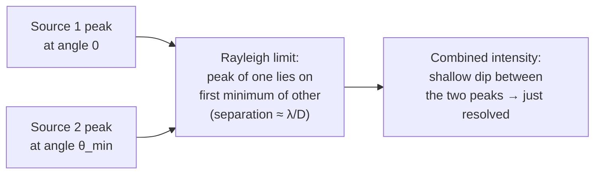

# Rayleigh Criterion

## Statement

Two point sources observed through a circular aperture are **just resolved** when the **central maximum** of the diffraction (Airy) pattern of one source falls on the **first minimum** of the pattern of the other. The angular separation at this limit is the smallest resolvable angle, $\theta_{\min}$.

## Equation

For a circular aperture, with small angles,

$$
\theta_{\min} \;\approx\; \frac{\lambda}{D}
$$

(For an exam-board treatment of a circular aperture the more precise form is $\theta_{\min} = 1.22\,\lambda/D$; AQA accepts $\theta \approx \lambda/D$ as the criterion.)

## Symbols and Units

- $\theta_{\min}$ — minimum resolvable angle between two point sources. Unit: **radian** (rad). See [[Radian]].
- $\lambda$ — wavelength of the radiation being observed. Unit: metre (m).
- $D$ — diameter of the circular aperture (telescope objective or radio dish). Unit: metre (m).

## Conditions

- Aperture is **circular** and uniformly illuminated.
- The two sources emit at (effectively) the same wavelength $\lambda$.
- Angles are small enough that $\sin\theta \approx \theta$ in radians.
- Diffraction-limited optics — no atmospheric seeing or aberrations spoiling the pattern (otherwise the practical limit is worse).
- Detector is fine enough to resolve the pattern (a coarse pixel grid or a low-resolution eye sets the limit instead).

## Physical Meaning

Light diffracts when it passes through an aperture, so even a perfect telescope spreads a point source into a small disk (the Airy disk) of angular radius $\sim \lambda/D$. If two stars are much closer in angle than this, their disks overlap completely and look like one. Rayleigh's criterion picks a particular "just separable" point — peak of one on first dark ring of the other — and uses it as the quantitative **diffraction limit** of the instrument. See [[Resolving-Power]] and [[Diffraction]].

## Foundation Link

Builds on the GCSE idea that waves [[Diffraction|diffract]] around obstacles and through gaps, with more spreading when $\lambda \sim D$. The new step at A-Level is to quantify "how close can two sources be before this spreading hides them".

## How to Use

1. Identify $\lambda$ (the band you are observing in) and $D$ (the aperture diameter).
2. Compute $\theta_{\min} = \lambda/D$ in **radians**.
3. Convert to arcseconds or degrees if the question requires it, or multiply by distance to the sources to get a linear separation.
4. Compare with the angular separation $\theta$ of the two sources: if $\theta > \theta_{\min}$ they are resolved.

Worked-style example (paraphrased): for a $D = 0.20\,\text{m}$ optical telescope at $\lambda = 5.5\times10^{-7}\,\text{m}$:
$\theta_{\min} \approx 5.5\times10^{-7}/0.20 \approx 2.8\times10^{-6}\,\text{rad}$ (about 0.6 arcsec).

## Derivation or Explanation

A circular aperture of diameter $D$ produces an Airy pattern whose first minimum lies at angular radius $\approx 1.22\,\lambda/D$ from the central maximum (from the first zero of the Bessel function $J_1$). The Rayleigh criterion is the choice of "just separated" as **first minimum on central maximum**, giving $\theta_{\min} \approx \lambda/D$ for a quick estimate or $1.22\,\lambda/D$ for a precise value.

## Related Quantities

- Wavelength $\lambda$
- Aperture diameter $D$
- Angular separation $\theta$ (rad — see [[Radian]])

## Related Models

- [[Astronomical-Telescope]]
- [[Reflecting-Telescope]]
- [[Diffraction]] — the underlying physics.

## Applications

- Sets resolution of every telescope at every wavelength: optical, IR, UV, X-ray, radio.
- Explains why radio telescopes need to be huge or linked into interferometer arrays (long $\lambda$).
- Explains why space telescopes (Hubble, JWST) get noticeably sharper images than ground-based ones of similar $D$ — no atmospheric blur, so they reach $\theta_{\min}$.
- Microscope resolution: same principle, with $\lambda$ of visible (or electron) waves and the objective aperture.

## Frontier Links

- [[Cosmology-Map]] — resolving high-redshift galaxies depends on this limit.
- Very-long-baseline interferometry (VLBI) achieves $\theta_{\min}$ matching a $D$ of thousands of kilometres.

## Common Mistakes

- Working in **degrees** when the equation requires **radians**.
- Claiming two stars at $\theta < \theta_{\min}$ are "invisible" — they are still detected, just not separated.
- Forgetting that a bigger $D$ helps **both** by lowering $\theta_{\min}$ **and** by raising collecting power ($\propto D^2$). See [[Resolving-Power]].
- Using the criterion when the atmosphere or detector — not diffraction — is the real limit. Ground-based optical scopes usually hit ~1 arcsec atmospheric "seeing" long before the diffraction limit.

## Visuals

### Rayleigh criterion — two Airy patterns at the limit

*Figure: The Rayleigh criterion takes the "peak-on-first-minimum" configuration as the just-resolved case; their angular separation is $\theta_{\min} \approx \lambda/D$.*
*Source: Authored for this vault (CC0). No external copyright.*

### From Wikimedia

<!-- wiki-images: yes -->

#### Two Airy patterns at the Rayleigh limit
![[_attachments/05_Laws-and-Results/Rayleigh-Criterion--wiki-airy-rayleigh.png]]
*Figure: Two point sources whose Airy patterns are separated so that the central maximum of one falls on the first minimum of the other — the just-resolved Rayleigh case, with the combined profile showing a shallow central dip.*
*Source: Wikimedia Commons — [Airy disk spacing near Rayleigh criterion.png](https://commons.wikimedia.org/wiki/File:Airy_disk_spacing_near_Rayleigh_criterion.png) — Public domain — Spencer Bliven. Retrieved 2026-06-27.*

## Source Trace

- Source: [[AQA-Physics-7407-7408-Specification]] §3.9.1 (Telescopes — resolving power, Rayleigh criterion)
- Public source: HyperPhysics ("Rayleigh Criterion"); OpenStax College Physics, Ch. 27 (Wave Optics — Limits of Resolution).
- Section/Page: Spec p. (Astrophysics option).
