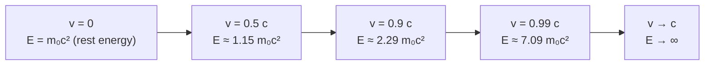

# Relativistic Mass and Energy

## Statement

As an object's speed approaches the speed of light, its **inertia (relativistic mass) increases without bound**, and its **total energy** is given by $E = mc^{2}$. This makes $c$ a universal speed limit for any object with rest mass.

## Equation

Relativistic mass:

$$
m = \dfrac{m_{0}}{\sqrt{1 - \dfrac{v^{2}}{c^{2}}}} = \gamma m_{0}
$$

Total energy and rest energy:

$$
E = mc^{2}, \qquad E_{0} = m_{0}c^{2}
$$

Kinetic energy (relativistic):

$$
E_{\text{k}} = (\gamma - 1)\, m_{0}c^{2}
$$

## Symbols and Units

- Symbol: $m_{0}$ — Meaning: **rest mass** (invariant mass) — the mass measured in the object's own rest frame. Unit: kilogram (kg).
- Symbol: $m$ — Meaning: relativistic mass — the inertia an observer measures when the object moves at speed $v$. Unit: kilogram (kg).
- Symbol: $v$ — Meaning: speed of the object relative to the observer. Unit: m s$^{-1}$.
- Symbol: $c$ — Meaning: speed of light in vacuum, $\approx 3.00 \times 10^{8}$ m s$^{-1}$. Unit: m s$^{-1}$.
- Symbol: $\gamma = 1/\sqrt{1 - v^{2}/c^{2}}$ — Meaning: Lorentz factor (dimensionless).
- Symbol: $E$ — Meaning: total energy (rest energy + kinetic). Unit: joule (J).
- Symbol: $E_{0}$ — Meaning: rest energy. Unit: joule (J).
- Symbol: $E_{\text{k}}$ — Meaning: relativistic kinetic energy. Unit: joule (J).

## Conditions

- The frame is inertial.
- $v < c$ for any object with $m_{0} > 0$.
- The classical $\tfrac{1}{2}m_{0}v^{2}$ formula for kinetic energy is only valid at $v \ll c$; otherwise use the relativistic expression.

## Physical Meaning

Mass and energy are two faces of the same physical quantity. A hot object has more mass than a cold one. A compressed spring has more mass than a relaxed one. A nucleus has *less* mass than the sum of its separate nucleons because energy was released as binding energy.

Because $m = \gamma m_{0}$ and $\gamma \to \infty$ as $v \to c$, accelerating a massive object to $c$ would require infinite energy. So $c$ is the universal speed limit. Only **massless** particles like photons travel at $c$ — and they have *no* rest frame.

For low speeds, $E_{\text{k}} = (\gamma - 1)m_{0}c^{2}$ reduces to the familiar $\tfrac{1}{2}m_{0}v^{2}$ (a binomial expansion of $\gamma$).

## Foundation Link

Extends GCSE [[Kinetic-Energy]] beyond low-speed approximations and connects to GCSE ideas of mass conservation — which turns out to be only an approximation valid when energy changes are tiny compared with $m_{0}c^{2}$.

## How to Use

1. To get inertia of a moving object: $m = \gamma m_{0}$.
2. To get rest energy: $E_{0} = m_{0}c^{2}$ (huge — 1 g of mass ≈ $9 \times 10^{13}$ J).
3. To get kinetic energy of a relativistic particle: $E_{\text{k}} = (\gamma - 1)m_{0}c^{2}$.
4. To find energy released in a nuclear reaction: take the mass defect $\Delta m$ and multiply by $c^{2}$.

## Derivation or Explanation

Conservation of momentum in inertial collisions, combined with the invariance of $c$ from [[Special-Relativity]], forces the momentum to be defined as $p = \gamma m_{0} v$. Treating $\gamma m_{0}$ as the inertia gives the relativistic mass. Integrating the work–energy theorem then yields $E = \gamma m_{0}c^{2}$, with rest energy $m_{0}c^{2}$ even when $v = 0$.

## Related Quantities

- [[Mass]]
- [[Energy]]
- [[Momentum]]
- [[Kinetic-Energy]]

## Related Models

- Inertial frame
- Point particle

## Applications

- **Nuclear binding energy** — mass defect explains energy released in fission and fusion (see [[Mass-Energy-Equivalence]]).
- **Particle accelerators** — electrons in modern linacs reach $\gamma \sim 10^{4}$; the beam's inertia, not its speed, is what increases.
- **Annihilation and pair production** — rest mass is converted directly to photon energy and vice versa.
- **Stellar power** — the Sun loses mass at $\sim 4 \times 10^{9}$ kg s$^{-1}$ as nuclear fusion converts mass to radiation.

## Frontier Links

- [[Relativity-Map]]
- Higgs mechanism — origin of rest mass (beyond A-Level)

## Common Mistakes

- Using $\tfrac{1}{2}m_{0}v^{2}$ for fast particles — it badly underestimates kinetic energy near $c$.
- Forgetting the rest energy term — total energy $E$ includes $m_{0}c^{2}$ even for a stationary object.
- Believing objects can be accelerated past $c$ "with enough energy" — the energy required diverges as $v \to c$.
- Confusing relativistic mass $m$ with rest mass $m_{0}$ in problem statements. Modern physicists prefer to talk about invariant rest mass only — but at A-Level AQA still uses the $\gamma m_{0}$ language.
- Treating photons with the $m = \gamma m_{0}$ formula — photons have $m_{0} = 0$ and use $E = pc$ instead.

## Visuals

### Energy versus speed

*Figure: Total energy grows without bound as $v \to c$ — an infinite-energy barrier preventing any massive object from reaching the speed of light.*
*Source: Authored for this vault (CC0). No external copyright.*

## Source Trace

- Source: [[AQA-Physics-7407-7408-Specification]] §3.12.3
- Section/Page: Turning Points in Physics — Special Relativity (HyperPhysics; OpenStax University Physics)
