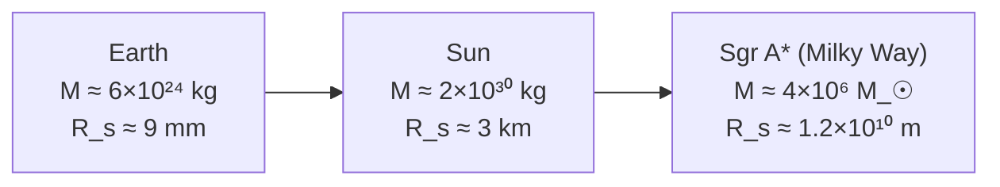

# Schwarzschild Radius

## Statement

The **Schwarzschild radius** `R_s` is the radius of the event horizon of a non-rotating black hole of mass `M`. Inside this radius the escape velocity exceeds the speed of light, so no signal (including light) can leave.

## Equation

`R_s = 2 G M / c²`

## Symbols and Units

- Symbol: `R_s` — Meaning: Schwarzschild radius — Unit: metre (m).
- Symbol: `G` — Meaning: Newtonian gravitational constant ≈ `6.67 × 10⁻¹¹ N m² kg⁻²` — Unit: `N m² kg⁻²`.
- Symbol: `M` — Meaning: mass of the object — Unit: kilogram (kg).
- Symbol: `c` — Meaning: speed of light in vacuum ≈ `3.00 × 10⁸ m s⁻¹` — Unit: `m s⁻¹`.

## Conditions

- Non-rotating, uncharged, spherically symmetric mass (Schwarzschild solution of general relativity).
- The formula gives the size of the horizon, not the object inside it.
- Treated at A-level as a result, not a derivation.

## Physical Meaning

Anything compressed inside its own Schwarzschild radius is a black hole. For the Sun, `R_s ≈ 3 km`; for the Earth, `R_s ≈ 9 mm`. The horizon is not a solid surface — it is the one-way boundary beyond which future light cones tilt entirely inward.

## Foundation Link

A Newtonian escape-velocity argument gives the same numerical answer:

`½ v² = G M / R` ⇒ setting `v = c` and solving for `R` gives `R = 2 G M / c²`.

This is a coincidence (the real derivation is relativistic), but it gives a useful way to remember the formula. Builds on [[Newtons-Law-of-Gravitation]] and [[Gravitational-Potential]].

## How to Use

Given mass `M` of a stellar remnant or supermassive black hole, plug into `R_s = 2GM/c²` to get the horizon size in metres.

Worked sanity check (Sun-mass black hole):
`R_s = 2 × 6.67×10⁻¹¹ × 2.0×10³⁰ / (3.0×10⁸)² ≈ 3.0 × 10³ m ≈ 3 km`.

## Derivation or Explanation

Optional — see "Foundation Link". The proper derivation comes from solving Einstein's field equations in vacuum around a spherically symmetric mass, well beyond A-level scope.

## Related Quantities

- [[Mass]]
- Speed of light, gravitational constant.

## Related Models

- [[Supernovae-Neutron-Stars-and-Black-Holes]]
- Non-rotating "Schwarzschild" black hole.

## Applications

- Estimating event-horizon sizes of stellar-mass and supermassive black holes (e.g. Sagittarius A* in the Milky Way).
- Cross-checks for [[Quasars]] powered by supermassive black holes.

## Frontier Links

- Relativity-Map — Schwarzschild solution, Kerr (rotating) black holes, Hawking radiation.

## Common Mistakes

- Forgetting the factor of 2 in front of `GM/c²`.
- Plugging in `M` in solar masses without converting to kilograms.
- Saying "the black hole has radius `R_s`" — `R_s` is the horizon size, not the size of any physical object.

## Visuals

### Schwarzschild radius scaling

*Figure: `R_s` scales linearly with mass.*
*Source: Authored for this vault (CC0). No external copyright.*

### From Wikimedia

<!-- wiki-images: yes -->

#### The M87 black hole — imaging the event horizon
![[_attachments/05_Laws-and-Results/Schwarzschild-Radius--wiki-m87-black-hole.jpg]]
*Figure: The first direct image of a black hole's shadow (M87*, by the Event Horizon Telescope). The dark central region surrounds the event horizon, whose scale is set by the Schwarzschild radius `R_s = 2GM/c²`.*
*Source: Wikimedia Commons — [Black hole - Messier 87.jpg](https://commons.wikimedia.org/wiki/File:Black_hole_-_Messier_87.jpg) — CC BY 4.0 — Event Horizon Telescope. Retrieved 2026-06-27.*

## Source Trace

- Source: [[AQA-Physics-7407-7408-Specification]] §3.9.3
- Section/Page: Black holes; Schwarzschild radius `R_s = 2GM/c²`.
- Public reference: HyperPhysics "Schwarzschild Radius"; NASA Imagine the Universe — Black Holes.
