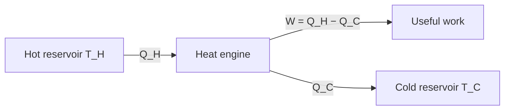

# Second Law of Thermodynamics

## Statement

A heat engine cannot convert heat fully into work in a cyclic process. To produce work continuously it must take heat from a **hot source** at temperature $T_H$ and reject some heat to a **cold sink** at temperature $T_C$. There is a maximum possible efficiency — the **Carnot efficiency** — set purely by those two temperatures, and no real engine can beat it.

This is why the [[First-Law-of-Thermodynamics]] alone is not enough: energy conservation would permit an engine that turns 100 J of heat into 100 J of work, but the second law forbids it.

## Equation

Actual efficiency of a heat engine:

$$\eta = \frac{W}{Q_H} = \frac{Q_H - Q_C}{Q_H} = 1 - \frac{Q_C}{Q_H}$$

Maximum theoretical (Carnot) efficiency:

$$\eta_{\max} = \frac{T_H - T_C}{T_H} = 1 - \frac{T_C}{T_H}$$

## Symbols and Units

- $Q_H$ — heat taken from the hot reservoir per cycle, J.
- $Q_C$ — heat rejected to the cold reservoir per cycle, J.
- $W = Q_H - Q_C$ — net work done by the engine per cycle, J.
- $T_H$ — absolute temperature of the hot source, **kelvin** (K).
- $T_C$ — absolute temperature of the cold sink, **kelvin** (K).
- $\eta$ — efficiency, dimensionless (often expressed as a percentage).

## Conditions

- Heat reservoirs are large enough to keep their temperatures constant during the cycle.
- $T_H$ and $T_C$ are absolute temperatures — **always use kelvin**, never °C.
- $\eta_{\max}$ assumes a reversible (Carnot) cycle — slow, frictionless, no temperature gradients. No real engine is reversible, so real efficiencies fall below this ceiling.

## Physical Meaning

The first law says you can never get more work out than the heat you put in. The second law says you cannot even get all of it: a fraction $T_C/T_H$ of the input heat must always be dumped to the cold sink. The bigger the temperature gap between source and sink, the less you have to dump, and the better the maximum efficiency.

For a car engine with $T_H \approx 2200$ K (combustion) and $T_C \approx 300$ K (atmosphere):

$$\eta_{\max} = 1 - \frac{300}{2200} \approx 0.86 = 86\%$$

— a hard upper bound. In practice [[Engine-Cycles]] are limited to about 30% by:

- non-reversible processes (rapid combustion, friction),
- heat loss through cylinder walls,
- incomplete combustion,
- mechanical losses to friction and accessories.

## Foundation Link

At GCSE you learn that heat naturally flows from hot to cold and never spontaneously the other way. The second law turns this everyday asymmetry into a hard ceiling on engine performance. It is also the reason an isolated cup of tea cools to room temperature but never spontaneously reheats.

## How to Use

1. Identify the hot-source and cold-sink temperatures and convert to kelvin.
2. Compute $\eta_{\max}$ as the theoretical ceiling.
3. Use $\eta = W/Q_H$ to find actual efficiency from measured work or power.
4. Compare actual to maximum to comment on engine quality or losses.

## Related Quantities

- [[Temperature]]
- [[Work]]
- [[Internal-Energy]]

## Related Models

- [[Ideal-Gas-Model]]

## Applications

- [[Engine-Cycles]]
- [[Reversed-Heat-Engines]]
- Power stations — why steam at higher pressure (so higher $T_H$) gives a higher-efficiency plant.

## Frontier Links

- Entropy and the statistical interpretation of the second law.
- Heat death of the universe — the second law applied to cosmology.

## Common Mistakes

- Using temperatures in °C instead of kelvin in the Carnot formula. The result will be wrong (and may exceed 1).
- Confusing $Q_C$ (heat rejected to cold sink) with $Q_H$ (heat from hot source).
- Quoting a real engine efficiency higher than $\eta_{\max}$ — this is impossible and signals a unit slip.
- Claiming the second law forbids any heat going to work — it only forbids **complete** conversion in a cycle.

## Visuals

### Heat-engine block diagram

*Figure: A heat engine takes heat Q_H from the hot reservoir, delivers work W, and must reject Q_C to the cold reservoir.*
*Source: Authored for this vault (CC0). No external copyright.*

## Source Trace

- Source: [[AQA-Physics-7407-7408-Specification]] §3.11.2 (Engineering Physics — Heat engines and second law)
- Public source: HyperPhysics (second law, Carnot cycle); OpenStax College Physics §15.3–15.5.
- Section/Page: AQA specification §3.11.2.3
