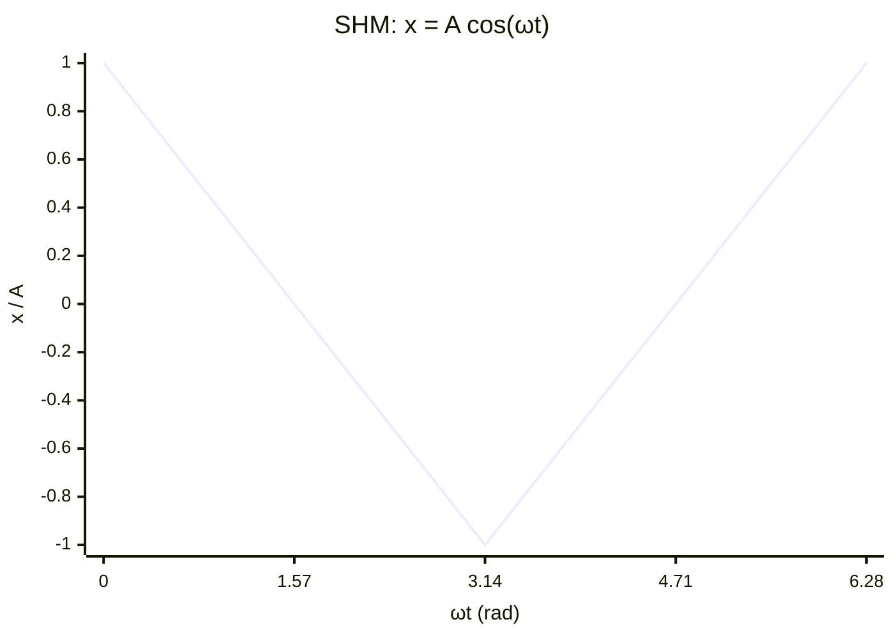

# Simple Harmonic Motion Equation

## Statement

A body undergoes simple harmonic motion when its acceleration is directly proportional to its displacement from a fixed equilibrium position and is always directed towards that position.

## Equation

Defining condition:

$$a = -\omega^2 x$$

Solutions and related results:

- $x = A \cos(\omega t)$  (released from maximum displacement) or $x = A \sin(\omega t)$ (released from equilibrium)
- $v = \pm\omega \sqrt{A^2 - x^2}$;  $v_{max} = \omega A$
- $a = -\omega^2 x$;  $a_{max} = \omega^2 A$
- $\omega = 2\pi f = \frac{2\pi}{T}$

## Symbols and Units

- a — acceleration — m s⁻²
- x — displacement from equilibrium — m
- A — [[Amplitude]] (maximum displacement) — m
- ω — angular frequency — rad s⁻¹ (base s⁻¹)
- f — [[Frequency]] — Hz
- T — [[Period]] — s
- t — time — s

## Conditions

- Restoring influence proportional to displacement (e.g. [[Hookes-Law]] spring; pendulum at small angles where $\sin\theta \approx \theta$ in [[Radian]]).
- No (or negligible) [[Damping]] for the constant-amplitude solutions.
- Period is independent of amplitude (isochronous).

## Physical Meaning

The negative sign means the acceleration is always a *restoring* effect pulling the body back to equilibrium. This guarantees sinusoidal motion: speed is greatest at the centre and zero at the extremes, while acceleration is greatest at the extremes and zero at the centre.

## Foundation Link

Builds on [[Hookes-Law]] (force ∝ extension) and Newton's second law: combining $F = -kx$ with $F = ma$ gives $a = -\frac{k}{m}x$, i.e. $\omega^2 = \frac{k}{m}$.

## How to Use

Identify the restoring relationship, extract $\omega^2$ as the constant of proportionality between a and −x, then use $\omega = \frac{2\pi}{T}$ to find period or frequency and the v/a equations for speeds and accelerations. See [[Solving-SHM-Problems]].

## Derivation or Explanation

For a mass–spring system, [[Hookes-Law]] gives restoring force $F = -kx$. Newton's second law gives $ma = -kx$, so $a = -\frac{k}{m}x$. Comparing with $a = -\omega^2 x$ gives $\omega = \sqrt{\frac{k}{m}}$ and $T = 2\pi\sqrt{\frac{m}{k}}$. For a simple pendulum of length L, $T = 2\pi\sqrt{\frac{L}{g}}$.

## Related Quantities

- [[Amplitude]]
- [[Period]]
- [[Frequency]]
- [[Acceleration]]

## Related Models

- [[Simple-Harmonic-Oscillator]]
- [[Ideal-Spring-Model]]

## Applications

- [[Banked-Tracks-and-Centrifuges]]

## Frontier Links

- [[Quantum-Mechanics-Map]]

## Common Mistakes

- [[Confusing-Angular-and-Linear-Quantities]]

## Visuals

### SHM displacement, velocity, and acceleration

*Figure: SHM displacement varies as a cosine. Velocity is 90° ahead (maximum at centre, zero at extremes) and acceleration is 180° ahead (maximum and opposing at extremes).*
*Source: Authored for this vault (CC0). No external copyright.*

### From Wikipedia

<!-- wiki-images: yes -->

#### Simple Harmonic Motion Orbit

![[_attachments/05_Laws-and-Results/Simple-Harmonic-Motion-Equation--wiki-simple-harmonic-motion-orbit.gif]]
*Figure: from Wikipedia article "Simple harmonic motion".*
*Source: Wikimedia Commons — [Simple_Harmonic_Motion_Orbit.gif](https://commons.wikimedia.org/wiki/File:Simple_Harmonic_Motion_Orbit.gif). Retrieved 2026-05-20.*

#### Scotch yoke animation

![[_attachments/05_Laws-and-Results/Simple-Harmonic-Motion-Equation--wiki-scotch-yoke-animation.gif]]
*Figure: from Wikipedia article "Simple harmonic motion".*
*Source: Wikimedia Commons — [Scotch yoke animation.gif](https://commons.wikimedia.org/wiki/File:Scotch_yoke_animation.gif). Retrieved 2026-05-20.*

#### Simple Harmonic Motion Orbit

![[_attachments/05_Laws-and-Results/Simple-Harmonic-Motion-Equation--wiki-simple-harmonic-motion-orbit.gif]]
*Figure: from Wikipedia article "Simple harmonic motion".*
*Source: Wikimedia Commons — [Simple Harmonic Motion Orbit.gif](https://commons.wikimedia.org/wiki/File:Simple_Harmonic_Motion_Orbit.gif). Retrieved 2026-05-20.*

## Source Trace

- Source: OpenStax College Physics; HyperPhysics; The Physics Classroom — no copied text
- Section/Page: OCR alignment: [[OCR-Physics-A-H556-Specification]] (M5.3 Oscillations)
