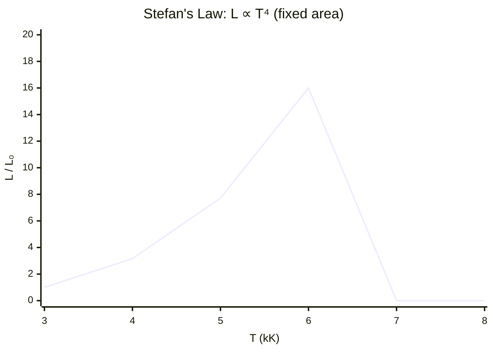

# Stefan's Law

## Statement

The total power radiated by a black body is proportional to its surface area
and to the fourth power of its absolute temperature.

## Equation

$$L = 4\pi r^2 \sigma T^4$$

(for a spherical star of radius r; in general $P = \sigma A T^4$)

## Symbols and Units

- L: luminosity, total radiated power — W
- r: radius of the star — m
- A: surface area — m²
- σ: Stefan(-Boltzmann) constant, $5.67 \times 10^{-8}$ — W m⁻² K⁻⁴
- T: absolute surface temperature — K

## Conditions

- The body radiates as a black body (good approximation for stars)
- T must be the absolute temperature in kelvin

## Physical Meaning

Because of the T⁴ dependence, a small rise in surface temperature gives a
large rise in [[Luminosity]]. Two stars of equal size but different
temperature differ greatly in power output. Combined with distance, it links
the true power of a star to the brightness observed on Earth.

## Foundation Link

Builds on the GCSE idea that hotter and larger objects emit more thermal
radiation, made precise through the A⁠T⁴ dependence.

## How to Use

Find T from a star's spectrum using [[Wiens-Displacement-Law]], then either
compute L from a known radius, or rearrange to estimate the stellar radius r
from measured luminosity and temperature.

## Derivation or Explanation

Obtained by integrating the black-body (Planck) spectral distribution over
all wavelengths; the integration is beyond A-Level — only the $L \propto AT^4$ result
is required.

## Related Quantities

- [[Luminosity]]
- [[Wavelength]]

## Related Models

- [[Stellar-Evolution]]

## Applications

- Estimating stellar radii and luminosities
- [[Hertzsprung-Russell-Diagram]] interpretation

## Frontier Links

- [[Cosmology-Map]]

## Common Mistakes

- Using T in °C instead of kelvin (huge error from the 4th power)
- Forgetting the surface area depends on r²
- Confusing total power (Stefan) with peak wavelength ([[Wiens-Displacement-Law]])

## Visuals

### Luminosity vs temperature (T⁴ dependence)

*Figure: Luminosity rises steeply with temperature due to the T⁴ factor. A star twice as hot emits 16 times more power per unit area.*
*Source: Authored for this vault (CC0). No external copyright.*

### From Wikipedia

<!-- wiki-images: yes -->

#### Stefan Boltzmann 001

![[_attachments/05_Laws-and-Results/Stefans-Law--wiki-stefan-boltzmann-001.svg]]
*Figure: from Wikipedia article "Stefan–Boltzmann law".*
*Source: Wikimedia Commons — [Stefan_Boltzmann_001.svg](https://commons.wikimedia.org/wiki/File:Stefan_Boltzmann_001.svg). Retrieved 2026-05-20.*

#### Blackbody peak wavelength exitance vs temperature

![[_attachments/05_Laws-and-Results/Stefans-Law--wiki-blackbody-peak-wavelength-exitance-vs-te.svg]]
*Figure: from Wikipedia article "Stefan–Boltzmann law".*
*Source: Wikimedia Commons — [Blackbody peak wavelength exitance vs temperature.svg](https://commons.wikimedia.org/wiki/File:Blackbody_peak_wavelength_exitance_vs_temperature.svg). Retrieved 2026-05-20.*

#### Stefan-Boltzmann Law

![[_attachments/05_Laws-and-Results/Stefans-Law--wiki-stefan-boltzmann-law.png]]
*Figure: from Wikipedia article "Stefan–Boltzmann law".*
*Source: Wikimedia Commons — [Stefan-Boltzmann Law.png](https://commons.wikimedia.org/wiki/File:Stefan-Boltzmann_Law.png). Retrieved 2026-05-20.*

## Source Trace

- Source: OpenStax College Physics; HyperPhysics; NASA educational material — no copied text
- OCR alignment: [[OCR-Physics-A-H556-Specification]]
- Section/Page: OCR M5.5 Astrophysics and cosmology
