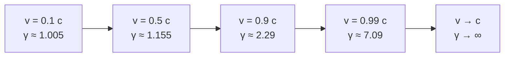

# Time Dilation

## Statement

A clock moving relative to an observer ticks more slowly than an identical clock at rest in the observer's frame. The slowdown grows without bound as the relative speed approaches the speed of light.

## Equation

$$
t = \dfrac{t_{0}}{\sqrt{1 - \dfrac{v^{2}}{c^{2}}}}
$$

The denominator is often written as $1/\gamma$, where $\gamma = 1/\sqrt{1 - v^{2}/c^{2}}$ is the **Lorentz factor**.

## Symbols and Units

- Symbol: $t_{0}$ — Meaning: **proper time** — the time interval measured by a clock that is *at rest* relative to the events (both events happen at the same place in its frame). Unit: second (s).
- Symbol: $t$ — Meaning: **dilated time** — the same interval measured by an observer in a frame in which the clock is moving at speed $v$. Unit: second (s).
- Symbol: $v$ — Meaning: relative speed of the two inertial frames. Unit: m s$^{-1}$.
- Symbol: $c$ — Meaning: speed of light in vacuum, $\approx 3.00 \times 10^{8}$ m s$^{-1}$. Unit: m s$^{-1}$.

## Conditions

- Both frames are **inertial** (no acceleration).
- $t_{0}$ must be the **proper time** — the interval where the two events happen at the same spatial point in that frame.
- $v < c$.

## Physical Meaning

Because the speed of light is the same in every inertial frame ([[Special-Relativity]]), the rate at which time flows must differ between frames. The faster a clock moves relative to you, the slower it appears to tick. Each observer sees the *other's* clocks run slow — the effect is symmetric, not a real "slowing down" of one clock.

For $v \ll c$, $\gamma \approx 1$ and the effect is negligible. For $v = 0.99c$, $\gamma \approx 7.1$ — a moving second lasts about 7 seconds in the lab.

## Foundation Link

Builds on the GCSE idea that time is the same for everyone (Newtonian absolute time) — and shows that idea is only an approximation valid at low speeds.

## How to Use

1. Identify which frame contains the proper time $t_{0}$ — the clock for which the two events happen at the same location.
2. Identify the relative speed $v$ between the frames.
3. Calculate $\gamma = 1/\sqrt{1 - v^{2}/c^{2}}$.
4. The other observer measures $t = \gamma t_{0}$, which is **longer** than $t_{0}$.

## Derivation or Explanation

A light-clock thought experiment makes the result inevitable: a photon bouncing between two horizontal mirrors traces a vertical path of length $2L$ in the clock's rest frame (taking time $t_{0} = 2L/c$). For a moving observer, the photon traces a longer zig-zag path of length $2\sqrt{L^{2} + (vt/2)^{2}}$, but still at speed $c$. Setting the path equal to $ct$ and solving gives $t = t_{0}/\sqrt{1 - v^{2}/c^{2}}$.

## Related Quantities

- [[Velocity]]
- [[Speed of Light]]

## Related Models

- Light-clock model
- Inertial frame

## Applications

- **Cosmic-ray muons** — muons created high in the atmosphere have a rest lifetime of about $2.2\,\mu$s, far too short to reach the ground at any sub-$c$ speed classically. Time dilation extends their lab-frame lifetime enough that many reach sea-level detectors. (From the muon's frame, the same fact is explained by [[Length-Contraction]] of the atmosphere.)
- GPS satellites — onboard clocks must be corrected for time dilation (and gravitational effects) to keep positions accurate.
- Particle accelerators — unstable particles travel further than their rest lifetimes would predict.

## Frontier Links

- [[Relativity-Map]]
- Gravitational time dilation (general relativity — beyond A-Level)

## Common Mistakes

- Mixing up $t$ and $t_{0}$. **Proper time is the smaller one**, measured by the clock at rest relative to the events.
- Forgetting the symmetry — observer A sees B's clock slow; observer B sees A's clock slow. This is not a contradiction because they disagree about simultaneity.
- Using $v$ in km h$^{-1}$ — convert to m s$^{-1}$ before dividing by $c$.
- Trying to use $v \geq c$ — the formula breaks down; massive objects cannot reach $c$.

## Visuals

### Lorentz factor versus speed

*Figure: The Lorentz factor stays close to 1 at low speeds and diverges as $v$ approaches $c$ — that's why time dilation is invisible in everyday life but enormous near light speed.*
*Source: Authored for this vault (CC0). No external copyright.*

### From Wikimedia

<!-- wiki-images: yes -->

#### Light-clock geometry
![[_attachments/05_Laws-and-Results/Time-Dilation--wiki-light-clock.svg]]
*Figure: In the clock's rest frame the photon goes straight up and down; to a moving observer it traces a longer zig-zag at the same speed c, so more time must elapse — the geometry behind t = t₀/√(1 − v²/c²).*
*Source: Wikimedia Commons — [Time-dilation-002.svg](https://commons.wikimedia.org/wiki/File:Time-dilation-002.svg) — Public domain — Mdd4696. Retrieved 2026-06-27.*

## Watch

- [[Time-Dilation-and-Length-Contraction|Length Contraction and Time Dilation  /  Special Relativity Ch. 5]] — minutephysics

## Source Trace

- Source: [[AQA-Physics-7407-7408-Specification]] §3.12.3
- Section/Page: Turning Points in Physics — Special Relativity (HyperPhysics; OpenStax University Physics)
