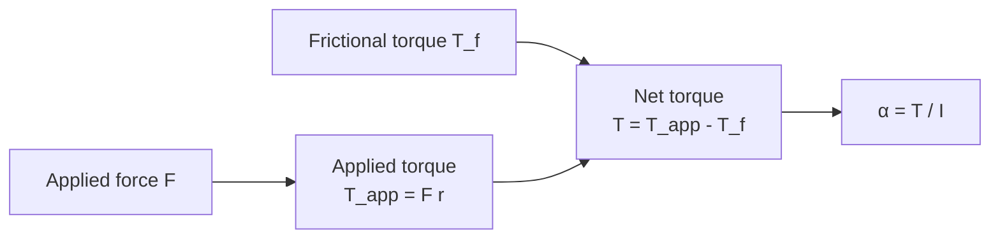

# Torque and Angular Acceleration

## Statement

The net torque acting on a rigid body about a fixed axis equals the body's moment of inertia about that axis multiplied by its angular acceleration. This is the rotational form of [[Newton-Second-Law]].

## Equation

$$
T = I \alpha
$$

A torque is produced by a force acting at a distance from the axis:

$$
T = F r
$$

where $r$ is the perpendicular distance from the axis to the line of action of the force.

## Symbols and Units

- $T$: net torque about the axis — newton metre, N m.
- $F$: magnitude of the applied force — newton, N.
- $r$: perpendicular distance from the axis to the line of action of $F$ — metre, m.
- $I$: [[Moment-of-Inertia]] of the body about the same axis — $\mathrm{kg\,m^{2}}$.
- $\alpha$: angular acceleration — rad s⁻² (see [[Radian]]).

## Conditions

- Rigid body rotating about a **fixed** axis.
- $T$ is the **net** (resultant) torque about that axis — sum signed torques, including any frictional torque.
- $I$ must be the moment of inertia about the **same** axis as $T$.
- All quantities measured in consistent SI units, with $\alpha$ in rad s⁻².

## Physical Meaning

Torque is to rotation what force is to translation. A large $I$ (mass spread far from the axis) makes a body sluggish to spin up or slow down, just as large mass makes an object sluggish in linear motion. Frictional torque in bearings always opposes rotation and reduces the net $T$ that produces angular acceleration.

## Foundation Link

You already know that pushing harder, or pushing further from a hinge, makes a door swing more easily — this is the everyday meaning of [[Moment]]. The new step at A-Level is connecting that turning effect to a measurable angular acceleration via $I$.

## How to Use

1. Identify the axis of rotation.
2. Compute every torque about that axis (apply $T = Fr$ to each force; remember to subtract frictional torque).
3. Look up or compute $I$ about the same axis.
4. Solve $T_\text{net} = I\alpha$ for the unknown.

If $T$ is constant, $\alpha$ is constant and the rotational SUVAT equations from [[Rotational-Motion]] apply.

## Derivation or Explanation

For a single point mass on a rigid rod, Newton's second law along the tangential direction gives $F = m a_t = m r \alpha$. Multiplying both sides by $r$: $T = F r = m r^{2} \alpha = I \alpha$. Summing over every mass element of a rigid body extends this to the general result.

## Related Quantities

- [[Moment-of-Inertia]]
- [[Angular-Velocity]]
- [[Moment]]
- [[Force]]

## Related Models

- [[Constant-Acceleration-Model]]

## Applications

- [[Flywheels]]
- Motor shafts, gearboxes, machine tool spindles, where frictional torque limits achievable $\alpha$.

## Frontier Links

- [[...]]

## Common Mistakes

- Using a force's full magnitude when only the **perpendicular component** of the lever arm contributes to torque.
- Mixing axes: computing $T$ about one axis and $I$ about another.
- Forgetting to include frictional torque, which reduces the net $T$.
- Using degrees per second² instead of rad s⁻² for $\alpha$.

## Visuals

### Net torque drives angular acceleration

*Figure: Net torque after subtracting friction drives the angular acceleration via T = Iα.*
*Source: Authored for this vault (CC0). No external copyright.*

## Source Trace

- Source: [[AQA-Physics-7407-7408-Specification]] §3.11.1 (Engineering Physics — Rotational dynamics)
- Section/Page: Public reference — HyperPhysics; OpenStax College Physics
