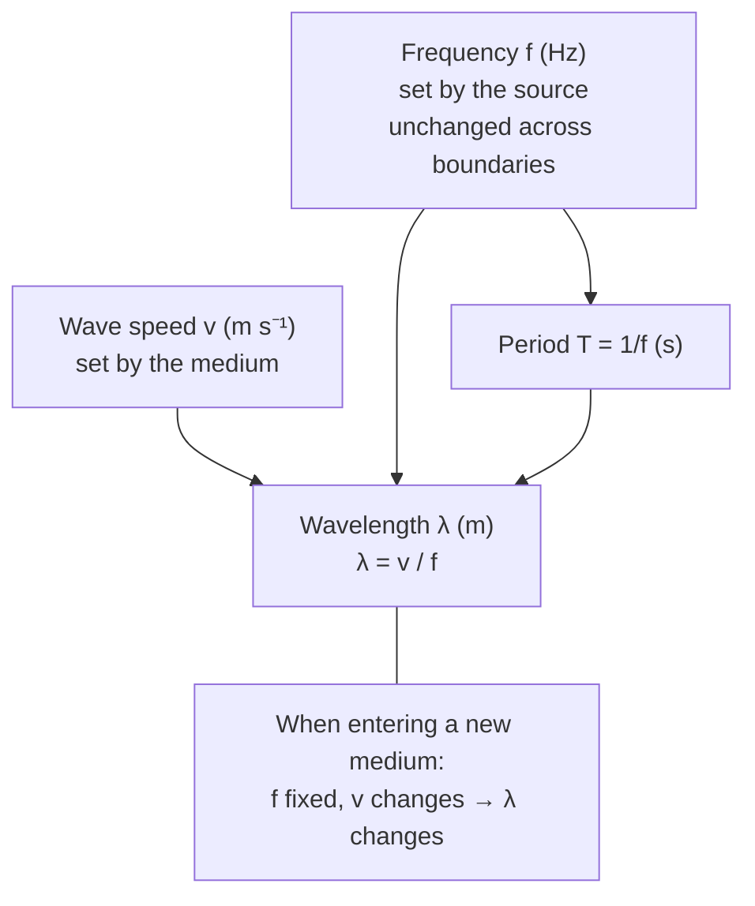

# Wave Speed Equation

## Statement

The speed of a wave equals its frequency multiplied by its wavelength. This relationship links how often a wave oscillates to how far one cycle extends in space and to how fast the wave pattern travels.

## Equation

$$v = f \lambda$$

## Symbols and Units

- `v`: wave speed (speed of the wave pattern, not the medium particles), metres per second `m s⁻¹` (scalar)
- `f`: frequency, hertz `Hz` (equivalent to `s⁻¹`)
- `λ`: wavelength, metres `m`

Related: $f = 1/T$, where `T` is the period in seconds `s`.

## Conditions

- Holds for all progressive waves: mechanical and electromagnetic, transverse and longitudinal.
- In a non-dispersive medium `v` is fixed by the medium, so increasing `f` decreases `λ`.
- In a dispersive medium the speed depends on frequency, so the relation applies at each frequency separately.

## Physical Meaning

In one period `T`, the wave advances exactly one wavelength `λ`, so its speed is $\lambda/T = f\lambda$. Frequency is set by the source and does not change when a wave enters a new medium; the wave speed and wavelength change together. This is the key idea behind refraction (see [[Snell-Law]]).

## Foundation Link

GCSE introduces $\text{wave speed} = \text{frequency} \times \text{wavelength}$ and the idea of transverse and longitudinal waves. A-Level adds the period link $f = 1/T$, phase, and the constancy of frequency across boundaries, leading into refraction and the [[Photon-Model]].

## How to Use

1. Identify which two of `v`, `f`, `λ` are known.
2. Rearrange $v = f\lambda$ for the unknown.
3. Convert frequency from `1/T` if only the period is given.
4. When a wave changes medium, keep `f` fixed and recompute `λ` from the new `v`.

## Derivation or Explanation

By definition, in one period the wave moves one wavelength: $v = \text{distance}/\text{time} = \lambda/T$. Since $f = 1/T$, this gives $v = f\lambda$.

## Related Quantities

- [[Wavelength]]
- [[Frequency]]

## Related Models

- [[Photon-Model]]

## Applications

- Sound, radio, microwave, and light frequency–wavelength conversions
- Tuning standing waves on strings and in pipes
- Designing antennas and waveguides

## Frontier Links

- [[Quantum-Mechanics-Map]] — combined with the [[Photon-Model]] and [[De-Broglie-Equation]], this links wave and particle descriptions of matter and light.

## Common Mistakes

- Confusing wave speed with the speed of particles in the medium
- Assuming frequency changes when a wave enters a new medium (it does not)
- Mixing units (frequency in kHz, wavelength in cm)

## Visuals

### Wave speed, frequency, wavelength relationship

*Figure: Wave speed equation — v = fλ. Frequency is fixed by the source; wavelength adjusts when the wave enters a new medium.*
*Source: Authored for this vault (CC0). No external copyright.*

## Source Trace

- Source: OpenStax College Physics; HyperPhysics; Physics LibreTexts — paraphrased, no copied text
- OCR alignment: [[OCR-Physics-A-H556-Specification]]
