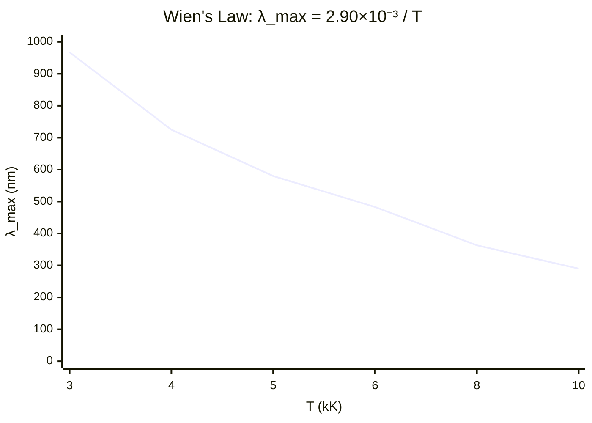

# Wien's Displacement Law

## Statement

The wavelength at which a black body emits most strongly is inversely
proportional to its absolute temperature: hotter bodies peak at shorter
wavelengths.

## Equation

$$\lambda_{max} T = 2.90 \times 10^{-3} \ \text{m K}$$

## Symbols and Units

- λ_max: wavelength of peak emission — m
- T: absolute (thermodynamic) temperature of the surface — K
- Wien constant: $2.90 \times 10^{-3}$ — m K

## Conditions

- The body radiates approximately as a black body (stars are good
  approximations)
- T must be the absolute temperature in kelvin

## Physical Meaning

A star's continuous spectrum has a peak wavelength that reveals its surface
temperature. A red star is cooler (peak at longer λ); a blue-white star is
hotter (peak at shorter λ). The cosmic microwave background peaks in the
microwave region, implying a temperature of about 2.7 K — key evidence for
the [[Big-Bang-Theory]].

## Foundation Link

Builds on the GCSE idea that hotter objects glow from red to white/blue,
made quantitative as a relationship between peak [[Wavelength]] and
temperature.

## How to Use

Measure λ_max from a star's spectrum, then $T = \frac{2.90 \times 10^{-3}}{\lambda_{max}}$. Combine
with [[Stefans-Law]] ($L = 4\pi r^2 \sigma T^4$) to estimate stellar radius.

## Derivation or Explanation

Follows from differentiating the black-body (Planck) spectral distribution
and setting the derivative to zero — the derivation itself is beyond A-Level;
only the result is required.

## Related Quantities

- [[Wavelength]]
- [[Luminosity]]

## Related Models

- [[Stellar-Evolution]]

## Applications

- Determining stellar surface temperatures
- Estimating the CMB temperature

## Frontier Links

- [[Cosmology-Map]]

## Common Mistakes

- Using temperature in °C instead of kelvin
- Confusing peak wavelength with total power (that is [[Stefans-Law]])
- Reading the law backwards (hotter = longer wavelength)

## Visuals

### Peak wavelength vs temperature

*Figure: Hotter stars peak at shorter wavelengths (blue-white); cooler stars peak at longer wavelengths (red). The Sun (~5800 K) peaks near 500 nm (visible green).*
*Source: Authored for this vault (CC0). No external copyright.*

### From Wikipedia

<!-- wiki-images: yes -->

#### Wiens law

![[_attachments/05_Laws-and-Results/Wiens-Displacement-Law--wiki-wiens-law.svg]]
*Figure: from Wikipedia article "Wien's displacement law".*
*Source: Wikimedia Commons — [Wiens_law.svg](https://commons.wikimedia.org/wiki/File:Wiens_law.svg). Retrieved 2026-05-20.*

#### 230617T161650planckParam6000

![[_attachments/05_Laws-and-Results/Wiens-Displacement-Law--wiki-230617t161650planckparam6000.svg]]
*Figure: from Wikipedia article "Wien's displacement law".*
*Source: Wikimedia Commons — [230617T161650planckParam6000.svg](https://commons.wikimedia.org/wiki/File:230617T161650planckParam6000.svg). Retrieved 2026-05-20.*

#### Blacksmith at work02

![[_attachments/05_Laws-and-Results/Wiens-Displacement-Law--wiki-blacksmith-at-work02.jpg]]
*Figure: from Wikipedia article "Wien's displacement law".*
*Source: Wikimedia Commons — [Blacksmith at work02.jpg](https://commons.wikimedia.org/wiki/File:Blacksmith_at_work02.jpg). Retrieved 2026-05-20.*

## Source Trace

- Source: OpenStax College Physics; HyperPhysics; NASA educational material — no copied text
- OCR alignment: [[OCR-Physics-A-H556-Specification]]
- Section/Page: OCR M5.5 Astrophysics and cosmology
