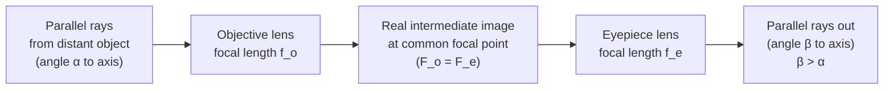

# Astronomical Telescope

## Core Idea

An **astronomical (refracting) telescope** in normal adjustment uses two converging lenses arranged on a common axis — an **objective** of long focal length and an **eyepiece** of short focal length — to make distant objects appear at a larger angle at the eye.

## Assumptions

- The object is effectively at infinity (parallel rays enter the objective).
- Both lenses are thin converging lenses on a common optical axis.
- "Normal adjustment": the final image is formed at infinity so the relaxed eye views it without strain.
- The eye is placed close to the eyepiece (at the exit pupil).
- Lenses are aberration-free (idealisation).

## Quantities Involved

- $f_o$ — focal length of the **objective lens** (m). Long, to gather light from far away and form a small real image close to its focal point.
- $f_e$ — focal length of the **eyepiece lens** (m). Short, to act as a magnifier on that intermediate image.
- $L$ — separation between the two lenses (m). In normal adjustment: $L = f_o + f_e$.
- $\alpha$ — angle subtended at the unaided eye by the distant object (rad). See [[Radian]].
- $\beta$ — angle subtended at the eye by the final image (rad).
- $M$ — **angular magnification** (dimensionless).

## Key Equations

In normal adjustment:

$$
M \;=\; \frac{\beta}{\alpha} \;=\; \frac{f_o}{f_e}
$$

- $M$: angular magnification (no unit).
- $\beta$: angle subtended by the final image at the eye (rad).
- $\alpha$: angle subtended by the object at the unaided eye (rad).
- $f_o, f_e$: objective and eyepiece focal lengths (m).

Condition: parallel light in, parallel light out (normal adjustment).

Related: [[Ray-Model-of-Light]], [[Refractive-Index]].

## When to Use

- Visual astronomy with a refractor.
- Any AQA exam question asking for separation of lenses or angular magnification of a two-lens telescope in normal adjustment.
- Estimating image size at the eye for a known object angle.

## Limits of the Model

- Real lenses introduce **chromatic aberration** (different wavelengths focus at different points — see [[Reflecting-Telescope]] for why mirrors avoid this).
- Large objective diameters become heavy and sag under gravity, limiting refractor size.
- Field of view falls off; the thin-lens equation is only approximate near the axis.
- The "angle at the unaided eye" assumes the object is far enough that $\alpha \approx h/d$ is small.

## Foundation Link

Builds on the GCSE idea that a converging lens forms a real image of a distant object near its focal plane, and on the [[Ray-Model-of-Light]] used to trace rays through thin lenses.

## Related Methods

- [[Ray-Diagram]]
- Small-angle approximation (using [[Radian]] measure).

## Related Applications

- Visual observation of planets, the Moon, double stars.
- Spotting scopes and historical refractors.
- See [[Astronomical-Distances]] for what the telescope is pointed at.

## Frontier Links

- [[Cosmology-Map]] — telescopes as our primary tool for surveying the universe.

## Common Mistakes

- Writing $M = f_e/f_o$ (inverted).
- Forgetting that normal adjustment requires the final image at infinity, not at the near point.
- Using degrees in $M = \beta/\alpha$ when the rest of the working uses radians (the ratio is fine, but be consistent).
- Confusing **angular** magnification with **linear** magnification.

## Visuals

### Ray diagram — refracting telescope in normal adjustment

*Figure: In normal adjustment the objective's focal point coincides with the eyepiece's focal point, so parallel light enters and parallel light leaves; lens separation is $f_o + f_e$.*
*Source: Authored for this vault (CC0). No external copyright.*

### From Wikimedia

<!-- wiki-images: yes -->

#### Yerkes 40-inch refracting telescope
![[_attachments/06_Models/Astronomical-Telescope--wiki-yerkes-refractor.jpg]]
*Figure: The Yerkes Observatory refractor — the largest astronomical refracting telescope ever built — showing the long tube needed for a large objective focal length $f_o$.*
*Source: Wikimedia Commons — [Yerkes 40 inch Refractor Telescope-2006.jpg](https://commons.wikimedia.org/wiki/File:Yerkes_40_inch_Refractor_Telescope-2006.jpg) — Public domain — user Kb9vrg. Retrieved 2026-06-27.*

## Source Trace

- Source: [[AQA-Physics-7407-7408-Specification]] §3.9.1.1 (Astrophysics — Telescopes)
- Public source: HyperPhysics ("Astronomical Telescope"); OpenStax College Physics, Ch. 26 (Vision and Optical Instruments).
- Section/Page: Spec p. (Astrophysics option).
