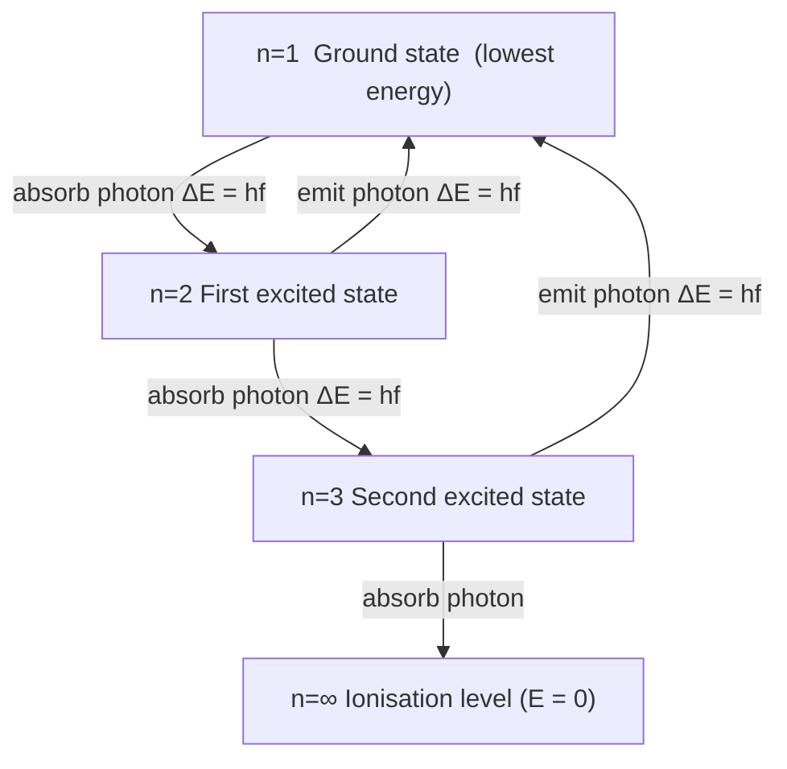

# Bohr Model

## Core Idea

The Bohr model keeps the nucleus-and-electrons picture of the [[Nuclear-Model]]
but adds a key restriction: electrons can only occupy certain allowed orbits,
each with a fixed, discrete energy. The atom can only gain or lose energy in
jumps between these levels.

## Assumptions

- Electrons orbit the nucleus only in certain stable, allowed orbits without
  radiating energy.
- Each allowed orbit corresponds to a definite electron energy — a discrete
  energy level.
- An electron can move between levels only by absorbing or emitting a photon
  whose energy exactly equals the energy difference.
- The lowest level (ground state) is the most stable; higher levels are
  excited states.

## Quantities Involved

- [[Photon-Energy]]
- [[Energy-Levels]]

## Key Equations

- Photon emitted or absorbed in a transition:
  ΔE = E₂ − E₁ = hf, where h is the Planck constant
  (6.63 × 10⁻³⁴ J s) and f is the photon frequency (Hz).
- Equivalently ΔE = hc/λ, linking the change to the photon [[Wavelength]] λ
  (c = speed of light).

## When to Use

Use the Bohr model to explain line spectra, why atoms emit and absorb only
certain wavelengths, [[Ionisation]], and the link between atomic transitions
and [[Photon-Energy]].

## Limits of the Model

- It works cleanly only for hydrogen-like (single-electron) atoms.
- It still pictures electrons as particles in definite orbits; full quantum
  mechanics replaces orbits with probability distributions (orbitals).
- It does not predict relative spectral line intensities or fine structure.

## Foundation Link

It extends the [[Nuclear-Model]] by explaining the stability of atoms and the
existence of [[Energy-Levels]], which the purely nuclear picture cannot do.

## Related Methods

- Calculating photon frequency or wavelength from an energy-level diagram
- Reading emission and absorption line spectra

## Related Applications

- Spectral analysis of light from stars and gases

## Frontier Links

- Quantum-mechanical orbitals and the Schrödinger picture (beyond A-Level)

## Common Mistakes

- Treating energy levels as evenly spaced.
- Forgetting that only the exact energy difference is emitted or absorbed, not
  any value (see [[Confusing-Photon-Energy-and-Intensity]]).

## Visuals

### Bohr Model: Energy Level Transitions

*Figure: Electron transitions between discrete energy levels; each arrow represents absorption or emission of a photon with energy exactly equal to the level difference.*
*Source: Authored for this vault (CC0). No external copyright.*

## Source Trace

OpenStax College Physics; HyperPhysics; The Physics Classroom — no copied text.

OCR alignment: [[OCR-Physics-A-H556-Specification]]
