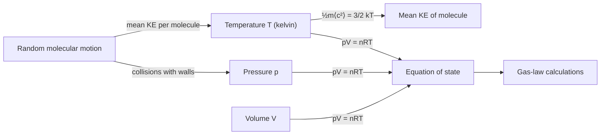

# Ideal Gas Model

## Core Idea

The ideal gas model describes a gas as a large number of identical point molecules in rapid random motion, exerting no forces on each other except during perfectly elastic collisions. Pressure arises purely from molecules colliding with and rebounding off the container walls. With these simplifications the macroscopic state of the gas is captured by one equation of state, *pV = nRT*, and pressure can be derived from molecular motion via kinetic theory.

## Assumptions

- Molecules are point particles with negligible volume compared with the container.
- No intermolecular forces except during collisions.
- All collisions (molecule–molecule and molecule–wall) are perfectly elastic.
- Motion is random; large number of molecules so statistics apply.
- Time of collision is negligible compared with time between collisions.

## Quantities Involved

- Pressure *p* (Pa)
- Volume *V* (m³)
- Absolute temperature *T* (K)
- Amount of substance *n* (mol) or number of molecules *N*
- Mean square speed *⟨c²⟩* (m² s⁻²)

## Key Equations

- $pV = nRT$ (equation of state)
- $pV = \frac{1}{3} N m \langle c^2 \rangle$ (kinetic theory)
- Mean kinetic energy per molecule: $\frac{1}{2}m\langle c^2 \rangle = \frac{3}{2}kT$

## When to Use

Use it for gases at low pressure and well above their condensation temperature: gas law calculations, balloon and syringe problems, and linking temperature to molecular kinetic energy.

## Limits of the Model

It fails at high pressure or low temperature, where molecular volume and intermolecular attraction become significant and the gas approaches liquefaction. Real gases deviate from *pV = nRT* under these conditions; corrected equations of state are then required (beyond A-Level scope).

## Foundation Link

This extends the GCSE particle model of gases (tiny particles bouncing around, pressure from collisions) into the quantitative kinetic theory and equation of state.

## Related Methods

- [[Applying-Conservation-of-Energy]]
- [[Finding-Gradient-from-a-Graph]]

## Related Applications

- Gas law and thermodynamics problems

## Frontier Links

- None at A-Level depth.

## Common Mistakes

- Using Celsius instead of kelvin in gas laws.
- Forgetting collisions must be perfectly elastic in the model.
- Applying it to gases near liquefaction.

## Visuals

### Ideal Gas Model: Concept Map

*Figure: How molecular motion links to macroscopic quantities p, V, T through the ideal gas model and kinetic theory.*
*Source: Authored for this vault (CC0). No external copyright.*

## Source Trace

- Source: OpenStax College Physics; The Physics Classroom; Isaac Physics — paraphrased, no copied text.
- OCR alignment: [[OCR-Physics-A-H556-Specification]]
