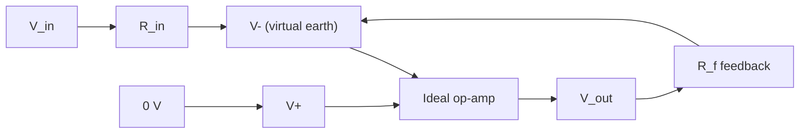

# Ideal Operational Amplifier

## Core Idea

An **operational amplifier** ("op-amp") is a high-gain differential amplifier. The **ideal op-amp** is a simplifying model that lets us predict the behaviour of feedback circuits with a few lines of algebra, ignoring the messy details of the real chip.

## Assumptions

The ideal op-amp has:

1. **Infinite open-loop voltage gain.** A vanishingly small differential input voltage drives a finite output. In a feedback circuit this forces $V_{+} - V_{-} \to 0$.
2. **Infinite input impedance.** No current flows into the $V_{+}$ or $V_{-}$ input pins.
3. **Zero output impedance.** The output can supply any current the load demands without its voltage sagging.
4. **Infinite bandwidth.** Gain is the same at every frequency.
5. **Differential input.** The output depends only on the difference $V_{+} - V_{-}$, not on either input's voltage relative to ground.
6. **Zero offset.** With both inputs equal, the output is exactly zero.

Symbols:

- $V_{+}$: non-inverting input voltage (V)
- $V_{-}$: inverting input voltage (V)
- $V_{out}$: output voltage (V)
- $A$: open-loop gain (dimensionless; ideally $\to \infty$)

In the ideal model: $V_{out} = A(V_{+} - V_{-})$ with $A \to \infty$, applied subject to the chip's supply rails.

## Quantities Involved

- [[Potential-Difference]]
- [[Resistance]]
- [[Current]]

## Key Equations

Two consequences are used constantly in feedback analysis (the "golden rules"):

- $V_{+} = V_{-}$ (the **virtual short** — for any practical feedback circuit, the two inputs sit at the same voltage).
- $I_{+} = I_{-} = 0$ (no current into the input pins).

In the **inverting** configuration the $V_{+}$ pin is tied to ground, so $V_{-}$ also sits at 0 V. This node is called the **virtual earth**: it has the voltage of ground but is not connected to it.

## When to Use

Use the ideal op-amp model whenever:

- The op-amp is connected with **negative feedback** (output tied back to $V_{-}$ through a resistor network).
- The signal frequency is well below the chip's bandwidth.
- The output is not driven into saturation.

In those conditions the model predicts circuit gain to within a few percent of reality.

## Limits of the Model

Real op-amps differ in important ways:

- Open-loop gain is large but finite (typically $10^{5}$ to $10^{6}$).
- Input impedance is large but finite; a tiny bias current does flow.
- Output impedance is small but nonzero.
- Bandwidth is finite: gain falls above a corner frequency (gain-bandwidth product is constant).
- Output saturates near the supply rails ($\pm V_{cc}$): once $V_{out}$ would exceed the rails, it clips.
- There is a small input offset voltage and bias current at the inputs.

When any of these matters (high frequency, very high gain, low signal, precision DC) you must go beyond the ideal model.

## Foundation Link

This model extends the simple amplifier idea (a black box with input/output voltages and a gain) by listing exactly which idealisations are made. It connects to the [[Potential-Divider]]: a resistor pair around an op-amp sets the closed-loop gain in the same arithmetic way a divider sets an output voltage.

## Related Methods

- Applying the golden rules to find closed-loop gain.
- Drawing the virtual-earth node for inverting circuits.

## Related Applications

- [[Operational-Amplifier-Circuits]]
- [[Signal-Processing]]
- [[Sensors]] — op-amps buffer and amplify sensor outputs.

## Frontier Links

- [[Semiconductor-Physics-Map]] — real op-amps are built from many MOSFETs and BJTs.

## Common Mistakes

- Forgetting that the virtual-short rule only holds with **negative** feedback in place.
- Treating the inverting input as truly grounded when it is only at the virtual-earth potential.
- Assuming the output can be larger than the supply voltage — it cannot; it clips at the rails.
- Confusing differential input voltage with the voltage of either input pin to ground.

## Visuals

### Ideal op-amp with negative feedback

*Figure: negative feedback through R_f pins the inverting input at the same voltage as the grounded non-inverting input.*
*Source: Authored for this vault (CC0). No external copyright.*

## Source Trace

- Source: [[AQA-Physics-7407-7408-Specification]] §3.13
- Public source: HyperPhysics; All About Circuits
- Section/Page: Electronics — ideal operational amplifier
