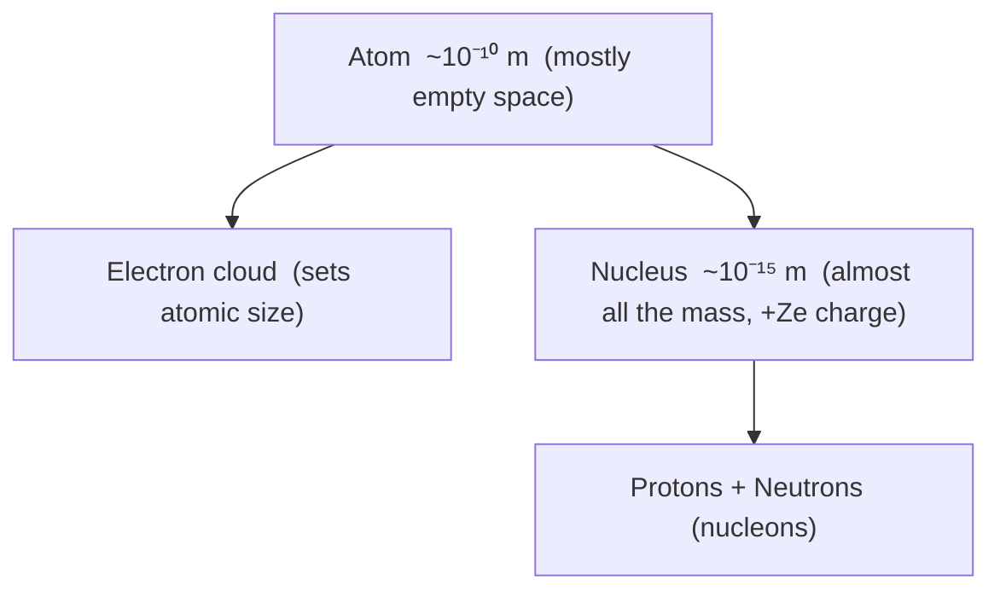

# Nuclear Model

## Core Idea

The nuclear model treats the atom as a very small, dense, positively charged
nucleus containing almost all of the mass, surrounded by a comparatively huge,
mostly empty region in which the electrons are found. It is the standard
working picture of the atom for A-Level.

## Assumptions

- The nucleus is point-like compared with the atom (radius ~10⁻¹⁵ m versus
  ~10⁻¹⁰ m for the atom).
- Almost all the atomic mass is concentrated in the nucleus (protons and
  neutrons).
- The nucleus carries the whole positive charge, +Ze, where Z is the proton
  number and e is the elementary charge (1.60 × 10⁻¹⁹ C).
- Electrons occupy the space outside the nucleus and carry the balancing
  negative charge.
- Most of the atom is empty space, so most fast particles fired at it pass
  almost straight through.

## Quantities Involved

- [[Density]]
- [[Atomic-Structure]]

## Key Equations

- Nuclear charge: Q = +Ze (Z = proton number, e = elementary charge)
- Approximate nuclear radius scaling: R = r₀A^(1/3), where A is the nucleon
  number and r₀ ≈ 1.2 × 10⁻¹⁵ m.

## When to Use

Use this model whenever a problem treats the atom as nucleus-plus-electrons:
explaining alpha-particle scattering, estimating nuclear size and density,
introducing isotopes, or setting up [[Radioactive-Decay]], [[Nuclear-Fission]]
and [[Nuclear-Fusion]].

## Limits of the Model

- It does not explain why electrons do not spiral into the nucleus — that
  needs the [[Bohr-Model]] and later quantum mechanics.
- It says nothing about discrete electron [[Energy-Levels]] or atomic spectra.
- It does not describe the forces that hold the nucleus together (the strong
  nuclear force is beyond the basic picture).

## Foundation Link

It refines the earlier "tiny solar-system atom" idea by giving real evidence
(Geiger–Marsden alpha scattering) for a concentrated nucleus, extending
[[The-Nuclear-Atom]].

## Related Methods

- Estimating nuclear density from mass number and radius
- Interpreting alpha-particle deflection angles

## Related Applications

- [[Nuclear-Fission]]
- [[Nuclear-Fusion]]

## Frontier Links

- Quark substructure of protons and neutrons (out of A-Level scope)

## Common Mistakes

- Picturing the nucleus as a large fraction of the atom rather than a tiny
  speck.
- Forgetting that the electrons, not the nucleus, set the atom's overall size.

## Visuals

### Nuclear Model: Atom Scale Comparison

*Figure: The nucleus is roughly 10⁵ times smaller than the atom in linear dimension; the atom is mostly empty space, explaining why most alpha particles pass straight through (Geiger–Marsden experiment).*
*Source: Authored for this vault (CC0). No external copyright.*

## Source Trace

OpenStax College Physics; HyperPhysics; The Physics Classroom — no copied text.

OCR alignment: [[OCR-Physics-A-H556-Specification]]
