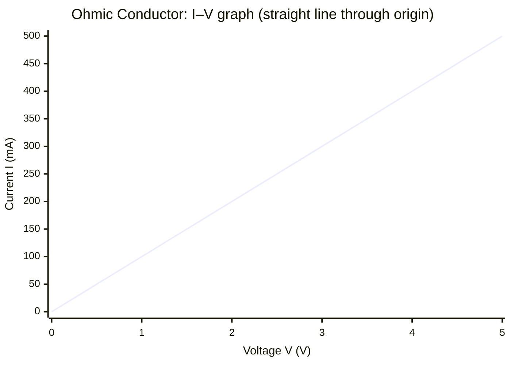

# Ohmic Conductor Model

## Core Idea

The ohmic conductor model treats a component as one whose current is exactly proportional to the potential difference across it, provided physical conditions (especially temperature) stay constant. Its resistance is therefore a single fixed number and its current–voltage graph is a straight line through the origin. A metal wire at constant temperature is the standard example. This idealisation underpins [[Ohms-Law]] and the simple use of $V = IR$ in circuit analysis.

## Assumptions

- Temperature (and other physical conditions) is constant.
- Resistance *R* is independent of current and voltage.
- The *I–V* characteristic is linear through the origin.
- The material is homogeneous along the conductor.

## Quantities Involved

- Current *I* (A)
- Potential difference *V* (V)
- Resistance *R* (Ω)

## Key Equations

- [[Ohms-Law]]: $V = IR$
- $R = \frac{\rho L}{A}$ (resistance from resistivity, length, cross-section)

## When to Use

Use it for metallic conductors and resistors operating within their normal temperature range, and as the default assumption when a circuit problem does not flag a non-ohmic component.

## Limits of the Model

It fails for components whose resistance changes with conditions: filament lamps (resistance rises as the filament heats), diodes and LEDs (one-directional, non-linear), thermistors and LDRs (resistance depends on temperature/light). For these the *I–V* graph is curved and *R* is not constant.

## Foundation Link

This formalises the GCSE result that "for a fixed resistor, current is proportional to voltage", attaching the precise condition of constant temperature.

## Related Methods

- [[Analysing-Circuit-Diagrams]]
- [[Finding-Gradient-from-a-Graph]]

## Related Applications

- [[Potential-Divider]]

## Frontier Links

- None at A-Level depth.

## Common Mistakes

- Assuming ohmic behaviour for lamps, diodes, or thermistors.
- Forgetting the constant-temperature condition.
- Reading resistance as the gradient of an *I–V* graph instead of *V/I* at a point.

## Visuals

### I–V Graph: Ohmic Conductor (Linear Characteristic)

*Figure: A straight line through the origin confirms ohmic behaviour; resistance R = V/I = constant (not the gradient ΔI/ΔV, which equals 1/R).*
*Source: Authored for this vault (CC0). No external copyright.*

## Source Trace

- Source: OpenStax College Physics; The Physics Classroom; Isaac Physics — paraphrased, no copied text.
- OCR alignment: [[OCR-Physics-A-H556-Specification]]
