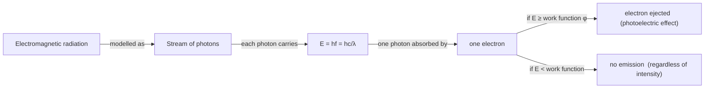

# Photon Model

## Core Idea

The photon model represents electromagnetic radiation as a stream of discrete energy packets called photons, each carrying energy *E = hf* proportional to its frequency. Unlike the continuous [[Wavefront-Model]], energy is delivered in indivisible lumps: a single photon interacts with a single electron in an all-or-nothing exchange. This particle-like picture is essential for explaining the [[Photoelectric-Effect]], where wave theory fails to predict the observed threshold frequency and instantaneous emission.

## Assumptions

- Light energy comes in discrete quanta of size *E = hf*.
- One photon interacts with one electron at a time.
- A photon is either absorbed entirely or not at all.
- Photon energy depends only on frequency, not on intensity.

## Quantities Involved

- Photon energy *E* (J)
- Frequency *f* (Hz) and wavelength *λ* (m)
- Planck constant *h* (J s)
- Work function *φ* (J) of the metal

## Key Equations

- *E = hf = hc/λ*
- [[Photoelectric-Equation]]: *hf = φ + ½mv²_max*

## When to Use

Use it for the photoelectric effect, line spectra and energy levels, threshold frequency arguments, and any situation where light delivers energy in discrete amounts to individual electrons or atoms.

## Limits of the Model

It does not explain interference and diffraction, which need the [[Wavefront-Model]]. Neither classical model alone is complete: light shows wave–particle duality, behaving as waves in propagation experiments and as particles in absorption/emission. The photon model is not a tiny "billiard ball" of light.

## Foundation Link

This extends the GCSE idea that "different colours of light carry different energy" into the precise quantised relation *E = hf*, explaining why only high-frequency light ejects electrons.

## Related Methods

- [[Using-the-Photoelectric-Equation]]

## Related Applications

- Photoelectric cells and photodiodes

## Frontier Links

- Wave–particle duality (beyond A-Level depth)

## Common Mistakes

- Thinking brighter (more intense) low-frequency light can eject electrons.
- Treating photon energy as depending on intensity.
- Using the photon model to explain diffraction.

## Visuals

### Photon Model: Energy Quantisation Chain

*Figure: The photon model links radiation frequency to discrete energy packets; intensity means more photons per second, not more energy per photon.*
*Source: Authored for this vault (CC0). No external copyright.*

## Source Trace

- Source: OpenStax College Physics; The Physics Classroom; Isaac Physics — paraphrased, no copied text.
- OCR alignment: [[OCR-Physics-A-H556-Specification]]
