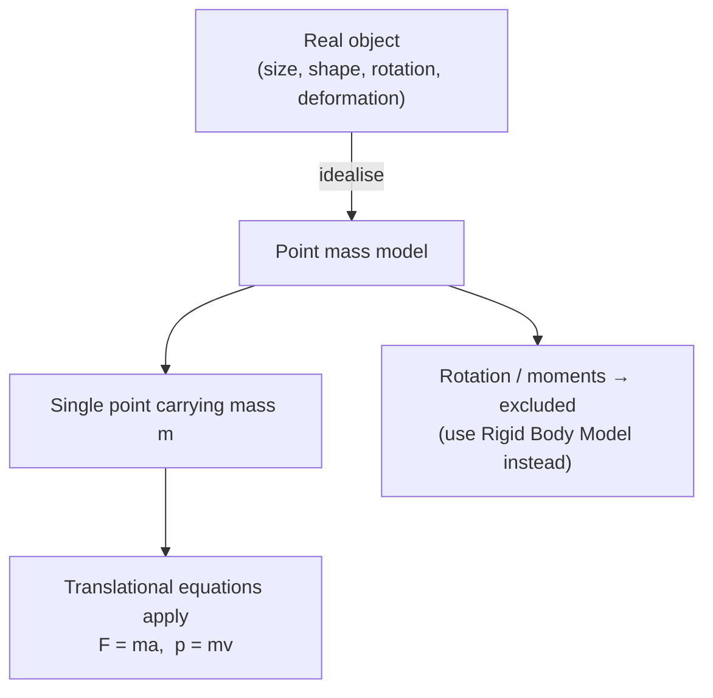

# Point Mass Model

## Core Idea

The point mass model treats an object as a single point that carries all of the object's mass but has no size, shape, or internal structure. All forces are taken to act at that point, so the object cannot rotate or deform — it can only translate. This is the most basic modelling step in mechanics: it lets us apply [[Newton-Second-Law]] and the SUVAT framework without worrying about torque, moments, or where on the body a force is applied. A car, a planet, or a falling raindrop can each be a point mass when only their overall motion matters.

## Assumptions

- All mass is concentrated at one point (often the centre of mass).
- The object has no extent, so no rotation or spin is modelled.
- The object does not deform; internal forces are ignored.
- All external forces are applied at the single point.

## Quantities Involved

- Mass *m* (kg, scalar)
- [[Velocity]] (m s⁻¹, vector)
- [[Acceleration]] (m s⁻² , vector)
- [[Force]] (N, vector)
- [[Momentum]] (kg m s⁻¹, vector)

## Key Equations

- [[Newton-Second-Law]]: *F = ma*
- *p = mv* (see [[Momentum]])

## When to Use

Use it when only the translational motion of the object matters and its size is negligible compared with distances involved — orbital mechanics, projectile flight, collisions analysed by [[Conservation-of-Momentum]], or any problem where rotation is irrelevant.

## Limits of the Model

It fails when size, shape, or rotation matter: a spinning wheel, a toppling ladder (needs moments), a deforming spring, or aerodynamic effects that depend on orientation. Rigid-body or extended-body models are then required.

## Foundation Link

This formalises the GCSE habit of drawing an object as a dot with arrows. It makes precise the assumption already used implicitly whenever a body is reduced to "a mass" in a force calculation.

## Related Methods

- [[Drawing-Free-Body-Diagrams]]
- [[Applying-Newton-Second-Law]]

## Related Applications

- [[Projectile-Motion]]

## Frontier Links

- None at A-Level depth.

## Common Mistakes

- Using a point mass where rotation or moments matter.
- Forgetting that the model places all forces at one point.

## Visuals

### Point Mass Model: What the Simplification Removes

*Figure: The point mass reduces a real object to a mass at a point; forces, momentum, and Newton's second law apply without any turning effects.*
*Source: Authored for this vault (CC0). No external copyright.*

## Source Trace

- Source: OpenStax College Physics; The Physics Classroom; Isaac Physics — paraphrased, no copied text.
- OCR alignment: [[OCR-Physics-A-H556-Specification]]
