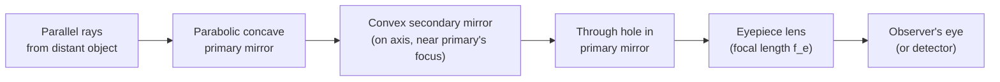

# Reflecting Telescope

## Core Idea

A **reflecting telescope** uses a curved **mirror** instead of a lens as the light-gathering element. The standard A-Level example is the **Cassegrain** arrangement: a large **parabolic concave primary mirror** collects light and reflects it onto a small **convex secondary mirror**, which sends the converging beam back through a hole in the primary to the **eyepiece**.

## Assumptions

- The primary mirror is **parabolic** (so all parallel rays on-axis focus to a single point — no spherical aberration on-axis).
- The secondary mirror is **convex** and placed inside the focal length of the primary.
- Object at infinity (parallel incoming rays).
- The eyepiece behaves as in the [[Astronomical-Telescope]] (acts as a magnifier on the intermediate image).
- Obstruction by the secondary mirror is small enough to ignore for ray geometry.

## Quantities Involved

- $f_o$ — effective focal length of the **objective** (primary + secondary system) (m).
- $f_e$ — focal length of the **eyepiece** (m).
- $D$ — diameter of the primary mirror (m); sets light-collecting power (see [[Resolving-Power]]).

## Key Equations

Same angular magnification result as for the refractor in normal adjustment:

$$
M \;=\; \frac{f_o}{f_e}
$$

- $M$: angular magnification (no unit).
- $f_o$: effective objective focal length (m).
- $f_e$: eyepiece focal length (m).

Light-collecting power $\propto D^2$ (area of primary).

## When to Use

- Any large astronomical telescope (research observatories overwhelmingly use reflectors).
- AQA questions asking for the **structure** of a Cassegrain reflector, or for a **comparison** with a refractor.

## Limits of the Model

- The secondary mirror **obstructs** part of the incoming beam, reducing intensity and adding diffraction effects.
- Mirrors must be precisely figured; surfaces tarnish and need re-coating.
- Off-axis rays still suffer from **coma** even with a parabolic primary.
- Treating the two-mirror system as a single "objective" of focal length $f_o$ is an idealisation.

## Foundation Link

Builds on the GCSE law of reflection ([[Law-of-Reflection]]) and on the [[Ray-Model-of-Light]]: a concave mirror brings parallel rays to a focus, just as a converging lens does, but **without refraction** — so the optical path does not depend on wavelength.

## Related Methods

- [[Ray-Diagram]] (with reflection at curved mirrors).

## Related Applications

- Hubble Space Telescope and almost all major ground-based optical telescopes (Cassegrain or its variants).
- Amateur Newtonian reflectors (related design, different secondary).

## Frontier Links

- [[Cosmology-Map]] — large reflectors enable deep-sky surveys and cosmological measurements.

## Relative Merits — Reflector vs Refractor

| Feature | Refractor ([[Astronomical-Telescope]]) | Reflector (Cassegrain) |
|---|---|---|
| Chromatic aberration | Yes — different wavelengths refract differently | **None** — reflection angle does not depend on wavelength |
| Spherical aberration | Possible with simple spherical lenses | Eliminated on-axis by a **parabolic** primary |
| Maximum size | Limited — large lenses sag under their own weight and can only be supported at the rim | Can be very large — a mirror is supported across its whole back surface |
| Weight per aperture | Heavy (glass throughout) | Lighter (only the front surface must be optically figured) |
| Light path | Straight through | Folded — compact tube |
| Obstruction | None on-axis | Secondary mirror blocks some incoming light |
| Maintenance | Sealed tube, low maintenance | Mirror surfaces tarnish, need re-aluminising |

## Common Mistakes

- Claiming reflectors have "no aberrations" — they still suffer **coma** off-axis and small spherical aberration if the mirror is spherical rather than parabolic.
- Forgetting that the eyepiece is still a lens, so the eyepiece can introduce some chromatic effects.
- Saying refractors are "better because they have no obstruction" without mentioning chromatic aberration and size limits.

## Visuals

### Cassegrain reflecting telescope — light path

*Figure: A Cassegrain reflector folds the light path: the parabolic primary converges light onto the convex secondary, which sends it back through a central hole in the primary to the eyepiece.*
*Source: Authored for this vault (CC0). No external copyright.*

## Source Trace

- Source: [[AQA-Physics-7407-7408-Specification]] §3.9.1.2 (Astrophysics — Reflecting telescopes; relative merits)
- Public source: HyperPhysics ("Reflecting Telescope; Cassegrain"); OpenStax College Physics, Ch. 26 (Vision and Optical Instruments).
- Section/Page: Spec p. (Astrophysics option).
