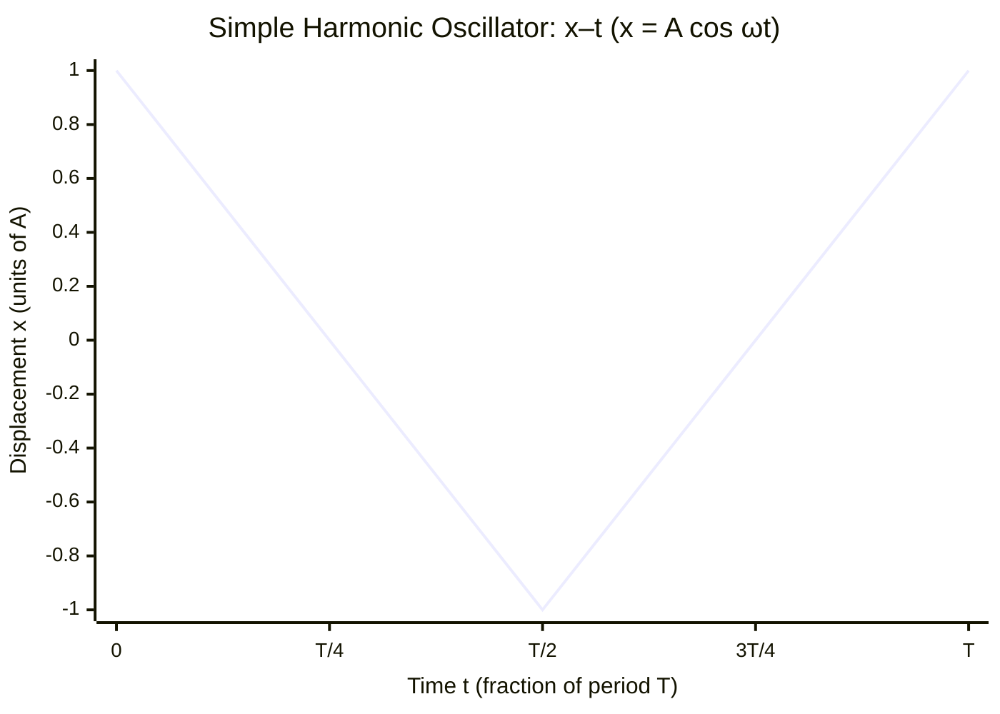

# Simple Harmonic Oscillator

## Core Idea

The simple harmonic oscillator model describes any system where the restoring force (or acceleration) is directly proportional to displacement from equilibrium and always directed back toward it: $a = -\omega^2 x$. This single condition produces sinusoidal motion with a period independent of amplitude (isochronous). A mass on an [[Ideal-Spring-Model|ideal spring]] and a small-angle pendulum are the canonical examples. The model is powerful because vastly different physical systems share the same mathematics once they satisfy the $a \propto -x$ condition.

## Assumptions

- Restoring force is proportional to displacement: $F = -kx$, hence $a = -\omega^2 x$.
- No damping (no energy lost to friction or drag).
- Oscillation amplitude is small enough that the linear restoring law holds (e.g. small-angle pendulum).
- The system has a single, well-defined equilibrium position.

## Quantities Involved

- Displacement *x* (m), amplitude *A* (m)
- Angular frequency *ω* (rad s⁻¹), period *T* (s), frequency *f* (Hz)
- [[Acceleration]] *a* (m s⁻²)
- [[Energy-Quantity|Energy]]: interchange of kinetic and potential

## Key Equations

- $a = -\omega^2 x$
- $x = A \cos(\omega t)$, $v_{max} = \omega A$, $a_{max} = \omega^2 A$
- $T = 2\pi\sqrt{\frac{m}{k}}$ (spring), $T = 2\pi\sqrt{\frac{L}{g}}$ (pendulum)
- Total energy constant (see [[Conservation-of-Energy]])

## When to Use

Use it for mass–spring systems, small-amplitude pendulums, vibrating molecules modelled as bonds, and any system whose graph of acceleration against displacement is a straight line with negative gradient.

## Limits of the Model

Real oscillators are damped, so amplitude decays and the ideal model overestimates long-term motion. Large amplitudes break the linear restoring law (e.g. a wide-swing pendulum is no longer isochronous). Driven and resonant behaviour needs the model extended with forcing and damping terms.

## Foundation Link

This extends the everyday observation of repeating back-and-forth motion (swings, vibrating rulers) into a precise condition and a universal set of equations.

## Related Methods

- [[Finding-Gradient-from-a-Graph]]
- [[Applying-Conservation-of-Energy]]

## Related Applications

- [[Simple-Harmonic-Motion-MOC]]

## Frontier Links

- None at A-Level depth.

## Common Mistakes

- Assuming SHM without checking $a \propto -x$.
- Thinking period depends on amplitude.
- Ignoring damping in real systems.

## Visuals

### SHM: Displacement–Time Graph (sinusoidal motion)

*Figure: Displacement varies sinusoidally with time; period T is independent of amplitude A (isochronous); velocity is greatest at x = 0, zero at x = ±A.*
*Source: Authored for this vault (CC0). No external copyright.*

## Source Trace

- Source: OpenStax College Physics; The Physics Classroom; Isaac Physics — paraphrased, no copied text.
- OCR alignment: [[OCR-Physics-A-H556-Specification]]
