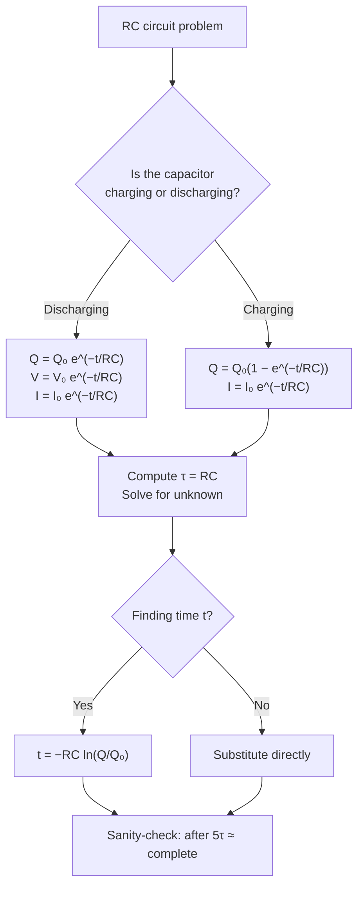

# Analysing Capacitor Charge and Discharge

## Purpose

To find the charge, voltage, current, or time in an RC circuit during exponential charging or discharging, and to determine the [[Time-Constant]] or [[Capacitance]] from data.

## When to Use

- A [[Capacitor]] is connected to a resistor and a switch.
- The question gives or asks for voltage/charge/current at a given time.
- Data of voltage against time is supplied and τ, R, or C is required.

## Prerequisites

- [[Capacitance]]
- [[Capacitor-Discharge-Equation]]
- [[Time-Constant]]

## Method

1. Identify the circuit values: R, C, and the initial charge Q₀ = C V₀ (or initial voltage V₀, initial current I₀ = V₀/R).
2. Compute the time constant τ = RC, ensuring R is in Ω and C in F (convert μF, nF).
3. Choose the right exponential form:
   - Discharge: Q = Q₀ e^(−t/RC); likewise V = V₀ e^(−t/RC), I = I₀ e^(−t/RC).
   - Charging: Q = Q₀(1 − e^(−t/RC)) towards the final charge; current still decays as I = I₀ e^(−t/RC).
4. Substitute and solve. To find time, take natural logs: t = −RC ln(Q/Q₀).
5. For experimental data, plot ln V against t (see [[Capacitor-Discharge-Graph]]); the gradient is −1/RC, so τ = −1/gradient and hence C = τ/R.
6. Sanity-check: after 1τ ≈ 37% remains (discharge); after 5τ treat as complete.

## Worked Example

A 100 μF capacitor charged to 12 V discharges through 47 kΩ. τ = (47000)(100×10⁻⁶) = 4.7 s. After 5 s: V = 12 e^(−5/4.7) ≈ 12 × 0.345 ≈ 4.1 V. (Link a full worked example if one exists.)

## Why It Works

Discharge current is proportional to the remaining charge (I = V/R = Q/RC), so the rate of loss is proportional to the amount present. This self-limiting feedback is the defining property of exponential decay, giving the e^(−t/RC) solution.

## Common Mistakes

- Not converting μF/nF to farads before computing τ.
- Using the discharge form for the charge build-up (charge rises as 1 − e^(−t/RC)).
- Forgetting the minus sign when taking logs to solve for t.

## Related Quantities

- [[Capacitance]]
- [[Time-Constant]]
- [[Charge]]
- [[Potential-Difference]]

## Related Laws or Results

- [[Capacitor-Discharge-Equation]]

## Related Problem Types

- [[Capacitor-Timing-Circuits]]

## Visuals

### Equation selection for RC circuits

*Figure: Decision flowchart for choosing the correct RC equation. Discharge → exponential decay; charging → complementary form. Time requires taking ln.*
*Source: Authored for this vault (CC0). No external copyright.*

## Source Trace

- Source: OpenStax College Physics; HyperPhysics; Physics LibreTexts — no copied text
- Section/Page: OCR alignment: [[OCR-Physics-A-H556-Specification]] (M6.1)
