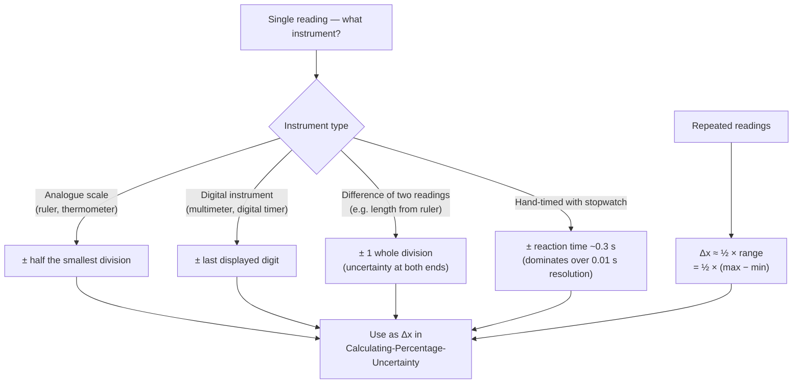

# Estimating Uncertainty from Apparatus

## Purpose

To assign a sensible absolute [[Measurement-Uncertainty|uncertainty]] to a single measurement, based on the equipment used rather than statistics.

## When to Use

Whenever you record a reading and need its `± value` for a [[Results-Table]] or for [[Combining-Uncertainties]].

## Prerequisites

- [[Measurement-Uncertainty]]
- [[Resolution-Accuracy-and-Precision]]

## Method

1. **Identify the instrument's resolution** (smallest scale division or last digital digit).
2. **Analogue scale read once** → uncertainty = ± half the smallest division (you interpolate between marks).
3. **Digital instrument** → uncertainty = ± the last displayed digit (or as the manufacturer states).
4. **A reading taken as a difference of two scale readings** (e.g. a length from two ruler positions) → the uncertainty applies at *both* ends, so use ± 1 whole division.
5. **Measurement limited by the operator, not the scale** (e.g. hand-timing with a stopwatch) → use the dominant effect: a reasonable estimate of human reaction time, not the stopwatch's 0.001 s resolution.
6. **Repeated readings** → uncertainty ≈ half the range ($\frac{1}{2} \times (\text{max} - \text{min})$).

## Worked Example

A stopwatch shows 12.4 s for one swing, timed by hand. Resolution is 0.01 s, but reaction time dominates, so quote $t = 12.4 \pm 0.3 \text{ s}$ (using ~0.3 s reaction time). Timing 20 swings instead and dividing by 20 shrinks this uncertainty twentyfold.

## Why It Works

Uncertainty should reflect the *largest* genuine source of doubt. Quoting the resolution when reaction time is ten times larger understates the true doubt.

## Common Mistakes

- Quoting stopwatch resolution for a hand-timed measurement.
- Forgetting the doubled uncertainty when a value is a difference of two readings.

## Related Quantities

- [[Acceleration]]

## Related Laws or Results

- _None directly._

## Related Problem Types

- _Deferred — uncertainty problem types from past-paper ingests._

## Visuals

### Selecting the appropriate uncertainty estimate

*Figure: Decision tree for estimating absolute uncertainty from apparatus. Always use the largest genuine source of doubt — do not default to instrument resolution when a larger effect (e.g. reaction time) dominates.*
*Source: Authored for this vault (CC0). No external copyright.*

## Source Trace

- Source: [[OCR-Physics-Practical-Skills-Handbook]]
- Section/Page: Appendix 3 — *Uncertainties*, *Measurement of time* (p31–32)
