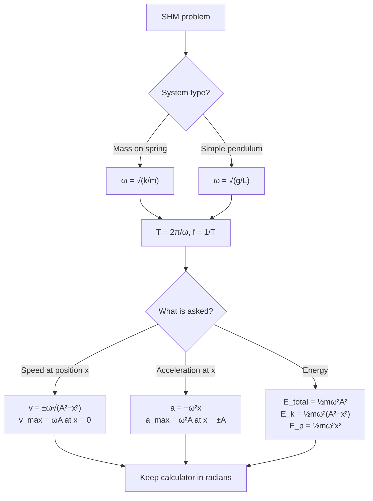

# Solving SHM Problems

## Purpose

A standard procedure for oscillation problems: finding period, frequency, displacement, velocity, acceleration, or energy of a simple harmonic oscillator.

## When to Use

- A system oscillates about an equilibrium (mass on spring, pendulum, floating object, vibrating mass).
- The question gives or asks for [[Period]], [[Frequency]], [[Amplitude]], maximum speed/acceleration, or energy.
- A restoring relationship of the form a = −ω²x can be identified.

## Prerequisites

- [[Simple-Harmonic-Motion]]
- [[Simple-Harmonic-Motion-Equation]]
- [[Hookes-Law]]

## Method

1. Confirm SHM: show acceleration ∝ −displacement (e.g. from [[Hookes-Law]] F = −kx with F = ma giving a = −(k/m)x).
2. Identify ω² as the constant of proportionality; for a spring ω = √(k/m), for a pendulum ω = √(g/L). Then T = 2π/ω, f = 1/T.
3. Choose the starting condition: x = A cos(ωt) if released from maximum displacement; x = A sin(ωt) if from equilibrium.
4. For speed at a given x use v = ±ω√(A² − x²); for maxima use v_max = ωA, a_max = ω²A.
5. For energy use total E = ½mω²A², with E_k = ½mω²(A²−x²) and E_p = ½mω²x² (see [[Energy-in-Simple-Harmonic-Motion]]).
6. Keep the calculator in [[Radian]] mode; check the period is independent of amplitude.

## Worked Example

A 0.30 kg mass on a spring of stiffness k = 12 N m⁻¹. ω = √(12/0.30) = 6.3 rad s⁻¹, T = 2π/6.3 ≈ 1.0 s. If A = 0.040 m, v_max = ωA = 0.25 m s⁻¹ and total energy = ½mω²A² ≈ 9.5 mJ.

## Why It Works

Any restoring effect proportional to displacement produces the equation a = −ω²x, whose solution is sinusoidal; matching the constant ω² to the physical parameters gives all timing and energy results.

## Common Mistakes

- [[Confusing-Angular-and-Linear-Quantities]]

## Related Quantities

- [[Amplitude]]
- [[Period]]
- [[Frequency]]
- [[Acceleration]]

## Related Laws or Results

- [[Simple-Harmonic-Motion-Equation]]
- [[Conservation-of-Energy]]
- [[Hookes-Law]]

## Related Problem Types

- [[Banked-Tracks-and-Centrifuges]]

## Visuals

### SHM problem-solving pathway

*Figure: Decision pathway for SHM calculations. Identify the system to find ω, then T and f; choose the energy or kinematic route for the final quantity.*
*Source: Authored for this vault (CC0). No external copyright.*

## Source Trace

- Source: OpenStax College Physics; HyperPhysics; The Physics Classroom — no copied text
- Section/Page: OCR alignment: [[OCR-Physics-A-H556-Specification]] (M5.3 Oscillations)
