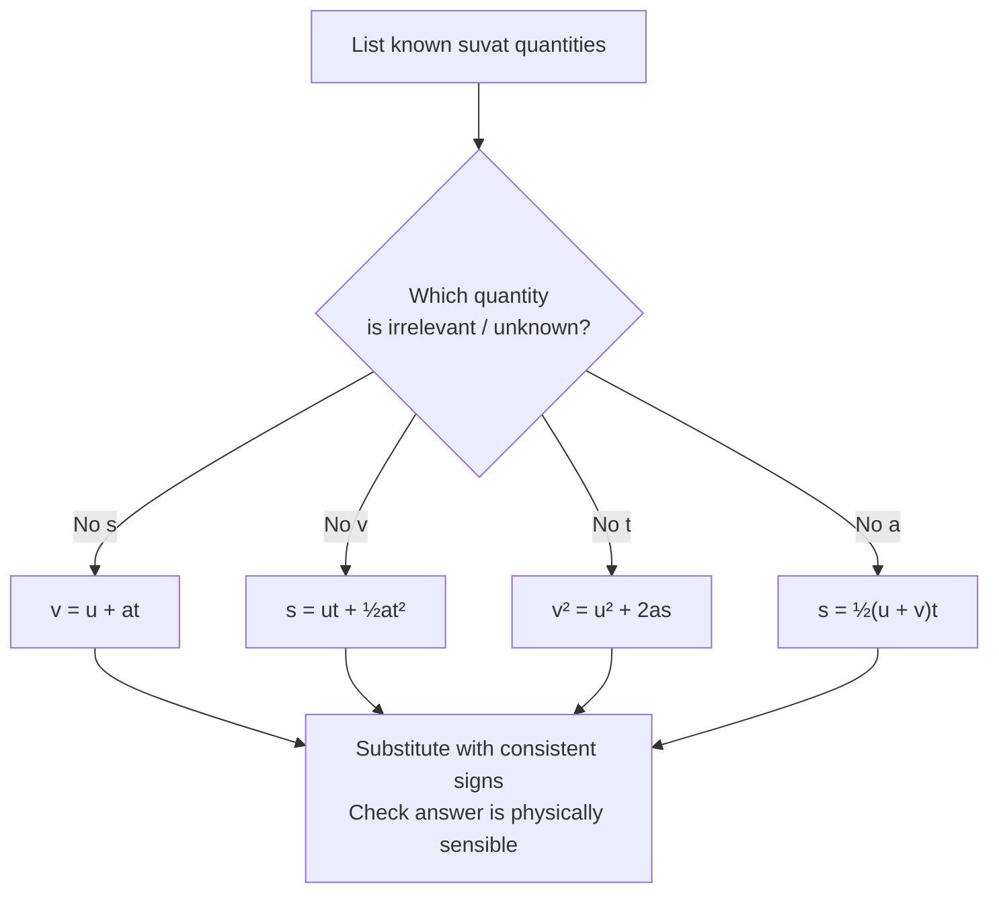

# Using SUVAT Equations

## Purpose

The SUVAT equations solve any constant-acceleration motion problem. Given any three of the five quantities — displacement *s*, initial velocity *u*, final velocity *v*, [[Acceleration]] *a*, time *t* — you can find the remaining two without calculus.

## When to Use

Use SUVAT when the [[Constant-Acceleration-Model]] applies: acceleration is constant in magnitude and direction. Typical triggers are free fall (*a = g*), uniform braking, a trolley down a fixed slope, or a straight-line [[Velocity-Time-Graph]]. Do **not** use it when acceleration varies (air resistance, springs, [[Simple-Harmonic-Oscillator]]).

## Prerequisites

- [[Constant-Acceleration-Model]]
- [[Acceleration]]
- [[Velocity]]

## Method

1. Define a positive direction and stick to it for all vectors.
2. List the known quantities with units and signs (e.g. *u*, *a*, *t*).
3. Identify the single unknown the question asks for, and note which quantity is irrelevant.
4. Choose the equation that contains your knowns and the target unknown but *not* the irrelevant quantity:
   - no *s* → *v = u + at*
   - no *v* → *s = ut + ½at²*
   - no *t* → *v² = u² + 2as*
   - no *a* → *s = ½(u + v)t*
5. Substitute numbers with units; solve algebraically.
6. Check the answer is physically reasonable (sign, magnitude, sensible time).

## Worked Example

A stone is thrown straight up at 12 m s⁻¹. Taking up as positive, *a = −9.81 m s⁻²*. Find the maximum height. At the top *v = 0*, *s* unknown, *t* irrelevant → use *v² = u² + 2as*. So *0 = 12² + 2(−9.81)s*, giving *s = 144 / 19.62 ≈ 7.3 m*. The positive value confirms the stone rises above the launch point.

## Why It Works

The SUVAT equations are the exact algebraic consequences of integrating a constant acceleration. *v = u + at* is acceleration integrated once; *s = ut + ½at²* is velocity integrated again. They encode the geometry of a straight-line velocity–time graph (gradient = *a*, area = *s*).

## Common Mistakes

- [[Constant-Acceleration-Model]] not actually valid (acceleration varies).
- Mixing displacement and distance.
- Inconsistent sign convention (up vs down, *g* sign).
- Forgetting *v = 0* at the top of vertical motion.

## Related Quantities

- [[Acceleration]]
- [[Velocity]]

## Related Laws or Results

- [[Constant-Acceleration-Model]]
- [[Newton-Second-Law]] (links acceleration to force)

## Related Problem Types

- [[Projectile-Motion]]
- Vertical free-fall problems

## Visuals

### SUVAT equation selector

*Figure: Choose the SUVAT equation that contains your three known quantities and the target unknown but excludes the irrelevant one. A constant-acceleration velocity–time graph has gradient = a and area = s.*
*Source: Authored for this vault (CC0). No external copyright.*

## Source Trace

- Source: OpenStax College Physics; The Physics Classroom; Isaac Physics — paraphrased, no copied text.
- OCR alignment: [[OCR-Physics-A-H556-Specification]]
