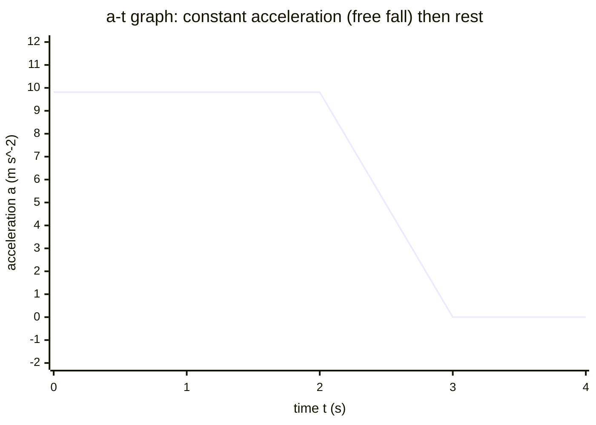

# Acceleration-Time Graph

## Core Idea

An acceleration-time graph shows how the [[Acceleration]] of an object varies with time. It is the third member of the kinematics graph family, completing the chain displacement → velocity → acceleration.

## Form

A line graph with time on the horizontal axis and acceleration on the vertical axis. A horizontal line at a non-zero value means constant acceleration (the constant-acceleration model used for free fall and SUVAT problems). A line on the time axis means zero acceleration — constant velocity. A negative value means acceleration directed in the negative direction (deceleration if the object moves positively).

## Axes / Labels / Components

- x-axis: time `t`, in seconds (s).
- y-axis: acceleration `a`, in metres per second squared (m s⁻²), with a labelled positive direction.

## Physical Meaning

The height of the line is the rate at which velocity is changing at that instant. For an object in free fall near Earth the graph is a horizontal line at about `9.81 m s⁻²` (linked to [[Gravitational-Field-Strength]]). A sudden jump in the line corresponds to a sudden change in the resultant [[Force]], via [[Newton-Second-Law]].

## Gradient / Area / Intercepts

- **Gradient** = rate of change of acceleration ("jerk"); rarely required at A-Level but conceptually the slope of `a` against `t`.
- **Area under the graph** = change in [[Velocity]] ($\Delta v = a \times t$ for a rectangle). This is the key reading: the area between the line and the time axis over an interval equals the velocity gained in that interval.
- **y-intercept** = the initial acceleration at $t = 0$.

## Converts To / From

- From: a [[Velocity-Time-Graph]] (its gradient at each point gives the acceleration value).
- To: velocity changes (area under the line), which rebuild a [[Velocity-Time-Graph]].

## Related Quantities

- [[Acceleration]]
- [[Velocity]]
- [[Force]]

## Related Methods

- [[Using-Gradient]]
- [[Using-Intercept]]

## Common Mistakes

- Thinking a constant positive acceleration line means the object is speeding up forever in one sense, ignoring direction.
- Confusing the area (which gives Δv) with displacement.
- Assuming the line height is velocity.

## Visuals

### Acceleration-time graph: free fall and rest

*Figure: A horizontal line at $a = 9.81 \text{ m s}^{-2}$ represents constant downward acceleration during free fall (the [[Gravitational-Field-Strength]] near Earth's surface). The line drops to zero at $t = 3 \text{ s}$, representing an object that has landed and is no longer accelerating. The area (rectangle) over any interval equals the change in [[Velocity]] during that interval.*
*Source: Authored for this vault (CC0). No external copyright.*

## Source Trace

- Source: OCR Practical Skills Handbook; The Physics Classroom; IOPSpark; OpenStax
- OCR alignment: [[OCR-Physics-A-H556-Specification]]
