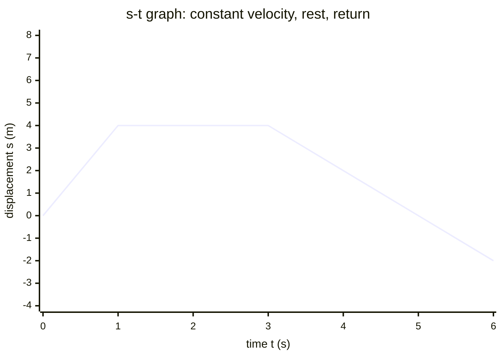

# Displacement-Time Graph

## Core Idea

A displacement-time graph shows how the position of an object relative to a chosen origin changes with time. Its gradient is the object's [[Velocity]], making it the natural starting point for analysing motion.

## Form

A line graph with time on the horizontal axis and displacement on the vertical axis. A horizontal line means the object is stationary (position not changing). A straight sloped line means constant velocity. A curve means changing velocity, i.e. acceleration. Because displacement is a vector, the line can go negative, meaning the object is on the opposite side of the origin.

## Axes / Labels / Components

- x-axis: time `t`, in seconds (s).
- y-axis: displacement `s`, in metres (m), measured from a defined origin and positive direction.
- Curves should be smooth; experimental points get a line of best fit.

## Physical Meaning

The line's height is *where* the object is, not how fast it moves. Returning to the time axis means returning to the start point (zero displacement), which is different from having travelled zero distance — an object can return to its origin after a long journey.

## Gradient / Area / Intercepts

- **Gradient** = change in displacement ÷ change in time = [[Velocity]]. A steeper line means faster motion; a negative gradient means motion back toward and past the origin. For a curve, the **tangent gradient** at a point gives the instantaneous velocity (use [[Finding-Gradient-from-a-Graph]]); the chord gradient gives average velocity.
- **Area under the graph** has *no standard physical meaning* — do not interpret it.
- **y-intercept** = the starting position at $t = 0$.

## Converts To / From

- From: position data, e.g. ticker tape or [[Using-Light-Gates]] timing.
- To: a [[Velocity-Time-Graph]] (gradient at each instant becomes the velocity value).

## Related Quantities

- [[Displacement]]
- [[Velocity]]

## Related Methods

- [[Finding-Gradient-from-a-Graph]]
- [[Using-Gradient]]

## Common Mistakes

- Treating a curving line as "speeding up along a hill" — the curve means accelerating, not moving on a slope.
- Reading off the height as speed instead of taking the gradient.
- Trying to find area under the line as if it meant distance.

## Visuals

### Displacement-time graph: three phases of motion

*Figure: The straight rising section (t = 0 to 1) has a positive gradient equal to the constant [[Velocity]]; the flat section (t = 1 to 3) has zero gradient — the object is stationary; the falling section (t = 3 onwards) has a negative gradient — the object moves back toward (and past) the origin. The y-intercept (0 m) is the starting position.*
*Source: Authored for this vault (CC0). No external copyright.*

## Source Trace

- Source: OCR Practical Skills Handbook; The Physics Classroom; IOPSpark; OpenStax
- OCR alignment: [[OCR-Physics-A-H556-Specification]]
