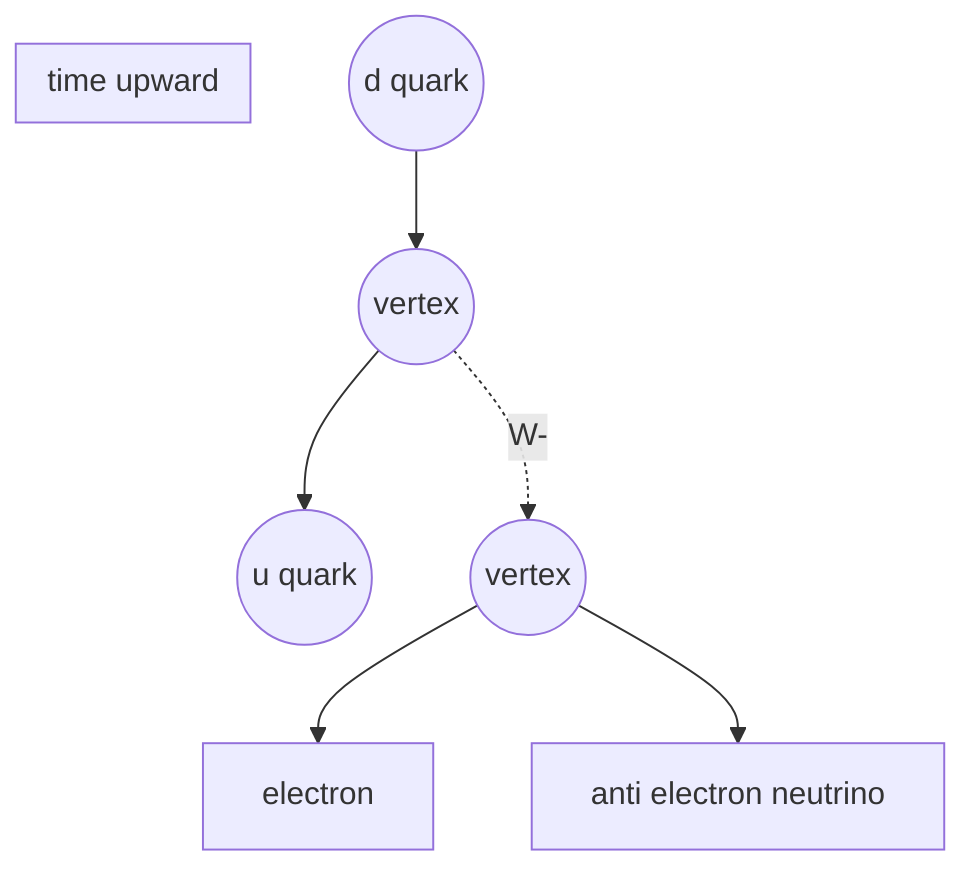

# Feynman Diagram

## Core Idea

A Feynman diagram is a schematic of a particle interaction. Incoming particles enter from one side, outgoing particles leave from the other, and the exchange particle is drawn as a line connecting two vertices. At each vertex, charge, baryon number, and lepton number balance.

## Form

The AQA version is the simplified "in–exchange–out" topology, not the full quantum-field-theory diagram. Conventions used in this vault and in AQA mark schemes:

- **Time** runs upward (or, equivalently, left-to-right; pick one and label it).
- **Solid arrowed lines** represent fermions (quarks, leptons, nucleons). Arrow direction along the time axis = particle; against it = antiparticle.
- **Wavy lines** represent photons (electromagnetic exchange).
- **Dashed or zig-zag lines** represent $W^{+}$ / $W^{-}$ bosons (weak exchange). Always label which one.
- A **vertex** is where three lines meet.

## Axes / Labels / Components

Every AQA diagram should clearly show:

1. A time arrow (axis label).
2. Each line labelled with the particle name or symbol.
3. The exchange particle clearly named ($\gamma$, $W^{+}$, $W^{-}$, $\pi^{0}$, …).
4. Charge balance at every vertex.

## Physical Meaning

The diagram is a bookkeeping tool, not a literal trajectory. It shows **what** turned into **what**, mediated by which exchange particle, with all conservation laws checkable at each vertex.

Standard AQA examples:

- **Electron–electron repulsion** (EM): two electrons exchange a virtual photon $\gamma$.
- **$\beta^{-}$ decay**: a down quark in a neutron emits a $W^{-}$, becoming an up quark; the $W^{-}$ then decays to an electron and an electron antineutrino. The neutron becomes a proton.
- **$\beta^{+}$ decay**: an up quark in a proton emits a $W^{+}$, becoming a down quark; the $W^{+}$ produces a positron and an electron neutrino. The proton becomes a neutron.
- **Electron capture**: a proton absorbs an electron via a $W$ exchange; outputs are a neutron and an electron neutrino.
- **Electron–proton collision (weak scattering)**: the same topology as electron capture rotated in time.

## Gradient / Area / Intercepts

Not applicable — Feynman diagrams have no quantitative axes.

## Converts To / From

- **From:** word equations of particle interactions; quark-level reaction equations.
- **To:** balanced equation with conservation checks ($Q$, $B$, $L_{e}$, $L_{\mu}$, $S$ where relevant).

## Related Quantities

- [[Charge]]
- [[Baryon-Number]]
- [[Lepton-Number]]
- [[Strangeness]]

## Related Methods

- [[Applying-Conservation-Laws-to-Particle-Interactions]]

## Common Mistakes

- Drawing $\beta^{-}$ decay with a $W^{+}$. The charge $-1$ leaves on the $W$, so it must be $W^{-}$.
- Forgetting to include the neutrino or antineutrino in $\beta$ decay.
- Using a wavy line for the $W$ boson (reserved for the photon).
- Drawing the time axis but reversing arrows for antiparticles inconsistently. Pick a convention and stick to it.
- Drawing more than three lines meeting at a single vertex.
- Including gluons or $Z^{0}$ in AQA answers (not required, often penalised if misused).

## Visuals

*Figure: Beta-minus decay at the quark level. A d quark becomes a u quark, emitting a W-, which decays to an electron and an electron antineutrino.*
*Source: Authored for this vault (CC0). No external copyright.*

### From Wikimedia

<!-- wiki-images: yes -->

#### Beta-minus decay Feynman diagram
![[_attachments/08_Representations/Feynman-Diagram--wiki-beta-minus-decay.svg]]
*Figure: a conventionally drawn Feynman diagram for beta-minus decay — a down quark turns into an up quark by emitting a W⁻ boson, which then decays to an electron and an electron antineutrino.*
*Source: Wikimedia Commons — [Feynmann Diagram beta minus decay.svg](https://commons.wikimedia.org/wiki/File:Feynmann_Diagram_beta_minus_decay.svg) — CC BY-SA 3.0 — Exc (Wikimedia user). Retrieved 2026-06-27.*

## Source Trace

- Source: [[AQA-Physics-7407-7408-Specification]] §3.2.1.4
- Section/Page: Particle interactions — simple Feynman diagrams.
- Explanatory reference: HyperPhysics "Feynman Diagrams"; OpenStax College Physics §33.4 (no text copied).
