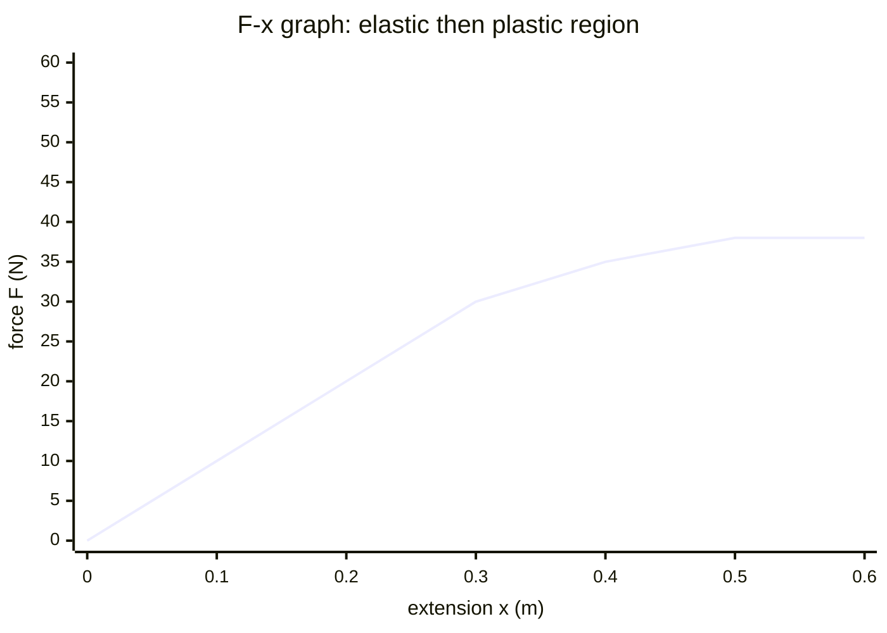

# Force-Extension Graph

## Core Idea

A force-extension graph shows how much a sample (spring or wire) stretches as the applied [[Force]] increases. It reveals elastic behaviour, the limit of proportionality, and the elastic strain energy stored.

## Form

A line graph with extension on the horizontal axis and force (load) on the vertical axis. For a Hookean material the graph starts as a straight line through the origin. Beyond the limit of proportionality it curves; for a ductile metal wire it then yields and extends greatly for little extra force before fracture.

## Axes / Labels / Components

- x-axis: extension `x` (or `e`), in metres (m) — the *increase* in length, not the total length.
- y-axis: force `F`, in newtons (N).
- Key points marked: limit of proportionality, elastic limit, yield point, fracture point.

## Physical Meaning

The shape encodes the material's mechanical behaviour. The straight portion shows [[Hookes-Law]] holding (`F = kx`). The point where the line stops being straight is the limit of proportionality; beyond the elastic limit the sample no longer returns to its original length when unloaded (plastic deformation).

## Gradient / Area / Intercepts

- **Gradient** of the straight section = the spring/force constant `k` (N m⁻¹) from [[Hookes-Law]]. A stiffer sample gives a steeper line. Find it with [[Finding-Gradient-from-a-Graph]].
- **Area under the line** = work done on the sample = elastic strain energy stored. For the linear region this is the triangle `½Fx = ½kx²`.
- **Intercept**: a well-behaved sample passes through the origin; a non-zero intercept usually signals slack or zero error in the apparatus.

## Converts To / From

- From: a loading experiment (see [[Measuring-Young-Modulus]]).
- To: a [[Stress-Strain-Graph]] by dividing force by cross-sectional area and extension by original length, removing the dependence on sample dimensions.

## Related Quantities

- [[Force]]
- [[Strain]]

## Related Methods

- [[Finding-Gradient-from-a-Graph]]
- [[Using-Gradient]]

## Common Mistakes

- Plotting total length instead of extension.
- Confusing the limit of proportionality with the elastic limit (they are close but distinct).
- Forgetting that the area gives energy only while loading is reversible.

## Visuals

### Force-extension graph: Hookean region then plastic deformation

*Figure: The straight section from the origin (x = 0 to 0.3 m) obeys [[Hookes-Law]]; its gradient is the spring constant k = F/x. Beyond the limit of proportionality the line curves and then flattens — the sample yields and extends with little extra force. The triangular area under the straight section equals the elastic strain energy stored (½Fx = ½kx²).*
*Source: Authored for this vault (CC0). No external copyright.*

## Source Trace

- Source: OCR Practical Skills Handbook; The Physics Classroom; IOPSpark; OpenStax
- OCR alignment: [[OCR-Physics-A-H556-Specification]]
