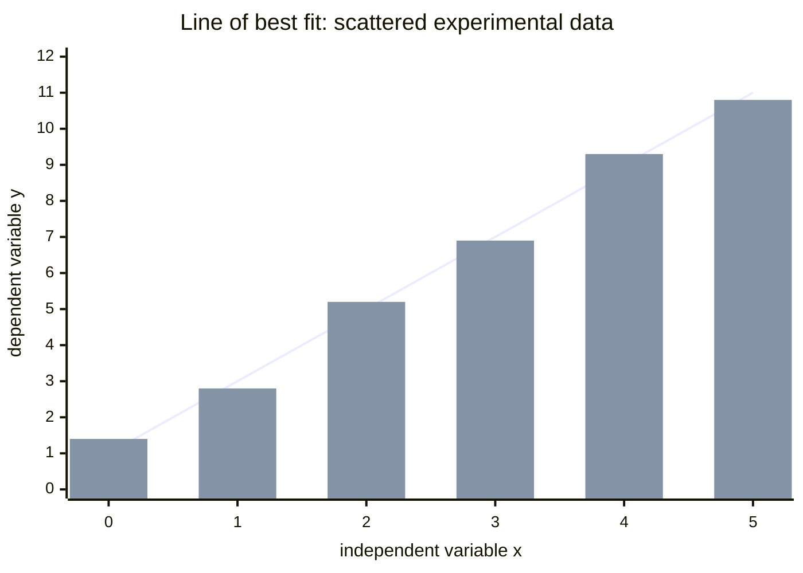

# Line-of-Best-Fit Graph

## Core Idea

A plotted graph of experimental data with a single straight (or smooth) line drawn to represent the underlying trend, used to extract a gradient and intercept.

## Form

Points from a [[Results-Table]] plotted on labelled axes, with a best-fit line balancing the scatter — roughly equal numbers of points above and below, ignoring identified anomalies.

## Axes / Labels / Components

- Axes labelled with **quantity / unit** (same convention as the [[Results-Table]]).
- Scales chosen so the plotted points fill more than half the grid in each direction, using sensible (1, 2, 5 ×10ⁿ) intervals.
- Points plotted to better than half a small square; anomalies circled and excluded from the fit.
- Error bars added where uncertainties are required; the fit should pass through (or near) the bars.

## Physical Meaning

The line represents the physical relationship; scatter about it reflects [[Systematic-and-Random-Errors|random error]], while a non-zero unexpected intercept can reveal a [[Systematic-and-Random-Errors|systematic error]].

## Gradient / Area / Intercepts

- **Gradient** — read using a large triangle spanning most of the line; it usually equals a physical quantity once the equation is linearised to `y = mx + c`.
- **Intercept** — the value where the line crosses an axis; physically meaningful only if that axis point is actually plotted (otherwise extrapolate honestly).
- **Area** — relevant only when the plotted quantities make the area a physical quantity.
- A worst-acceptable-line gives the gradient/intercept uncertainty.

## Converts To / From

- From: [[Results-Table]]
- To: a gradient/intercept value (a measured physical quantity)

## Related Quantities

- [[Acceleration]]

## Related Methods

- [[Calculating-Percentage-Uncertainty]]
- [[Significant-Figures-in-Measurements]]

## Common Mistakes

- Forcing the line through the origin when the data do not support it.
- Reading the gradient from a single point or a tiny triangle.

## Visuals

### Line of best fit through scattered data

*Figure: The straight line balances the scatter of the experimental points (bars), passing through the approximate centre of the spread. The gradient is read from a large triangle spanning most of the line: rise ÷ run gives the physical quantity encoded by the equation's y = mx + c form. A non-zero intercept may indicate a systematic offset in the apparatus.*
*Source: Authored for this vault (CC0). No external copyright.*

## Source Trace

- Source: [[OCR-Physics-Practical-Skills-Handbook]]
- Section/Page: Appendix 5 *Graphs*, *Plotting of points* (p40–44)
