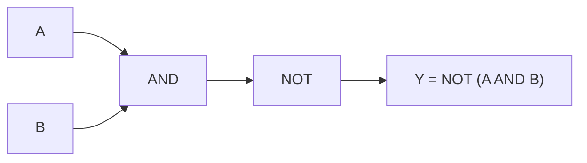

# Logic Gate Diagram

## Core Idea

A **logic gate diagram** uses a standard set of shape symbols and connecting lines to show how a digital circuit is built from gates. Each gate has a fixed **truth table** that defines the relationship between its inputs and output.

## Form

The diagram is a directed network: input lines on the left, gates as labelled shapes, and output lines on the right. Signals are binary — each line carries either logic 0 (low voltage) or logic 1 (high voltage). Gates may be wired in series and parallel to implement any Boolean function.

## Axes / Labels / Components

The six gates needed at A-Level (with their MIL/ANSI shape and Boolean expression):

| Gate | Inputs | Boolean | Words |
|---|---|---|---|
| **AND** | $A, B$ | $Y = A \cdot B$ | Output 1 only when **both** inputs are 1. |
| **OR** | $A, B$ | $Y = A + B$ | Output 1 when **either** input is 1. |
| **NOT** | $A$ | $Y = \overline{A}$ | Output is the inverse of the input. |
| **NAND** | $A, B$ | $Y = \overline{A \cdot B}$ | AND followed by NOT. |
| **NOR** | $A, B$ | $Y = \overline{A + B}$ | OR followed by NOT. |
| **XOR** | $A, B$ | $Y = A \oplus B$ | Output 1 when inputs **differ**. |

Symbol conventions:

- AND: D-shape with flat back.
- OR: shield shape with curved back.
- NOT: triangle with a small circle on the output.
- NAND, NOR: AND or OR shape with a small circle on the output (the circle means "inverted").
- XOR: OR shape with an extra curved line at the input.

Connecting lines should meet at a small dot if they are electrically joined, and cross without a dot if they are not.

Symbols used in expressions:

- $A, B, C, \dots$: input bits (0 or 1)
- $Y$: output bit (0 or 1)
- $\cdot$ or juxtaposition: AND
- $+$: OR
- overbar $\overline{\;\;}$: NOT
- $\oplus$: XOR

## Physical Meaning

Each gate is a small electronic circuit (typically a network of MOSFETs in modern CMOS — see [[Semiconductor-Devices]]) that maps input voltages to an output voltage according to the truth table. The diagram lets us reason about behaviour without drawing every transistor.

A complete logic circuit is read from left to right: trace each path, evaluate intermediate signals from the truth table of each gate, and arrive at the final output. The full input/output behaviour is captured by a combined truth table covering all $2^{n}$ input combinations.

## Gradient / Area / Intercepts

Not applicable — this is a structural diagram, not a graph. The analogue is the **truth table**, which lists output for every input combination, and the **Boolean expression**, which compresses it into algebra.

## Converts To / From

- From: Boolean expression.
- From: truth table.
- To: timing diagram (output waveform vs time, given input waveforms).
- To: combinational or sequential schematic (see [[Combinational-and-Sequential-Logic]]).

## Related Quantities

- [[Potential-Difference]] — what the 0 and 1 actually are physically.

## Related Methods

- Converting a truth table to a Boolean expression.
- Simplifying a Boolean expression using De Morgan's laws.
- Reading a gate diagram to verify a logic function.

## Common Mistakes

- Forgetting the inversion circle on NAND/NOR — drawing an AND when a NAND is required (or vice versa) changes the truth table completely.
- Drawing crossing lines without showing whether they are joined.
- Building a truth table with fewer than $2^{n}$ rows.
- Confusing XOR ("inputs differ") with OR ("at least one input is 1").
- Treating an unconnected gate input as automatically 0 — in CMOS it floats and gives unpredictable behaviour.

## Visuals

### NAND gate built from AND + NOT

*Figure: a NAND gate is logically equivalent to an AND followed by a NOT.*
*Source: Authored for this vault (CC0). No external copyright.*

### From Wikimedia

<!-- wiki-images: yes -->

#### Standard logic gate symbols
![[_attachments/08_Representations/Logic-Gate-Diagram--wiki-logic-gates.svg]]
*Figure: the standard MIL/ANSI symbols and truth tables for the common logic gates.*
*Source: Wikimedia Commons — [LogicGates.svg](https://commons.wikimedia.org/wiki/File:LogicGates.svg) — CC BY 3.0 — Vaughan Pratt. Retrieved 2026-06-27.*

## Source Trace

- Source: [[AQA-Physics-7407-7408-Specification]] §3.13
- Public source: HyperPhysics; All About Circuits
- Section/Page: Electronics — logic gate symbols and truth tables
