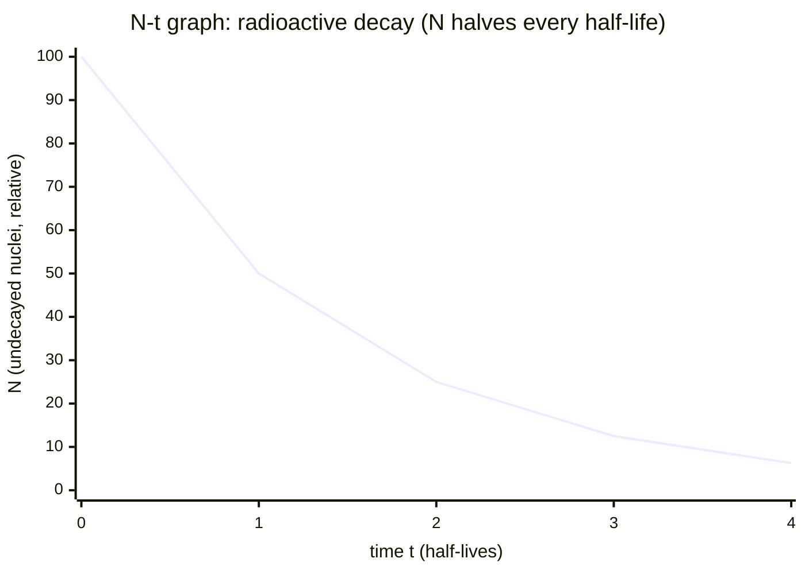

# Nuclear-Decay Graph

## Core Idea

A nuclear-decay graph shows how a radioactive quantity — number of undecayed nuclei `N`, activity `A`, or count rate — falls with time. Its characteristic exponential shape lets you read off the [[Half-Life]].

## Form

A line graph with time on the horizontal axis and the decaying quantity on the vertical axis. The curve is exponential: it falls steeply at first then ever more slowly, approaching but never reaching zero. Equal time intervals always halve the quantity, regardless of the starting point.

## Axes / Labels / Components

- x-axis: time `t` (s, or appropriate unit).
- y-axis: number of undecayed nuclei `N`, activity `A` (becquerel, Bq), or corrected count rate.
- Often a second version is plotted as `ln N` against `t`, which linearises the data.

## Physical Meaning

Decay is random and spontaneous: each nucleus has a fixed probability of decaying per unit time (the decay constant `λ`). The graph embodies `N = N₀ e^(−λt)` — the rate of decay is proportional to how much is left, giving a constant [[Half-Life]] independent of the amount present.

## Gradient / Area / Intercepts

- **Gradient of the curve** at any point = the activity `A = −dN/dt = λN` (rate of decay) at that instant.
- **Linearised plot:** `ln N` against `t` is a straight line with gradient `−λ` (the decay constant) and y-intercept `ln N₀`. Use [[Finding-Gradient-from-a-Graph]] and [[Using-Intercept]].
- **Half-life** is read directly: the time for the curve to fall from any value to half that value; averaging several such intervals improves reliability.
- **y-intercept** of the decay curve = the initial quantity `N₀`.

## Converts To / From

- From: count-rate measurements (with background subtracted).
- To: the decay constant `λ` (from the log plot gradient) and the [[Half-Life]] (`t½ = ln2 / λ`).

## Related Quantities

- [[Half-Life]]

## Related Methods

- [[Finding-Gradient-from-a-Graph]]
- [[Using-Intercept]]

## Common Mistakes

- Forgetting to subtract background count rate before plotting.
- Reading half-life from only one interval instead of averaging several.
- Expecting the curve to reach zero, or treating decay as a steady (linear) decrease.

## Visuals

### Nuclear decay curve: exponential fall of N with time

*Figure: At t = 0 the full quantity N₀ is present. After each [[Half-Life]] interval the quantity halves (100 → 50 → 25 → 12.5 → 6.25). The curve approaches zero asymptotically, never reaching it. The y-intercept is N₀; the gradient at any point equals −λN, where λ is the decay constant.*
*Source: Authored for this vault (CC0). No external copyright.*

## Source Trace

- Source: OCR Practical Skills Handbook; The Physics Classroom; IOPSpark; OpenStax
- OCR alignment: [[OCR-Physics-A-H556-Specification]]
