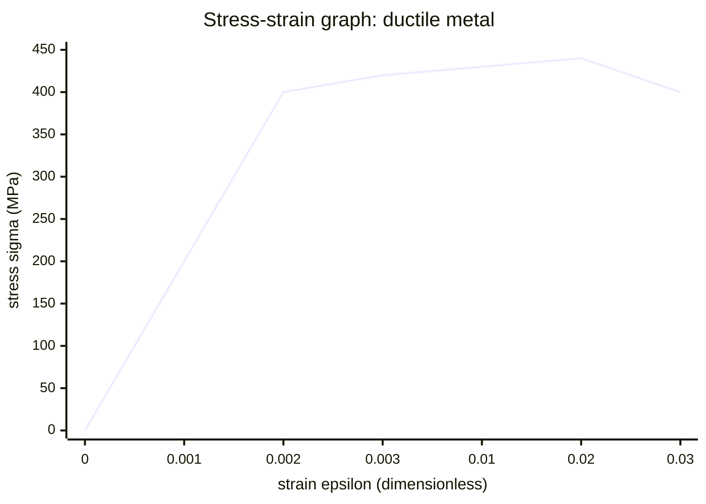

# Stress-Strain Graph

## Core Idea

A stress-strain graph plots [[Stress]] against [[Strain]] for a material. Unlike a force-extension graph it depends only on the *material*, not the sample's dimensions, so it characterises the material itself.

## Form

A line graph with strain on the horizontal axis and stress on the vertical axis. A typical ductile metal shows: a straight elastic region from the origin, the limit of proportionality, the elastic limit, a yield region where strain increases sharply, a maximum (ultimate tensile stress), then fracture. Brittle materials show a straight line ending abruptly at fracture with little plastic region.

## Axes / Labels / Components

- x-axis: strain $\varepsilon = \dfrac{\text{extension}}{\text{original length}}$ — dimensionless (often a percentage).
- y-axis: stress $\sigma = \dfrac{\text{force}}{\text{cross-sectional area}}$, in pascals (Pa).
- Marked features: limit of proportionality, elastic limit, yield point, ultimate tensile stress, fracture point.

## Physical Meaning

The curve summarises how the material responds to loading: how stiff it is, how far it deforms elastically, whether it yields plastically, and how strong it is before breaking. It distinguishes ductile (large plastic region), brittle (no plastic region) and polymeric behaviour.

## Gradient / Area / Intercepts

- **Gradient** of the straight elastic region = the [[Young-Modulus]] $E = \sigma / \varepsilon$ (Pa). A steeper line means a stiffer material. Use [[Finding-Gradient-from-a-Graph]] over the linear part only.
- **Area under the line** = energy stored per unit volume (the elastic strain energy density, J m⁻³); the area up to fracture relates to toughness.
- **Intercept**: passes through the origin for an ideal sample.

## Converts To / From

- From: a [[Force-Extension-Graph]] using $\sigma = F/A$ and $\varepsilon = x/L$.
- To: the [[Young-Modulus]] value (gradient of the elastic region).

## Related Quantities

- [[Stress]]
- [[Strain]]
- [[Young-Modulus]]

## Related Methods

- [[Finding-Gradient-from-a-Graph]]
- [[Using-Gradient]]

## Common Mistakes

- Taking the gradient over the whole curve rather than just the linear elastic region for Young modulus.
- Confusing ultimate tensile stress (the peak) with the fracture stress.
- Forgetting that strain is dimensionless, so Young modulus has the same units as stress.

## Visuals

### Stress-strain graph: ductile metal

*Figure: The steep straight region from the origin to ~0.002 represents the elastic region; its gradient is the [[Young-Modulus]] $E = \sigma/\varepsilon$. Beyond the limit of proportionality the curve rounds off at the yield region; the peak is the ultimate tensile stress (UTS); beyond this the material necks and fractures. The area under the curve up to any point equals the strain energy stored per unit volume.*
*Source: Authored for this vault (CC0). No external copyright.*

### From Wikipedia

<!-- wiki-images: yes -->

#### Stress strain ductile

![[_attachments/08_Representations/Stress-Strain-Graph--wiki-stress-strain-ductile.svg]]
*Figure: from Wikipedia article "Stress–strain curve".*
*Source: Wikimedia Commons — [Stress_strain_ductile.svg](https://commons.wikimedia.org/wiki/File:Stress_strain_ductile.svg). Retrieved 2026-05-20.*

#### Stress strain comparison brittle ductile

![[_attachments/08_Representations/Stress-Strain-Graph--wiki-stress-strain-comparison-brittle-ductile.svg]]
*Figure: from Wikipedia article "Stress–strain curve".*
*Source: Wikimedia Commons — [Stress strain comparison brittle ductile.svg](https://commons.wikimedia.org/wiki/File:Stress_strain_comparison_brittle_ductile.svg). Retrieved 2026-05-20.*

#### Stress strain ductile

![[_attachments/08_Representations/Stress-Strain-Graph--wiki-stress-strain-ductile.svg]]
*Figure: from Wikipedia article "Stress–strain curve".*
*Source: Wikimedia Commons — [Stress strain ductile.svg](https://commons.wikimedia.org/wiki/File:Stress_strain_ductile.svg). Retrieved 2026-05-20.*

## Source Trace

- Source: OCR Practical Skills Handbook; The Physics Classroom; IOPSpark; OpenStax
- OCR alignment: [[OCR-Physics-A-H556-Specification]]
