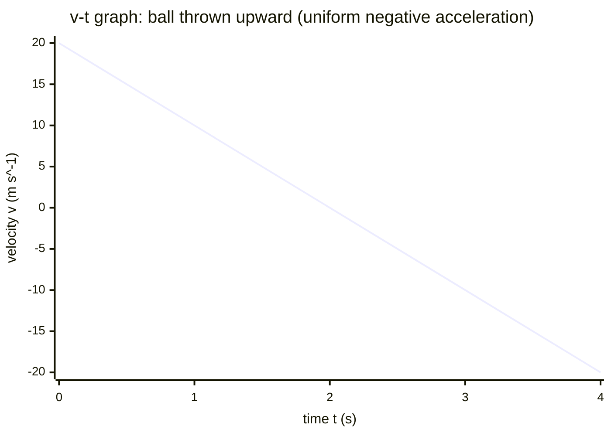

# Velocity-Time Graph

## Core Idea

A velocity-time graph shows how the [[Velocity]] of an object varies as time passes. It is the single most informative motion representation at A-Level because both [[Acceleration]] and [[Displacement]] can be read directly from it.

## Form

A line graph with time on the horizontal axis and velocity on the vertical axis. Because velocity is a vector, the vertical axis includes negative values: a line below the time axis means motion in the opposite direction, not "going backwards in time". A horizontal line means constant velocity; a sloped straight line means uniform acceleration; a curve means changing acceleration.

## Axes / Labels / Components

- x-axis: time `t`, in seconds (s).
- y-axis: velocity `v`, in metres per second (m s⁻¹), with a labelled positive direction.
- Each axis must carry a quantity, a unit, and a sensible scale; points are plotted with a line of best fit if from experimental data.

## Physical Meaning

The vertical position is how fast and in which direction the object moves at that instant. A line returning to and crossing $v = 0$ marks the moment the object is momentarily at rest and then reverses direction — the classic signature of a ball thrown upward.

## Gradient / Area / Intercepts

- **Gradient** = change in velocity ÷ change in time = [[Acceleration]]. A positive gradient is acceleration in the positive direction; a negative gradient is deceleration (or acceleration in the negative direction). Use [[Finding-Gradient-from-a-Graph]] over a large triangle for accuracy.
- **Area under the graph** = [[Displacement]] (not distance). Area above the time axis is positive displacement; area below counts as negative and partly cancels — so total displacement can be less than total distance travelled. For curves, estimate area by counting squares or the trapezium rule.
- **y-intercept** = the initial velocity `u` at $t = 0$.
- **x-intercept** = the instant the object is momentarily at rest.

## Converts To / From

- From: a [[Displacement-Time-Graph]] (its gradient gives velocity), or raw motion data from [[Using-Light-Gates]].
- To: an [[Acceleration-Time-Graph]] (gradient at each point) and displacement values (area).

## Related Quantities

- [[Velocity]]
- [[Acceleration]]
- [[Displacement]]

## Related Methods

- [[Finding-Gradient-from-a-Graph]]
- [[Using-Gradient]]

## Common Mistakes

- Reading the height of the line as acceleration — height is velocity, gradient is acceleration.
- Treating area as distance when velocity goes negative.
- Confusing a velocity-time graph with a [[Displacement-Time-Graph]] (a horizontal line means *constant velocity* here, but *stationary* there).

## Visuals

### Velocity-time graph of a ball thrown straight up

*Figure: A straight line of constant negative gradient. The y-intercept is the initial (upward) velocity `u`; the gradient is the constant [[Acceleration]] (here negative, i.e. gravity); the x-intercept marks the instant the ball is momentarily at rest; below the axis the line represents motion in the opposite (downward) direction. Area above the axis is positive [[Displacement]], area below is negative and partly cancels it.*
*Source: Authored for this vault (CC0). No external copyright.*

### From Wikipedia

<!-- wiki-images: yes -->

#### Acceleration

![[_attachments/08_Representations/Velocity-Time-Graph--wiki-acceleration.svg]]
*Figure: from Wikipedia article "Motion graphs and derivatives".*
*Source: Wikimedia Commons — [Acceleration.svg](https://commons.wikimedia.org/wiki/File:Acceleration.svg). Retrieved 2026-05-20.*

#### Velocity vs time graph

![[_attachments/08_Representations/Velocity-Time-Graph--wiki-velocity-vs-time-graph.svg]]
*Figure: from Wikipedia article "Motion graphs and derivatives".*
*Source: Wikimedia Commons — [Velocity vs time graph.svg](https://commons.wikimedia.org/wiki/File:Velocity_vs_time_graph.svg). Retrieved 2026-05-20.*

## Source Trace

- Source: OCR Practical Skills Handbook; The Physics Classroom; IOPSpark; OpenStax
- OCR alignment: [[OCR-Physics-A-H556-Specification]]
