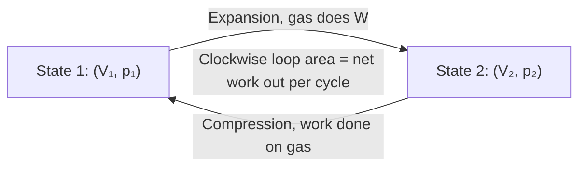

# pV Diagram

## Core Idea

A pV diagram plots a gas's [[Pressure]] against its [[Volume]] as it moves through a [[Thermodynamic-Processes|thermodynamic process]] or cycle. The shape of the curve identifies the process; the area underneath measures the [[Work]] done by the gas; the area enclosed by a closed loop measures the net work per cycle.

## Form

A two-dimensional graph. The state of the gas at any instant is a single point on the plane. A process is a curve joining two points; a cycle is a closed loop returned to the starting state.

## Axes / Labels / Components

- $y$-axis: **pressure** $p$ in pascals (Pa) or kilopascals (kPa).
- $x$-axis: **volume** $V$ in cubic metres (m$^3$) or litres.
- Conventionally, $p$ is plotted on the vertical axis even though $V$ is the independent variable in many engineering contexts.
- A direction arrow on the curve shows whether the gas is expanding or being compressed.

## Physical Meaning

Each point $(V, p)$ identifies a unique equilibrium state of the gas. The path between two states encodes how it got there — and the path matters: different routes between the same start and end points involve different heat and work transfers.

### Standard paths

- **Isothermal** — a smooth hyperbola $p \propto 1/V$.
- **Adiabatic** — a steeper hyperbola $p \propto V^{-\gamma}$ (drops faster than the isothermal).
- **Isobaric** (constant pressure) — a horizontal straight line.
- **Isochoric** (constant volume) — a vertical straight line.

## Gradient / Area / Intercepts

- **Area under the curve** between $V_1$ and $V_2$ equals the work done by the gas during the process:
  $$W = \int_{V_1}^{V_2} p \, dV$$
  Expansion (rightward) gives positive work by the gas; compression (leftward) gives negative work by the gas.
- **Area of a closed loop** equals the net work done by the gas per cycle. A clockwise loop is a heat engine (net work out). An anticlockwise loop is a heat pump or refrigerator (net work in).
- **Gradient** has no single named meaning, but a steeper drop with $V$ indicates an adiabatic rather than isothermal process.
- **Intercepts** rarely appear in engine diagrams; a process never reaches zero volume.

## Converts To / From

- From: equations of state ([[Ideal-Gas-Equation]]).
- To: numerical work and heat values via integration or area measurement; cycle analysis in [[Engine-Cycles]].

## Related Quantities

- [[Pressure]]
- [[Volume]]
- [[Temperature]]
- [[Work]]
- [[Internal-Energy]]

## Related Methods

- Counting squares or trapezium-rule estimation to find the loop area.
- Identifying the process type from the curve shape.

## Common Mistakes

- Reading the **area to the left of the curve** instead of the area underneath.
- Forgetting the **sign**: a leftward path (compression) means the gas does negative work.
- Treating an adiabatic and isothermal curve as the same — adiabatics are steeper.
- Forgetting that a clockwise loop is a net-work-out cycle (engine); anticlockwise is net-work-in (fridge).
- Mixing units: $p$ in kPa with $V$ in m$^3$ gives kJ, not J.

## Visuals

### Engine loop on a pV diagram

*Figure: A closed clockwise loop on a pV diagram; the enclosed area equals net work delivered per cycle.*
*Source: Authored for this vault (CC0). No external copyright.*

## Source Trace

- Source: [[AQA-Physics-7407-7408-Specification]] §3.11.2 (Engineering Physics — Thermodynamics)
- Public source: HyperPhysics (PV diagrams, indicator diagrams); OpenStax College Physics §15.1–15.2.
- Section/Page: AQA specification §3.11.2.2
