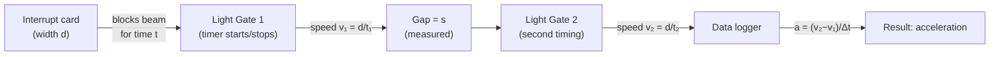

# Using Light Gates

## Aim

To measure short time intervals, instantaneous speeds and accelerations more reliably than a hand-operated stopwatch, by detecting when an object's interrupt card breaks an infrared beam.

## Variables

- Independent variable: not applicable — a timing technique used within kinematics and dynamics experiments.
- Dependent variable: the time interval, and hence speed or acceleration, of the moving object.
- Control variables: fixed interrupt-card width, consistent gate positions, same track conditions.

## Apparatus

- One or two light gates connected to a data logger or timer.
- Interrupt card of accurately measured width on the moving object (trolley, glider, falling mass).
- Track or runway; metre rule to set gate separation.

## Method

1. Measure the interrupt card width `d` accurately (use [[Using-Vernier-Calipers]] or a rule).
2. Fix the light gate(s) at known positions and connect to the timer/data logger.
3. For **instantaneous speed**: let the card pass through one gate; the timer records the time `t` the beam is blocked. Speed `v = d / t`.
4. For **acceleration**: use two gates a measured distance apart; record the speed at each gate and the time between them, then `a = (v₂ − v₁) / Δt`. Alternatively use a double-interrupt card at a single gate.
5. Repeat each run several times and take a mean.

## Measurements

Beam-block time at each gate; gate separation; card width; derived speeds and accelerations.

## Data Processing

Speed at a gate = card width ÷ block time. Acceleration from two speeds and the time between them, or from `v² = u² + 2as`. Mean of repeated runs.

## Graph Use

Speeds at successive positions can be plotted to build a [[Velocity-Time-Graph]]; its gradient gives [[Acceleration]] (see [[Using-Gradient]]).

## Uncertainty

- Sources: uncertainty in card width, the card not being exactly perpendicular to the beam, timer resolution, beam edge effects.
- Reduction: measure card width precisely and repeat; ensure the card passes squarely through the beam; use a narrow well-defined card; repeat runs and average. Light gates remove the reaction-time error inherent in manual stopwatch timing.

## Safety / Practical Limits

Low risk. Secure trolleys/runways so masses cannot fall onto feet; clamp gates firmly. The card must fully break the beam, so very narrow or transparent cards give poor triggering.

## Related Quantities

- [[Velocity]]
- [[Acceleration]]

## Related Laws or Results

- [[Newton-Second-Law]]

## Common Mistakes

- Using an inaccurately measured card width.
- Card not perpendicular to the beam, lengthening the block time.
- Treating the average speed through the gate as if it were exactly the instantaneous speed for a wide card.

## Visuals

### Light Gate Measurement Geometry

*Figure: Two-gate setup for measuring acceleration: the card of known width d blocks each beam for a short time, giving instantaneous speeds v₁ and v₂ at each gate; the data logger computes acceleration from the speed difference and the time interval between gates.*
*Source: Authored for this vault (CC0). No external copyright.*

## Source Trace

- Source: OCR Practical Skills Handbook; The Physics Classroom; IOPSpark; OpenStax
- OCR alignment: [[OCR-Physics-A-H556-Specification]]
