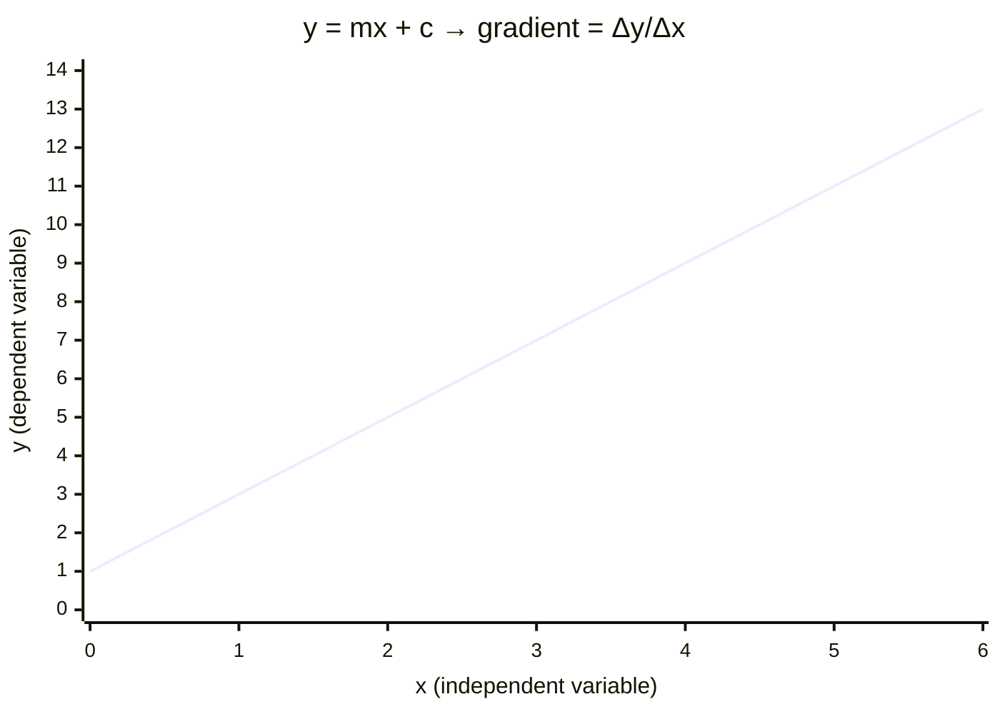

# Using Gradient

## Aim

To extract a physical quantity from the slope of a straight-line graph, and to estimate the uncertainty in that quantity from the spread of the data.

## Variables

- Independent variable: the quantity plotted on the x-axis (the one deliberately changed in the experiment).
- Dependent variable: the quantity plotted on the y-axis (the one measured in response).
- Control variables: every other condition (temperature, dimensions, supply, apparatus) held constant so the relationship is genuinely between the two plotted variables.

## Apparatus

- Plotted graph on graph paper or software, with a line of best fit.
- Ruler, sharp pencil, and a transparent set square for reading coordinates.

## Method

1. Rearrange the physical equation into straight-line form `y = mx + c`, so the gradient `m` corresponds to the wanted quantity.
2. Plot the data and draw the single best-fit straight line balancing points above and below.
3. Choose a large triangle on the line — the two points should span at least half the plotted range to reduce reading error.
4. Read the coordinates of both chosen points (read off the line, not off raw data points).
5. Gradient `m = (y₂ − y₁) / (x₂ − x₁)`, keeping units throughout.
6. Identify the physical quantity from the rearranged equation and quote it with units.

## Measurements

The coordinates of two well-separated points on the best-fit line; the axis scales and their units.

## Data Processing

Compute the gradient as the change in the y-quantity divided by the change in the x-quantity. Convert to the target quantity using the rearranged equation (e.g. gradient of force vs extension = spring constant; gradient of `ln N` vs time = −λ).

## Graph Use

The whole method *is* a graph analysis — gradient yields the relationship's constant. Drawing a maximum-gradient and minimum-gradient line through the error bars gives an uncertainty estimate.

## Uncertainty

- Main sources: scatter in data points, line-of-best-fit judgement, reading coordinates.
- Reduction: use a large triangle, plot many points over a wide range, add error bars and take the worst-acceptable lines to bound the gradient. Percentage uncertainty ≈ half the spread between max and min gradients, divided by the best gradient.

## Safety / Practical Limits

Not applicable (analysis step). Only valid when the relationship is genuinely linear over the range used.

## Related Quantities

- [[Acceleration]]
- [[Young-Modulus]]
- [[Resistance]]

## Related Laws or Results

- [[Hookes-Law]]
- [[Ohms-Law]]

## Common Mistakes

- Using two raw data points instead of points on the best-fit line.
- Choosing a tiny triangle, inflating the reading uncertainty.
- Forgetting to carry units, or not rearranging the equation into `y = mx + c` first.

## Visuals

### Gradient Extraction from a Best-Fit Line

*Figure: A straight-line best-fit graph. The gradient is found by choosing two well-separated points on the line (not on raw data points), drawing a large triangle, and computing m = Δy/Δx. The units of the gradient equal the units of the y-axis divided by the units of the x-axis, and the physical quantity is identified from the rearranged equation.*
*Source: Authored for this vault (CC0). No external copyright.*

## Source Trace

- Source: OCR Practical Skills Handbook; The Physics Classroom; IOPSpark; OpenStax
- OCR alignment: [[OCR-Physics-A-H556-Specification]]
