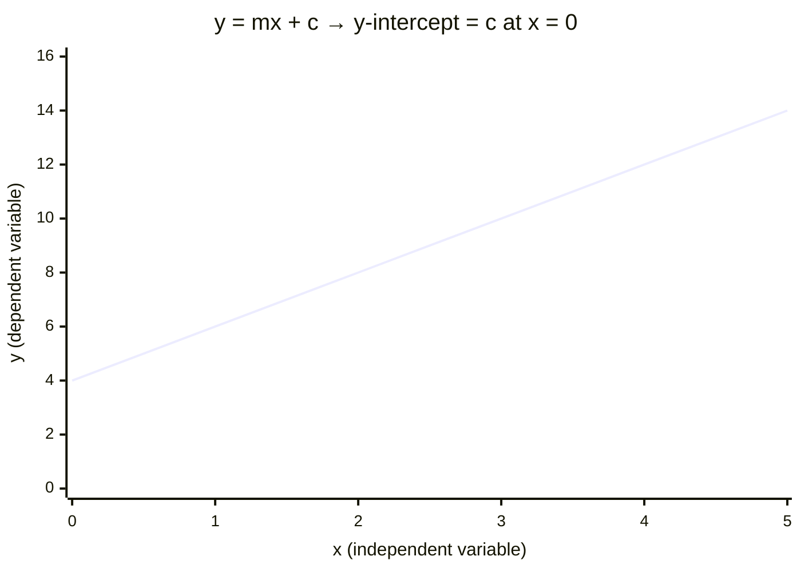

# Using Intercept

## Aim

To extract a physical quantity from where a straight-line graph crosses an axis, and to use the intercept as a check on systematic error.

## Variables

- Independent variable: quantity plotted on the x-axis.
- Dependent variable: quantity plotted on the y-axis.
- Control variables: all other conditions kept constant so the linear relationship holds.

## Apparatus

- Plotted graph with a line of best fit, ruler, sharp pencil.
- Graph paper with an axis origin shown (or the equation used to calculate the intercept if the origin is off-scale).

## Method

1. Rearrange the physical equation into $y = mx + c$, so the y-intercept `c` represents the wanted quantity.
2. Plot the data and draw the best-fit straight line.
3. If the y-axis is drawn at $x = 0$, read the intercept directly where the line crosses it.
4. If the origin is not shown, pick a point on the line $(x_1, y_1)$, find the gradient `m`, then compute $c = y_1 - m \cdot x_1$.
5. Identify the physical meaning of `c` from the rearranged equation and quote it with units.

## Measurements

The coordinate where the best-fit line meets the axis, or a point on the line plus the gradient.

## Data Processing

Interpret the intercept physically: e.g. the y-intercept of a $1/v$ against $1/u$ lens graph gives $1/f$; the y-intercept of terminal pd against current gives the emf in [[Determining-Internal-Resistance]]; a non-zero intercept where theory predicts zero indicates a systematic (zero) error.

## Graph Use

The intercept is read from the best-fit line, not from an individual point. Maximum and minimum acceptable lines give the intercept's uncertainty.

## Uncertainty

- Main sources: long extrapolation to the axis amplifies line-of-best-fit uncertainty; scatter in points.
- Reduction: minimise extrapolation distance by choosing axis scales sensibly; use error bars and worst-fit lines to bound the intercept; never force the line through the origin if the data does not support it.

## Safety / Practical Limits

Not applicable (analysis step). Extrapolating far beyond the data range reduces reliability.

## Related Quantities

- [[Internal-Resistance]]
- [[Potential-Difference]]

## Related Laws or Results

- [[Ohms-Law]]

## Common Mistakes

- Reading an "intercept" off a graph whose x-axis does not start at zero (false intercept).
- Forcing the line through the origin and hiding a real systematic error.
- Extrapolating a long way and treating the result as precise.

## Visuals

### Reading the y-Intercept from a Best-Fit Line

*Figure: The y-intercept c is read where the best-fit line crosses the y-axis (at $x = 0$). Here $c = 4$, representing a non-zero baseline quantity (e.g. the emf ε in the $V = \varepsilon - Ir$ graph, or a systematic offset). If the y-axis does not start at $x = 0$, the intercept must be calculated from a known point and the gradient.*
*Source: Authored for this vault (CC0). No external copyright.*

### From Wikipedia

<!-- wiki-images: yes -->

#### Y-intercept

![[_attachments/09_Experiments-and-Practicals/Using-Intercept--wiki-y-intercept.svg]]
*Figure: from Wikipedia article "Y-intercept".*
*Source: Wikimedia Commons — [Y-intercept.svg](https://commons.wikimedia.org/wiki/File:Y-intercept.svg). Retrieved 2026-05-20.*

#### E-to-the-i-pi

![[_attachments/09_Experiments-and-Practicals/Using-Intercept--wiki-e-to-the-i-pi.svg]]
*Figure: from Wikipedia article "Y-intercept".*
*Source: Wikimedia Commons — [E-to-the-i-pi.svg](https://commons.wikimedia.org/wiki/File:E-to-the-i-pi.svg). Retrieved 2026-05-20.*

## Source Trace

- Source: OCR Practical Skills Handbook; The Physics Classroom; IOPSpark; OpenStax
- OCR alignment: [[OCR-Physics-A-H556-Specification]]
