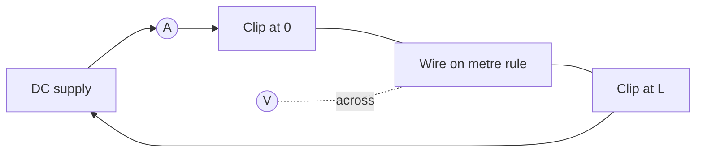

# Determining Resistivity of a Wire

## Aim

Determine the [[Resistivity]] of a metal wire by measuring how its [[Resistance]] depends on length, then combining with the wire's cross-sectional area.

## Variables

- Independent variable: length `L` of wire between the crocodile clips (m).
- Dependent variable: resistance `R` of that length (Ω), found from `V/I`.
- Control variables: wire material and gauge, ambient temperature, current (kept low and brief to avoid heating), connecting-lead resistance (zero/tare it).

## Apparatus

- Reel of uniform metal wire (e.g. constantan) taped to a metre rule.
- Two crocodile clips, low-voltage DC supply, ammeter, voltmeter, variable resistor.
- Micrometer screw gauge to measure diameter (see [[Using-a-Micrometer]]).
- Switch (to break the circuit between readings and limit heating).

## Method

1. Measure the wire diameter `d` at several points along its length and at different orientations; record the mean.
2. Set up the circuit with the ammeter in series and the voltmeter across the test length of wire.
3. Clip one crocodile clip at `L = 0.100 m` and read `V` and `I` immediately after closing the switch.
4. Open the switch, move the second clip to extend `L` in steps of about 0.100 m up to roughly 1.000 m.
5. Repeat readings and take a mean for each length.
6. Calculate `R = V/I` for each length.

## Measurements

- Diameter `d` (six readings, mean and spread).
- Length `L` between clips (m), read against the metre rule.
- Potential difference `V` (V) and current `I` (A) for each length.

## Data Processing

Cross-sectional area `A = πd²/4`. The wire obeys

`R = ρL / A`,

so a graph of `R` against `L` is a straight line through the origin with gradient `ρ/A`. Hence

`ρ = gradient × A`.

See [[Finding-Gradient-from-a-Graph]].

## Graph Use

- Axes: `R` (y, Ω) against `L` (x, m).
- Expected shape: straight line through origin.
- Gradient: `ρ/A`, giving `ρ` once `A` is known.
- A non-zero intercept signals lead/contact resistance — subtract it rather than ignore.

## Uncertainty

- Diameter dominates because `A ∝ d²`, so a 1% error in `d` becomes 2% in `A` and in `ρ`.
- Length uncertainty is small for long wires; keep `L` large to reduce its fractional contribution.
- Heating raises resistance — keep currents low and switch off between readings.
- Combine percentage uncertainties from `R`, `L`, and `A` using [[Combining-Uncertainties]].

## Safety / Practical Limits

- Wire can get hot if current is too high; use a variable resistor to keep `I` modest.
- Inspect insulation on leads; avoid short circuits at the crocodile clips.

## Related Quantities

- [[Resistance]]
- [[Resistivity]]

## Related Laws or Results

- `R = ρL / A`

## Common Mistakes

- Using a single diameter reading instead of a mean of several orientations.
- Letting the wire heat up between readings (raises `R`, biases `ρ`).
- Ignoring lead/contact resistance shown by a non-zero intercept.

## Visuals

### Circuit and graph schematic

*Figure: Ammeter in series with the wire; voltmeter across the length `L` between the clips.*
*Source: Authored for this vault (CC0). No external copyright.*

### From Wikimedia

<!-- wiki-images: yes -->

#### Micrometer screw gauge
![[_attachments/09_Experiments-and-Practicals/Determining-Resistivity-of-a-Wire--wiki-micrometer.jpg]]
*Figure: a micrometer screw gauge, used to measure the wire diameter `d` accurately before computing the cross-sectional area.*
*Source: Wikimedia Commons — [Micrometer (screw gauge).jpg](https://commons.wikimedia.org/wiki/File:Micrometer_(screw_gauge).jpg) — CC BY-SA 4.0 — Riaz. Retrieved 2026-06-27.*

## Source Trace

- Source: [[AQA-Physics-7407-7408-Specification]] §3.5 (Required practical 5)
- Public reference: AQA practical handbook (referenced, not copied); IOPSpark resistivity-of-a-wire guidance.
