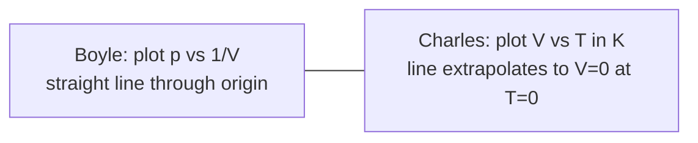

# Investigating Boyle and Charles Laws

## Aim

Test the two gas laws that underpin the [[Ideal-Gas-Equation]]: Boyle's law (`pV = constant` at fixed `T`) and Charles's law (`V/T = constant` at fixed `p`), and use Charles's law to extrapolate towards absolute zero.

## Variables

**Boyle's law:**
- Independent: [[Pressure]] `p` on the gas (Pa).
- Dependent: [[Volume]] `V` of the trapped gas.
- Control: amount of gas (sealed sample), [[Temperature]] (allow time to equilibrate after each compression).

**Charles's law:**
- Independent: temperature `T` of a water bath (K).
- Dependent: length of gas column (proportional to `V`).
- Control: pressure (open capillary tube held at atmospheric `p`), amount of gas.

## Apparatus

- **Boyle:** Boyle's-law apparatus (oil-filled column with sealed air space, foot pump, Bourdon pressure gauge, calibrated scale).
- **Charles:** capillary tube sealed at one end with a small bead of concentrated sulphuric acid trapping a column of dry air, mounted alongside a thermometer in a beaker of water; heater/stirrer.

## Method

**Boyle's law:**
1. Note initial pressure and gas-column length.
2. Use the pump to raise pressure in small steps; wait ~30 s for thermal equilibrium.
3. Record `p` and `V` at each step.
4. Reduce pressure back through the same values to check repeatability.

**Charles's law:**
1. Place the capillary tube and thermometer in a beaker of cold water; stir, then record length `L₀` and temperature `T` (convert to kelvin).
2. Heat the bath in steps of ~10 °C, stirring well; at each step pause for thermal equilibrium and record `L` and `T`.
3. Repeat up to about 80 °C.

## Measurements

- Boyle: `p` (Pa) and `V` (or column length × constant area).
- Charles: column length `L` (mm) and bath temperature `T` (K).

## Data Processing

- Boyle: compute `1/V` and tabulate alongside `p`.
- Charles: tabulate `L` (proxy for `V`) against `T` in kelvin.

## Graph Use

- Boyle: plot `p` against `1/V`. A straight line through the origin confirms `pV = constant`; gradient equals `nRT`.
- Charles: plot `V` (or `L`) against `T` in kelvin. A straight line whose extrapolation hits `V = 0` at about `−273 °C` supports the absolute-zero interpretation.
- See [[Finding-Gradient-from-a-Graph]] and [[Linearising-a-Graph]] for the choice of axes.

## Uncertainty

- Boyle: pressure-gauge resolution; reading parallax on the oil column; trapped-air heating during rapid compression (mitigate by waiting).
- Charles: thermometer resolution and bath non-uniformity (stir); end-effects in the capillary; difficulty keeping `p` truly constant.
- Combine fractional uncertainties using [[Combining-Uncertainties]] before computing `pV` products or gradients.

## Safety / Practical Limits

- Boyle's-law apparatus stores energy under pressure — do not exceed the rated maximum; wear eye protection.
- Charles's apparatus uses concentrated sulphuric acid — handle the prepared tube only; do not refill in the lab.
- Hot water bath: avoid scalding; use a stirrer rather than a hand.

## Related Quantities

- [[Pressure]]
- [[Volume]]
- [[Temperature]]

## Related Laws or Results

- [[Ideal-Gas-Equation]] (`pV = nRT`)

## Common Mistakes

- Plotting `V` against `T` in °C instead of K — destroys the proportionality.
- Compressing too fast in Boyle's apparatus so the gas heats, then reading before it cools.
- Forgetting that the oil column shifts the effective gas length.

## Visuals

### Two gas-law graphs

*Figure: Both laws are confirmed by straight-line graphs once axes are chosen sensibly.*
*Source: Authored for this vault (CC0). No external copyright.*

### From Wikimedia

<!-- wiki-images: yes -->

#### Boyle's law apparatus
![[_attachments/09_Experiments-and-Practicals/Investigating-Boyle-and-Charles-Laws--wiki-boyles-law-apparatus.png]]
*Figure: a Boyle's-law apparatus — a foot pump compresses a sealed air column above oil while a gauge reads the pressure.*
*Source: Wikimedia Commons — [Boyles law appratus.png](https://commons.wikimedia.org/wiki/File:Boyles_law_appratus.png) — CC0 — Guy vandegrift. Retrieved 2026-06-27.*

## Source Trace

- Source: [[AQA-Physics-7407-7408-Specification]] §3.6 (Required practical 8)
- Public reference: AQA practical handbook (referenced, not copied); IOPSpark gas-laws guidance.
