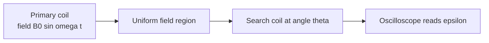

# Investigating Flux Linkage with a Search Coil

## Aim

Use a search coil and oscilloscope to investigate how the induced emf (and hence [[Magnetic-Flux-Linkage]]) depends on the angle between the coil axis and an alternating magnetic field, confirming the cosine dependence implied by [[Faradays-Law]].

## Variables

- Independent variable: angle `θ` between the search-coil axis and the field direction (0° = axis aligned with `B`).
- Dependent variable: peak induced emf `ε₀` (V), read from the oscilloscope trace.
- Control variables: amplitude and frequency of the alternating current in the field-producing coil, position of the search coil at the centre of the field region, number of turns and area of the search coil.

## Apparatus

- Large primary coil (e.g. Helmholtz pair or solenoid) driven by a signal generator producing an alternating current of fixed amplitude and frequency.
- Search coil: a small flat coil with known turns `N` and mean area `A`, mounted on a protractor so its axis can be rotated about a vertical diameter.
- Oscilloscope to display the induced emf waveform.
- Optional: AC ammeter to monitor the primary current.

## Method

1. Set the signal generator to a fixed frequency (typically 50–500 Hz) and a fixed amplitude; record the primary current.
2. Position the search coil at the centre of the field region with its axis parallel to the field (`θ = 0`).
3. Read the peak-to-peak voltage `V_pp` on the oscilloscope and convert to peak emf `ε₀ = V_pp / 2`.
4. Rotate the search coil by 10° and re-read `ε₀`.
5. Continue in 10° steps from 0° to 90° (and beyond to 180° to check symmetry).
6. Repeat each angle and average.

## Measurements

- Angle `θ` from the protractor (°, converted to rad for calculation).
- Peak induced emf `ε₀` at each angle.

## Data Processing

For a coil at angle `θ` to a uniform alternating field `B(t) = B₀ sin(ωt)`, the flux linkage is

`NΦ = N · B₀ A cosθ · sin(ωt)`,

so

`ε = −d(NΦ)/dt = −N B₀ A ω cosθ · cos(ωt)`.

Peak emf: `ε₀ = N B₀ A ω · cosθ`. Tabulate `ε₀` and `cosθ`.

## Graph Use

- Plot `ε₀` (y) against `cosθ` (x).
- A straight line through the origin confirms the cosθ dependence and so confirms [[Faradays-Law]] for this geometry.
- Gradient = `N B₀ A ω`; with `N`, `A`, and `ω` known, you can estimate the peak field `B₀`.
- See [[Linearising-a-Graph]] for why `cosθ` is the right horizontal axis.

## Uncertainty

- Reading peak-to-peak on the oscilloscope (graticule resolution; trigger jitter).
- Angle uncertainty from the protractor (~1°), which matters near 90° because `cosθ` changes fast there.
- Coil not exactly at the field centre — keep its position fixed while only the angle changes.
- Stray pickup from mains wiring and from the signal-generator leads — twist them and keep them away from the search coil.

## Safety / Practical Limits

- Low voltages and currents — main hazard is hot or vibrating coils at high drive amplitude. Keep within the signal generator's rating.
- Strong magnets, if used to provide a steady reference, should be kept clear of cards and devices.

## Related Quantities

- [[Magnetic-Flux-Linkage]]

## Related Laws or Results

- [[Faradays-Law]]
- [[Electromagnetic-Induction]]

## Common Mistakes

- Reading peak-to-peak as the peak (factor-of-two error in `ε₀`).
- Forgetting to convert degrees to radians when computing derivatives or comparing with `ω`.
- Moving the coil's position when rotating it — the field is not perfectly uniform.

## Visuals

### Geometry of search coil in alternating field

*Figure: Only the field component along the search-coil axis links the turns, giving the `cosθ` factor.*
*Source: Authored for this vault (CC0). No external copyright.*

## Source Trace

- Source: [[AQA-Physics-7407-7408-Specification]] §3.7 (Required practical 11)
- Public reference: AQA practical handbook (referenced, not copied); IOPSpark search-coil guidance.
