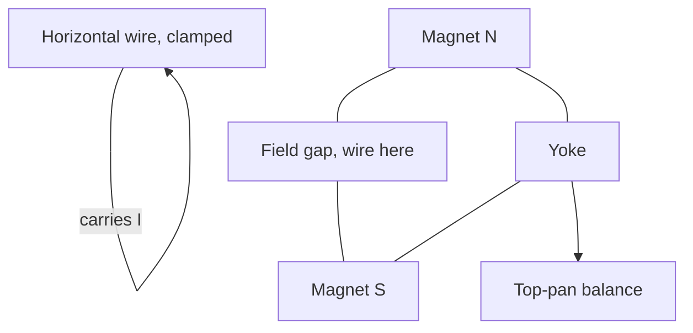

# Investigating Force on a Current-Carrying Wire

## Aim

Investigate how the force on a current-carrying conductor in a magnetic field depends on current `I`, length `L` of wire in the field, and [[Magnetic-Flux-Density]] `B`, using a top-pan balance to measure the force directly, and so test `F = BIL`.

## Variables

- Independent variable: current `I` (A) through the wire (or `L`, or magnet arrangement, depending on the run).
- Dependent variable: force `F` (N) on the magnet assembly, read as a mass change on the top-pan balance and converted by `F = Δm·g`.
- Control variables: position and orientation of the wire (perpendicular to `B`), magnet geometry, ambient field (zero the balance with current off), wire kept straight and centred in the gap.

## Apparatus

- Top-pan balance reading to ≥ 0.01 g.
- Pair of slab magnets on a yoke (or a Magnadur arrangement) producing a roughly uniform horizontal field across a known gap.
- Stiff straight copper wire clamped horizontally, passing through the field gap perpendicular to `B`.
- Low-voltage DC supply, ammeter, variable resistor, switch.

## Method

1. Place the magnet assembly on the top-pan balance and zero it.
2. Clamp the wire so it lies horizontally in the gap, perpendicular to the field, not touching the magnets.
3. Close the switch and quickly record `I` and the new balance reading; open the switch.
4. Vary `I` in steps using the variable resistor; record `Δm` at each `I`.
5. Reverse the current direction to confirm the force reverses (sign of `Δm` change).
6. Repeat with a different length `L` in the field, or with extra magnets stacked to change `B`.

## Measurements

- Current `I` (A) from the ammeter.
- Mass change `Δm` (kg) from the balance.
- Length `L` (m) of wire actually inside the magnetic gap.

## Data Processing

Convert mass change to force: `F = Δm · g`. By Newton's third law the upward force on the magnets equals the downward force on the wire (or vice versa, depending on current direction). Tabulate `F` against `I`.

## Graph Use

- Plot `F` (y, N) against `I` (x, A) for fixed `L` and `B`.
- A straight line through the origin confirms `F ∝ I`.
- Gradient = `BL`. With `L` measured directly, `B = gradient / L`.
- See [[Finding-Gradient-from-a-Graph]].

## Uncertainty

- Balance reading: resolution and drift (re-zero often).
- Field is not perfectly uniform across the gap — keep the wire centred and use small currents so heating doesn't warp the wire.
- Length `L` "in the field" is fuzzy at the magnet edges; quote a sensible range.
- Combine percentage uncertainties in `Δm`, `I`, and `L` via [[Combining-Uncertainties]].

## Safety / Practical Limits

- Currents above a few amps heat the wire quickly — keep runs short, use a switch and fuse.
- Magnets are brittle and pinch fingers; handle by the yoke, not the poles.

## Related Quantities

- [[Magnetic-Flux-Density]]

## Related Laws or Results

- [[Force-on-a-Current-Carrying-Conductor]] (`F = BIL` when wire is perpendicular to `B`)

## Common Mistakes

- Letting the wire touch the magnets, so the balance reads contact force, not magnetic force.
- Forgetting to convert grams to kilograms before multiplying by `g`.
- Treating `L` as the total wire length instead of just the part in the field.

## Visuals

### Balance-and-magnet arrangement

*Figure: Wire fixed in space; the reaction force pushes down on the magnet/yoke assembly sitting on the balance.*
*Source: Authored for this vault (CC0). No external copyright.*

## Source Trace

- Source: [[AQA-Physics-7407-7408-Specification]] §3.7 (Required practical 10)
- Public reference: AQA practical handbook (referenced, not copied); IOPSpark force-on-a-current guidance.
