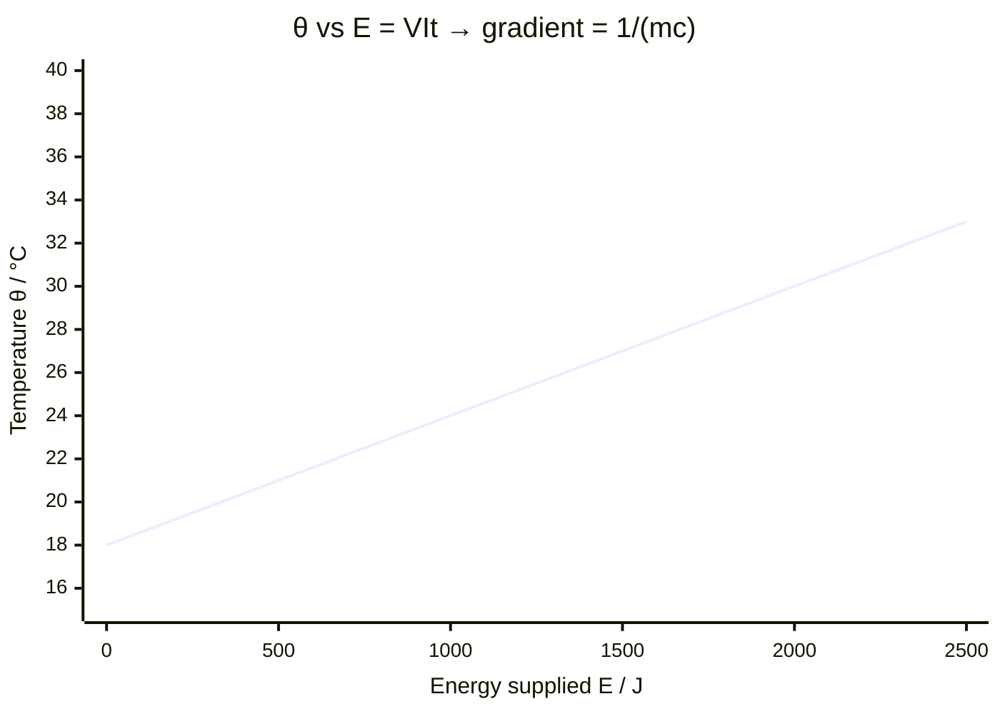

# Measuring Specific Heat Capacity

## Aim

To determine the specific heat capacity $c$ of a solid (or liquid) by supplying a measured amount of electrical energy and recording the temperature rise.

## Variables

- Independent variable: energy supplied $E$ (controlled via heating time at fixed power)
- Dependent variable: temperature $\theta$ of the block/liquid
- Control variables: mass $m$ of the sample, ambient conditions, insulation, the sample material

## Apparatus

- Metal block (e.g. aluminium) with holes for heater and thermometer, or an insulated beaker of liquid
- Low-voltage electrical immersion heater
- Power supply, voltmeter and ammeter (or joulemeter)
- Stopwatch, balance, thermometer or temperature sensor with datalogger
- Insulation (lagging) and a lid

## Method

1. Measure the mass $m$ of the block/liquid on a balance.
2. Insulate the block; add a little oil/water to the thermometer hole for good thermal contact.
3. Record the starting temperature.
4. Switch on the heater; record $V$, $I$ and start the stopwatch simultaneously.
5. Record temperature at regular time intervals (or log continuously).
6. Switch off after a suitable rise; note that temperature keeps rising briefly (thermal lag) and record the maximum.

## Measurements

Mass $m$ (kg); potential difference $V$ (V); current $I$ (A); heating time $t$ (s); temperature against time.

## Data Processing

Electrical energy supplied $E = VIt$. With $E = mc\,\Delta\theta$, rearranged: $c = \dfrac{VIt}{m\,\Delta\theta}$.

## Graph Use

Plot temperature $\theta$ (y-axis) against energy supplied $E = VIt$ (x-axis). The graph is a straight line of **gradient** $\dfrac{1}{mc}$, so $c = \dfrac{1}{m \times \text{gradient}}$. Using the gradient (rather than single start/end points) averages out random error and reduces the effect of initial warm-up.

## Uncertainty

- Heat lost to surroundings (systematic) makes the measured $\Delta\theta$ too small, so $c$ is over-estimated — reduce with lagging, a lid, and starting below / ending above room temperature to balance heat exchange.
- Thermometer reading and resolution (random) — repeat, use a digital sensor/datalogger.
- Thermal lag between heater, block and thermometer — use good thermal contact and the gradient method.

## Safety / Practical Limits

Hot apparatus and heater — allow cooling before handling; do not exceed the heater's voltage rating; avoid electrical connections near water.

## Related Quantities

- [[Specific-Heat-Capacity]]
- [[Specific-Latent-Heat]]
- [[Temperature]]
- [[Energy]]

## Related Laws or Results

- [[Conservation-of-Energy]]

## Common Mistakes

- [[Confusing-Heat-and-Temperature]]
- Using mass in grams
- Ignoring heat losses (no lagging)

## Visuals

### Temperature against Energy Supplied Graph

*Figure: Temperature θ rises linearly with energy supplied E = VIt for a well-insulated block. The gradient equals 1/(mc), so the specific heat capacity c = 1/(m × gradient). The slight curve at the start reflects warm-up of the heater; using the gradient of the best-fit line averages this out.*
*Source: Authored for this vault (CC0). No external copyright.*

## Source Trace

- Source: OpenStax College Physics; HyperPhysics; The Physics Classroom — paraphrased, no copied text
- Section/Page: OCR alignment: [[OCR-Physics-A-H556-Specification]] (Module 5.1.2; practical skills)
