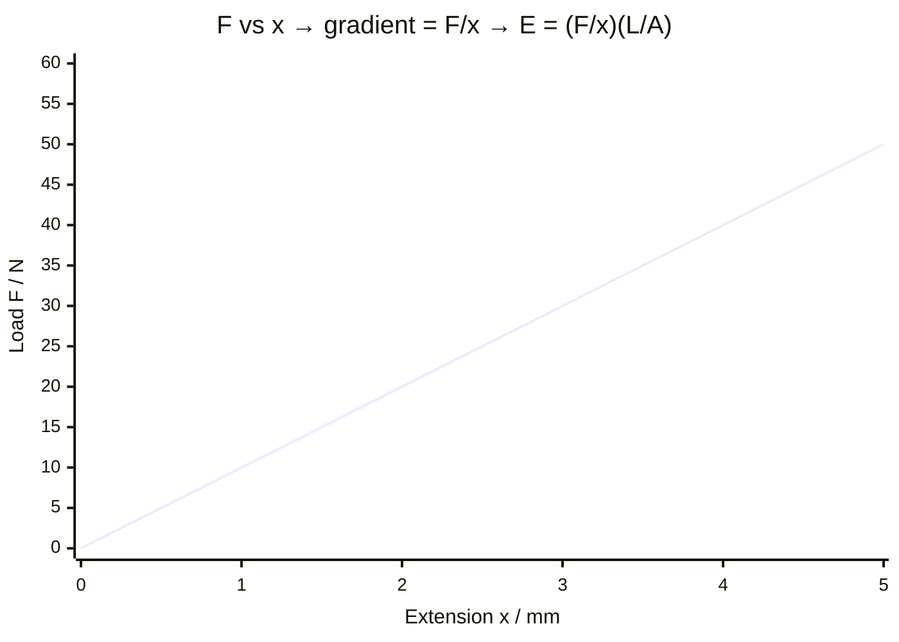

# Measuring Young Modulus

## Aim

To determine the [[Young-Modulus]] of a material in wire form by measuring how it extends under tension.

## Variables

- Independent variable: load (tension force) `F` applied to the wire.
- Dependent variable: extension `x` of the wire.
- Control variables: same wire (material, original length `L`, diameter), same temperature, same support.

## Apparatus

- Long thin wire of the test material clamped at one end over a pulley.
- Slotted masses and hanger; marker/Vernier reference for reading extension.
- Micrometer (for diameter — see [[Using-a-Micrometer]]); metre rule/tape for original length; safety goggles.

## Method

1. Measure the original length `L` of the wire from clamp to marker with a metre rule.
2. Measure the wire diameter `d` at several points with a micrometer; take a mean and find cross-sectional area $A = \frac{\pi d^2}{4}$.
3. Apply a small initial load to straighten the wire and set the reference mark to zero.
4. Add masses in steps, recording the load $F = mg$ and the corresponding extension `x` each time.
5. Continue to a sensible maximum (staying within the elastic region), then unload in steps to check the wire returns to its original length (elastic behaviour).

## Measurements

Load `F`, extension `x`, original length `L`, mean diameter `d`.

## Data Processing

From the definition $E = \frac{\text{stress}}{\text{strain}} = \frac{F/A}{x/L} = \frac{FL}{Ax}$. Plot a [[Force-Extension-Graph]] (`F` against `x`); its gradient is $F/x$, so $E = \frac{\text{gradient} \times L}{A}$. Alternatively plot a [[Stress-Strain-Graph]] and take the gradient of the linear region directly.

## Graph Use

`F` (y-axis) against `x` (x-axis), straight through the origin in the elastic region; gradient $= F/x$ (see [[Using-Gradient]]). Combine with `L` and `A` to get `E`.

## Uncertainty

- Sources: diameter measurement (squared in `A`, so it dominates the percentage uncertainty), extension reading, original length.
- Reduction: measure diameter several times at different points and orientations; use a long wire (large `L` gives larger, more measurable extensions); read extension with a Vernier scale; combine uncertainties (see existing [[Combining-Uncertainties]]) noting the diameter term is doubled.

## Safety / Practical Limits

Wear safety goggles — a wire under tension can snap and recoil. Place a padded box under the masses. Stay within the elastic limit, or the wire deforms permanently and the analysis is invalid.

## Related Quantities

- [[Young-Modulus]]
- [[Stress]]
- [[Strain]]

## Related Laws or Results

- [[Hookes-Law]]

## Common Mistakes

- Taking a single diameter reading (the largest contributor to uncertainty).
- Loading beyond the elastic limit, so the wire does not return.
- Forgetting the small straightening pre-load when zeroing the extension.

## Visuals

### Force against Extension Graph (Elastic Region)

*Figure: Load F plotted against extension x in the elastic region gives a straight line through the origin (Hooke's Law region). The Young modulus $E = \frac{\text{gradient} \times L}{A}$, where L is the original wire length and $A = \frac{\pi d^2}{4}$ is the cross-sectional area. Deviation from linearity above the elastic limit is not plotted here.*
*Source: Authored for this vault (CC0). No external copyright.*

### From Wikipedia

<!-- wiki-images: yes -->

#### Stress strain ductile

![[_attachments/09_Experiments-and-Practicals/Measuring-Young-Modulus--wiki-stress-strain-ductile.svg]]
*Figure: from Wikipedia article "Young's modulus".*
*Source: Wikimedia Commons — [Stress_strain_ductile.svg](https://commons.wikimedia.org/wiki/File:Stress_strain_ductile.svg). Retrieved 2026-05-20.*

#### SpiderGraph YoungMod

![[_attachments/09_Experiments-and-Practicals/Measuring-Young-Modulus--wiki-spidergraph-youngmod.gif]]
*Figure: from Wikipedia article "Young's modulus".*
*Source: Wikimedia Commons — [SpiderGraph YoungMod.gif](https://commons.wikimedia.org/wiki/File:SpiderGraph_YoungMod.gif). Retrieved 2026-05-20.*

#### Stress strain ductile

![[_attachments/09_Experiments-and-Practicals/Measuring-Young-Modulus--wiki-stress-strain-ductile.svg]]
*Figure: from Wikipedia article "Young's modulus".*
*Source: Wikimedia Commons — [Stress strain ductile.svg](https://commons.wikimedia.org/wiki/File:Stress_strain_ductile.svg). Retrieved 2026-05-20.*

## Source Trace

- Source: OCR Practical Skills Handbook; The Physics Classroom; IOPSpark; OpenStax
- OCR alignment: [[OCR-Physics-A-H556-Specification]]
