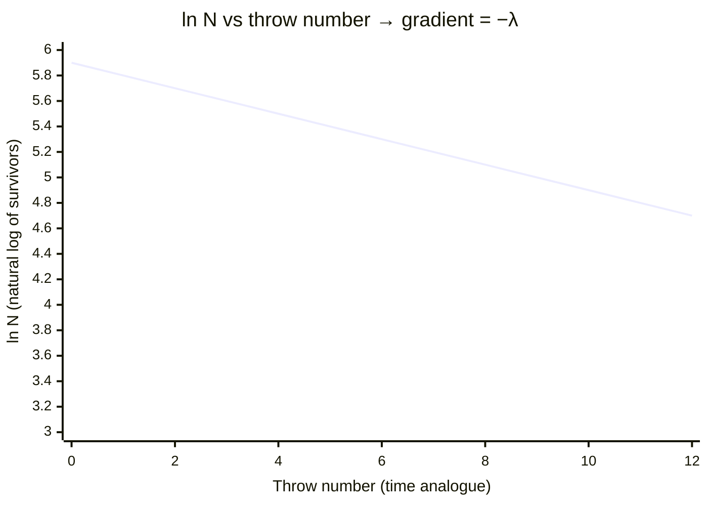

# Modelling Radioactive Decay

## Aim

To model the random, exponential nature of [[Radioactive-Decay]] using an analogue (dice or coins) and to determine an effective decay constant and half-life.

## Variables

- Independent variable: number of throws (analogue for time, t)
- Dependent variable: number of "undecayed" objects remaining, N
- Control variables: total objects per trial, decay rule (e.g. remove any die showing a six), consistent throwing method

## Apparatus

- A large set (e.g. 200–600) of identical dice or coins
- Tray or container for throwing
- Tally sheet and graph paper or spreadsheet

## Method

1. Count and record the initial number of objects N₀.
2. Throw all objects together (this represents one time interval).
3. Remove every object meeting the decay rule (e.g. a die showing 6, probability 1/6).
4. Record the number remaining, N.
5. Repeat steps 2–4 with the survivors, logging N after each throw, until few objects remain.
6. Repeat the whole run and/or pool class data to reduce random scatter.

## Measurements

After each throw: throw number (time analogue) and number of surviving objects N.

## Data Processing

- Plot N against throw number $\rightarrow$ exponential decay curve.
- Plot $\ln N$ against throw number $\rightarrow$ straight line of gradient $-\lambda$ (effective decay constant per throw).
- Determine the "half-life" as the number of throws for N to halve, and check $t_{1/2} = \frac{\ln 2}{\lambda}$.

## Graph Use

- Axes: $\ln N$ (y) vs throw number (x).
- Gradient $= -\lambda$.
- y-intercept $= \ln N_0$.

## Uncertainty

- Random scatter is large for small N (the model becomes unreliable near the end) — use a large N₀ and pool data.
- Counting/sorting errors; mitigate by careful tallying.
- The model assumes a fixed decay probability per object per throw, mirroring the constant [[Decay-Constant]].

## Safety / Practical Limits

Low risk; ensure objects are not a slip or choking hazard. This is an analogue — it illustrates randomness and exponential decay, not real nuclear physics or [[Activity]] in becquerels.

## Related Quantities

- [[Decay-Constant]]
- [[Activity]]
- [[Half-Life]]

## Related Laws or Results

- [[Radioactive-Decay-Law]]

## Common Mistakes

- Plotting N (not ln N) and expecting a straight line
- Trusting late-stage data where N is too small
- Confusing throws-as-time with real seconds

## Visuals

### ln N against Throw Number (Exponential Decay Linearised)

*Figure: Plotting ln N against throw number gives a straight line of gradient $-\lambda$ (the effective decay constant per throw) and y-intercept $\ln N_0$. The "half-life" in throws is $t_{1/2} = \frac{\ln 2}{\lambda}$. Data scatter grows as N becomes small (late throws) — a feature of real radioactive statistics.*
*Source: Authored for this vault (CC0). No external copyright.*

## Source Trace

- Source: OpenStax College Physics; HyperPhysics; CERN educational material — no copied text
- OCR alignment: [[OCR-Physics-A-H556-Specification]]
