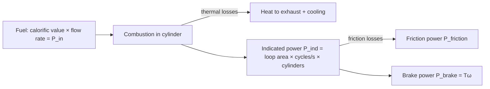

# Engine Cycles

## Problem Context

A four-stroke internal combustion engine converts the chemical energy of fuel into useful mechanical work by taking a gas through a closed cycle of [[Thermodynamic-Processes]]. The idealised cycle (Otto for petrol, Diesel for diesel) is sketched on a [[pV-Diagram]] called an **indicator diagram**. Comparing the theoretical loop to the measured one reveals where energy is lost and lets engineers report meaningful efficiencies.

## Physical Ideas

- [[First-Law-of-Thermodynamics]]
- [[Second-Law-of-Thermodynamics]]
- [[Thermodynamic-Processes]]
- [[pV-Diagram]]
- [[Conservation-of-Energy]]

## The Four-Stroke Cycles

### Otto cycle (petrol, idealised)

1. **Induction** — intake valve open, piston pulls fuel/air mix in at near-atmospheric pressure.
2. **Adiabatic compression** — both valves shut, piston compresses mixture quickly.
3. **Ignition** — spark fires; pressure rises at almost constant volume.
4. **Adiabatic (power) expansion** — hot gas pushes piston down doing work.
5. **Exhaust** — exhaust valve opens, pressure drops at constant volume; piston pushes burnt gas out.

### Diesel cycle (idealised)

Same shape, but ignition happens by **adiabatic compression alone** (no spark) and combustion is modelled as **constant-pressure** heat addition rather than constant-volume.

### Real vs theoretical indicator diagrams

The theoretical loop has sharp corners and well-defined process types. A real indicator diagram, recorded by a sensor on the cylinder, has rounded corners and a smaller enclosed area — valve timing, heat loss to cylinder walls, friction, and incomplete combustion all eat into the work output.

## Mathematical Tools

### Input power (from fuel)

$$P_{\text{in}} = \text{calorific value} \times \text{fuel flow rate}$$

- Calorific value in J kg$^{-1}$ (or J m$^{-3}$ for gases).
- Fuel flow rate in kg s$^{-1}$ (or m$^3$ s$^{-1}$).
- Gives input power in watts (W).

### Indicated power (from the pV loop)

$$P_{\text{ind}} = (\text{area of pV loop}) \times (\text{cycles per second}) \times (\text{number of cylinders})$$

- Loop area in joules (J) per cycle per cylinder.
- Cycles per second: for a four-stroke engine, $n_{\text{cycles}} = \frac{1}{2} \times (\text{rpm}/60)$ because one power stroke happens every **two** crankshaft revolutions.
- $P_{\text{ind}}$ in watts.

### Brake power (useful mechanical output)

$$P_{\text{brake}} = T\omega$$

- $T$ — torque on the crankshaft, N m, measured with a brake dynamometer.
- $\omega$ — angular velocity, rad s$^{-1}$ ($= 2\pi \times$ rotations per second).
- $P_{\text{brake}}$ in watts.

### Friction power

$$P_{\text{friction}} = P_{\text{ind}} - P_{\text{brake}}$$

The mechanical losses in bearings, piston rings, pumping, and accessories.

### Efficiencies

- **Thermal (indicated) efficiency**: $\eta_{\text{th}} = P_{\text{ind}}/P_{\text{in}}$ — how well the cycle converts heat to mechanical work in the cylinder.
- **Mechanical efficiency**: $\eta_{\text{mech}} = P_{\text{brake}}/P_{\text{ind}}$ — how much indicated power survives friction.
- **Overall (brake) efficiency**: $\eta_{\text{overall}} = P_{\text{brake}}/P_{\text{in}} = \eta_{\text{th}} \times \eta_{\text{mech}}$.

A typical petrol car engine has $\eta_{\text{th}} \approx 30\%$, $\eta_{\text{mech}} \approx 80\%$, so $\eta_{\text{overall}} \approx 25\%$.

## Typical Questions

- Read the area of a given indicator loop and compute indicated power at a stated rpm.
- Given calorific value and fuel rate, find input power and overall efficiency.
- Compare petrol vs diesel cycles using their pV diagrams.
- Explain why real indicator diagrams have smaller areas than theoretical ones.

## Method Outline

1. Sketch or read the indicator diagram; identify each process.
2. Find loop area (counting squares or geometry) — this is work per cycle per cylinder.
3. Multiply by cycles per second and number of cylinders → indicated power.
4. Use $P = T\omega$ for brake power; subtract to get friction power.
5. Compute the requested efficiency.

## Assumptions

- Working substance behaves as an [[Ideal-Gas-Model]].
- Theoretical cycles use idealised adiabatic and isobaric/isochoric legs.
- Complete combustion; no leakage past piston rings.
- Steady-state operation at the stated rpm.

## Links to Other Subjects

- Mathematics: trapezium and Simpson's rule for loop areas; angular kinematics for rpm ↔ $\omega$.
- Engineering: thermodynamic cycle design, materials at high temperature.

## Frontier Links

- Hybrid and electric powertrains — bypassing the thermodynamic-efficiency ceiling.
- Combined-cycle gas turbines pushing $\eta_{\text{overall}}$ above 60%.

## Common Mistakes

- Forgetting the factor of $\tfrac{1}{2}$ when converting rpm to cycles per second for a four-stroke engine.
- Mixing up brake, indicated, and input power.
- Confusing thermal efficiency with overall efficiency.
- Forgetting to multiply loop area by the number of cylinders.
- Reading a loop area in mixed units (kPa with cm$^3$) without converting.

## Visuals

### Power-flow chain of a four-stroke engine

*Figure: Energy from fuel flows through combustion, indicated power, and out to the crankshaft, losing a share at each stage.*
*Source: Authored for this vault (CC0). No external copyright.*

## Source Trace

- Source: [[AQA-Physics-7407-7408-Specification]] §3.11.2 (Engineering Physics — Thermodynamics and engines)
- Public source: HyperPhysics (Otto and Diesel cycles, heat-engine efficiency); OpenStax College Physics §15.4.
- Section/Page: AQA specification §3.11.2.2 and §3.11.2.3
