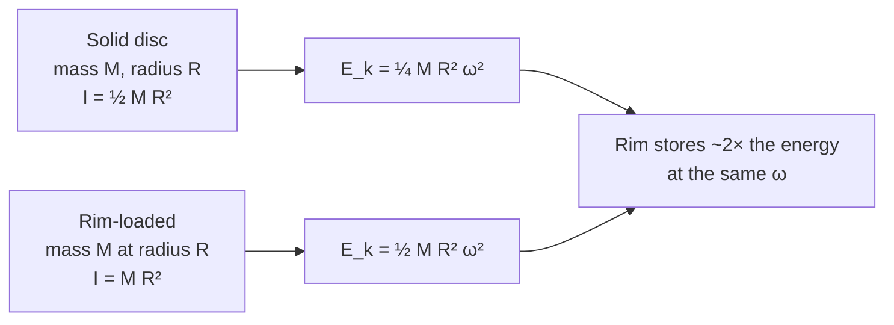

# Flywheels

## Problem Context

A flywheel is a heavy rotating disc or rim, deliberately designed to have a large [[Moment-of-Inertia]]. Engineers use flywheels to **store mechanical energy** and to **smooth out** fluctuations in torque or speed in machines such as engines, presses, potter's wheels, and electric vehicles with regenerative storage.

## Physical Ideas

- [[Rotational-Kinetic-Energy]]
- [[Moment-of-Inertia]]
- [[Angular-Velocity]]
- [[Torque-and-Angular-Acceleration]]
- [[Conservation-of-Energy]]

## Typical Questions

- How much energy is stored in a flywheel of moment of inertia $I$ spinning at angular velocity $\omega$?
- By what factor does the stored energy increase if $\omega$ is doubled?
- Why is mass placed at the **rim** of a flywheel rather than near the axis?
- Given a maximum safe rotation rate, what mass and radius are needed to store a target energy?
- How long can a flywheel deliver a given mean power before slowing significantly?

## Method Outline

1. Energy stored: $E_k = \tfrac{1}{2} I \omega^{2}$ (J, with $\omega$ in rad s⁻¹).
2. To increase capacity, increase $I$ (more mass, mass further from axis) or increase $\omega_\text{max}$ — but $E_k$ rises with $\omega^{2}$, so raising $\omega$ is very effective until material strength limits it.
3. Useful energy delivered between $\omega_1$ and $\omega_2$: $\Delta E_k = \tfrac{1}{2}I(\omega_1^{2}-\omega_2^{2})$.
4. Mean power available over time $\Delta t$: $P = \dfrac{\Delta E_k}{\Delta t}$, or instantaneously $P = T\omega$.
5. For smoothing: a flywheel acts as a kinetic-energy "buffer". When the driving torque exceeds the load, energy is stored ($\omega$ rises slightly); when the load exceeds the drive, the flywheel gives energy back ($\omega$ falls slightly).

### Factors affecting capacity

- **Mass distribution**: concentrating mass at large radius (rim-loaded) gives a much larger $I$ for the same mass than a solid disc.
- **Maximum safe $\omega$**: limited by tensile stress at the rim — material strength sets a hard ceiling.
- **Friction in bearings**: a frictional torque always opposes rotation, so stored energy leaks away as heat over time.
- **Aerodynamic drag**: high-performance flywheels run in vacuum housings to cut drag losses.

## Assumptions

- Rigid body rotating about a fixed axis.
- Rotational SUVAT or energy methods valid only when torque or energy losses are modelled correctly.
- The simple $E_k = \tfrac{1}{2}I\omega^{2}$ ignores material deformation at high $\omega$.

## Links to Other Subjects

- Mathematics: working with $\omega^{2}$ scaling, gradients of $E_k$–$\omega^{2}$ graphs.
- Computer Science: control systems modulating torque demand on a flywheel buffer (e.g. KERS in motorsport).

## Frontier Links

- [[...]]

## Common Mistakes

- Forgetting that $E_k$ scales with $\omega^{2}$: doubling $\omega$ stores **four** times the energy.
- Comparing flywheels by mass alone, ignoring radius distribution and so $I$.
- Treating frictional losses as negligible over long times.
- Using degrees s⁻¹ instead of rad s⁻¹ for $\omega$.

## Visuals

### Two flywheels, same mass

*Figure: Placing mass at the rim doubles I, and so doubles the stored energy at the same angular velocity.*
*Source: Authored for this vault (CC0). No external copyright.*

## Source Trace

- Source: [[AQA-Physics-7407-7408-Specification]] §3.11.1 (Engineering Physics — Rotational dynamics)
- Section/Page: Public reference — HyperPhysics; OpenStax College Physics
