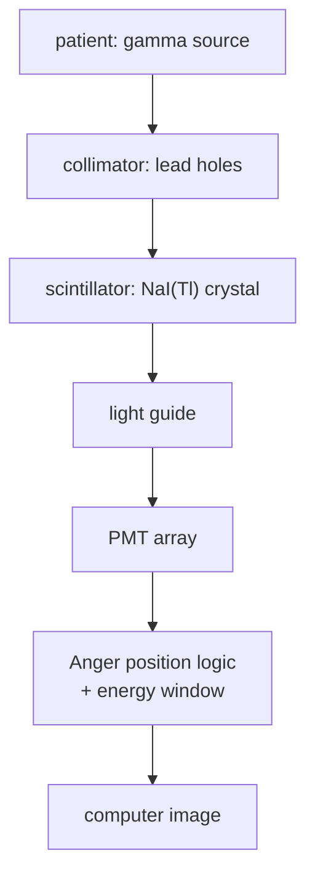

# Gamma Camera

## Problem Context

After a patient receives a gamma-emitting tracer (see [[Radionuclide-Imaging]]), photons stream outward in all directions. A gamma camera turns this stream into a planar image of where the tracer is concentrated. The whole instrument is essentially a 2-D photon-counter that records both *position* and *energy* of each detected gamma.

## Physical Ideas

- [[Radioactivity]]
- [[Photon-Energy]]
- [[Intensity]]
- [[Absorption-of-Gamma-Radiation]]

## Mathematical Tools

- photon energy $E = hf$
- exponential attenuation in the collimator
- count statistics: signal-to-noise $\propto \sqrt{N}$

## Structure

A gamma camera is a vertical stack of layers, each with one job.

1. **Collimator** — a thick lead plate drilled with thousands of long, narrow, parallel holes. Only photons travelling almost parallel to the holes pass through; oblique photons are absorbed by the lead septa. The collimator throws away most of the signal but is the only way to know *direction* — gamma photons cannot be focused with lenses.
2. **Scintillator crystal** — a large single crystal of sodium iodide doped with thallium, NaI(Tl). Each gamma photon that strikes the crystal is absorbed (mainly by the photoelectric effect at $\sim 140$ keV) and produces a brief flash of visible light. Flash brightness $\propto$ photon energy.
3. **Photomultiplier tubes (PMTs)** — an array of typically 50–100 PMTs sit behind a light guide on the back face of the crystal. Each PMT converts the weak flash into a measurable electrical pulse by photoelectric emission at its photocathode followed by avalanche multiplication across many dynodes — a single optical photon becomes $\sim 10^6$ electrons.
4. **Position logic** — comparing the pulse heights from PMTs near a flash gives $(x, y)$ by weighted-mean ("Anger logic"). The summed pulse gives the photon energy: only events near 140 keV are kept, rejecting scattered photons that have lost energy in the patient.
5. **Computer** — accumulates accepted events into a 2-D histogram. After a few minutes, the histogram *is* the image.

## Typical Questions

- Why use a collimator instead of a lens?
- Why NaI(Tl) rather than a semiconductor for clinical use?
- Why does a long imaging time improve image quality?
- What sets the spatial resolution? (collimator hole diameter and length; PMT spacing)

## Method Outline

1. Tracer accumulates in target organ
2. Camera positioned close to patient (closer = better resolution)
3. Acquisition runs for minutes while counts build up
4. Energy window rejects scattered photons
5. Image displayed; SPECT mode rotates the camera to make tomographic slices

## Assumptions

- Photon energy is well-defined (single-line emitter such as Tc-99m at 140 keV)
- Patient is still during acquisition
- Tracer biodistribution is in a steady state

## Links to Other Subjects

- Electronics: PMT signal chain and pulse-height analysis
- Statistics: Poisson counting noise

## Frontier Links

- [[Particle-Physics-Map]] — PET replaces the collimator with electronic coincidence detection of back-to-back 511 keV photons

## Common Mistakes

- Calling the collimator a "lens" — it does not focus, it filters direction
- Forgetting that most emitted photons never reach the detector (collimator efficiency is $\sim 10^{-4}$)
- Assuming the PMT detects the gamma directly — the PMT sees the *visible* scintillation light
- Ignoring the energy window: scattered photons would otherwise blur the image

## Visuals

*Source: Authored for this vault (CC0). No external copyright.*

## Source Trace

- Source: [[AQA-Physics-7407-7408-Specification]] §3.10.6
- Public reference: HyperPhysics — Gamma camera; OpenStax College Physics §32
