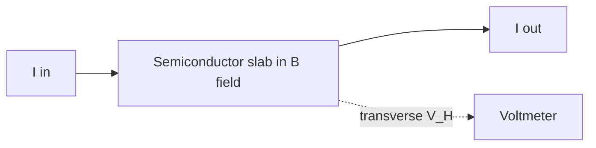

# Hall Effect Sensor

## Problem Context

How do we measure a magnetic field without a moving coil, detect whether a magnet is nearby, or sense the rotational speed of a wheel? The Hall effect gives a clean electrical answer: a small voltage that depends directly on magnetic flux density.

When current flows along a thin slab of semiconductor placed in a perpendicular magnetic field, the magnetic force on charge carriers pushes them sideways. Charge piles up on one face until an electric field across the slab balances the magnetic force. The resulting **Hall voltage** $V_{H}$ appears between the two side faces.

## Physical Ideas

- [[Magnetic-Flux-Density]]
- [[Semiconductor-Devices]]
- [[Current]]
- [[Potential-Difference]]
- [[Electric-Field]]
- [[Sensors]]

## Mathematical Tools

For a semiconductor slab of thickness $t$, carrying current $I$ perpendicular to a magnetic flux density $B$:

$$V_{H} = \frac{B I}{n q t}$$

- $V_{H}$: Hall voltage (V)
- $B$: magnetic flux density perpendicular to the current (T)
- $I$: current through the slab (A)
- $n$: number density of charge carriers (m⁻³)
- $q$: charge per carrier (C)
- $t$: slab thickness in the direction of $B$ (m)

For fixed $I$, $n$, $q$, $t$ the relation simplifies to $V_{H} \propto B$, which is the key result for a sensor.

Why semiconductors? $n$ is much smaller than in a metal, so $V_{H}$ is larger and easier to measure.

## Typical Questions

- Given $V_{H}$, $I$, $t$, and known carrier density, calculate $B$.
- Explain why a Hall probe uses a semiconductor rather than a metal strip.
- Describe how to use a Hall sensor to measure the magnetic field of a coil.
- A wheel has a magnet on it; explain how a Hall sensor produces a pulse train whose frequency gives the rotation rate.

## Method Outline

1. Pass a known constant current $I$ through a thin semiconductor slab.
2. Place the slab so its broad face is perpendicular to $B$.
3. Measure $V_{H}$ between the two side faces with a high-impedance voltmeter.
4. Use a calibration constant (or the formula) to convert $V_{H}$ to $B$.

## Assumptions

- The slab is thin compared with the field region (uniform $B$ across it).
- $I$ is held constant.
- The magnetic field is perpendicular to the current direction.
- Temperature is stable (carrier density $n$ varies with temperature in semiconductors).

## Links to Other Subjects

- Mathematics: linear proportionality and calibration.
- Computer Science: Hall sensors feed digital position/speed counters in motor controllers.

## Frontier Links

- [[Semiconductor-Physics-Map]] — the quantum Hall effect refines the picture and gives a resistance standard.

## Common Mistakes

- Using a thick slab and missing why semiconductor thin slabs are preferred.
- Forgetting that only the field component **perpendicular** to the slab contributes to $V_{H}$.
- Confusing $V_{H}$ with the driving voltage across the slab — $V_{H}$ is the small transverse voltage, not the longitudinal one.

## Visuals

### Hall slab geometry

*Figure: current passes longitudinally; the Hall voltage appears transversely across the slab.*
*Source: Authored for this vault (CC0). No external copyright.*

### From Wikimedia

<!-- wiki-images: yes -->

#### The Hall effect
![[_attachments/10_Applications/Hall-Effect-Sensor--wiki-hall-effect.png]]
*Figure: charge carriers deflected by the magnetic field build up on one face, creating the transverse Hall voltage.*
*Source: Wikimedia Commons — [Hall effect.png](https://commons.wikimedia.org/wiki/File:Hall_effect.png) — CC BY-SA 3.0 — Peo. Retrieved 2026-06-27.*

## Source Trace

- Source: [[AQA-Physics-7407-7408-Specification]] §3.13
- Public source: HyperPhysics; All About Circuits
- Section/Page: Electronics — Hall effect sensors
