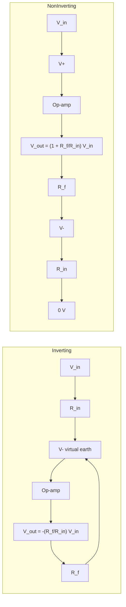

# Operational Amplifier Circuits

## Problem Context

A raw op-amp has gain so large that the slightest input drives the output to a supply rail. To make it useful as a linear amplifier we wrap it in **negative feedback** using resistors. Three configurations cover most A-Level use: **inverting**, **non-inverting**, and **summing**.

## Physical Ideas

- [[Ideal-Operational-Amplifier]]
- [[Potential-Difference]]
- [[Resistance]]
- [[Current]]
- [[Potential-Divider]]

## Mathematical Tools

For each circuit, $V_{in}$ and $V_{out}$ are measured relative to ground. Apply the [[Ideal-Operational-Amplifier]] golden rules.

**Inverting amplifier.** $V_{in}$ enters through $R_{in}$ into the $V_{-}$ pin; $V_{+}$ is grounded; feedback resistor $R_{f}$ connects $V_{out}$ back to $V_{-}$.

$$V_{out} = -\frac{R_{f}}{R_{in}}\, V_{in}$$

So the **closed-loop gain** is

$$G_{inv} = -\frac{R_{f}}{R_{in}}$$

Symbols:

- $R_{in}$: input resistor (Ω)
- $R_{f}$: feedback resistor (Ω)
- $G_{inv}$: voltage gain (dimensionless; negative sign means output is inverted)

The $V_{-}$ pin sits at the **virtual earth** (0 V), so the current $V_{in}/R_{in}$ flowing into it must flow through $R_{f}$, giving the formula.

**Non-inverting amplifier.** $V_{in}$ goes to the $V_{+}$ pin directly. The feedback network is a divider from $V_{out}$: $R_{f}$ to $V_{-}$ and $R_{in}$ from $V_{-}$ to ground.

$$V_{out} = \left(1 + \frac{R_{f}}{R_{in}}\right) V_{in}$$

so

$$G_{non} = 1 + \frac{R_{f}}{R_{in}}$$

The output is in phase with the input and the input impedance is very high.

**Summing amplifier.** Several inputs $V_{1}, V_{2}, \dots$ enter the virtual earth through their own resistors $R_{1}, R_{2}, \dots$, with a common feedback resistor $R_{f}$.

$$V_{out} = -R_{f}\left(\frac{V_{1}}{R_{1}} + \frac{V_{2}}{R_{2}} + \dots\right)$$

This is a **weighted sum** — each input is scaled by $R_{f}/R_{k}$ before being added. Picking equal resistors gives a simple inverted average up to a constant.

Conditions: all three formulas assume the ideal op-amp with negative feedback and an output that has not reached saturation.

## Typical Questions

- Choose $R_{f}$ and $R_{in}$ to give a specified gain.
- Predict $V_{out}$ for given $V_{in}$ and identify whether the chip is saturating.
- For a summing amplifier with two microphones, find the output for given input voltages.
- Explain why the input impedance of the non-inverting amplifier is much higher than that of the inverting one.

## Method Outline

1. Identify the configuration (inverting, non-inverting, summing).
2. Apply the golden rules: $V_{+} = V_{-}$ and no current into the inputs.
3. Write current balance at the inverting node.
4. Solve for $V_{out}$ in terms of $V_{in}$ and the resistors.
5. Check that $|V_{out}|$ stays below the supply rails — otherwise output **saturates**.

## Assumptions

- Op-amp is ideal (see [[Ideal-Operational-Amplifier]]).
- Negative feedback is properly connected.
- Frequencies are well below the chip's bandwidth.
- Output has not hit the supply rails.

## Saturation

If the algebra predicts $|V_{out}| > V_{cc}$ (supply rail), the real output clips at the rail. The chip stops behaving linearly; it now acts like a comparator. Clipping distorts the output and is the most common reason a measured gain falls short of the predicted value.

## Links to Other Subjects

- Mathematics: linear functions, weighted sums, sign conventions.
- Computer Science: summing amplifiers are the analogue heart of digital-to-analogue converters.

## Frontier Links

- [[Signal-Processing]]

## Common Mistakes

- Dropping the minus sign in the inverting gain formula.
- Confusing $R_{f}/R_{in}$ (inverting gain magnitude) with $1 + R_{f}/R_{in}$ (non-inverting gain).
- Ignoring saturation and quoting a calculated gain larger than the supply allows.
- Forgetting that the virtual earth carries no actual ground wire — measuring it with a probe and being surprised it reads 0 V.

## Visuals

### Inverting and non-inverting topologies

*Figure: the same op-amp gives different gain expressions depending on where V_in enters.*
*Source: Authored for this vault (CC0). No external copyright.*

## Source Trace

- Source: [[AQA-Physics-7407-7408-Specification]] §3.13
- Public source: HyperPhysics; All About Circuits
- Section/Page: Electronics — op-amp circuits
