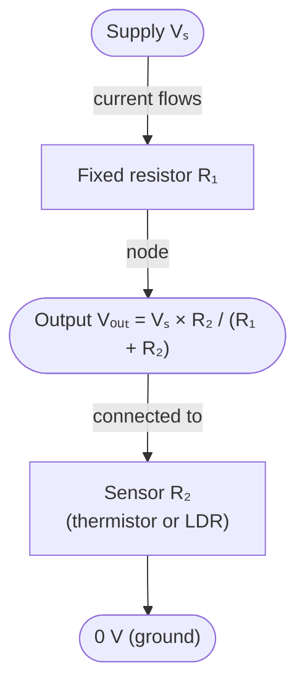

# Potential Divider Sensors

## Problem Context

Many automatic systems — light-activated lamps, thermostats, moisture alarms — sense a physical quantity by turning a resistance change into a voltage change. A potential divider with a sensing component (thermistor, light-dependent resistor, strain gauge) provides an output voltage that varies with the measured quantity. This is the standard A-Level context for designing and analysing sensing circuits.

## Physical Ideas

- [[Potential-Divider]]
- [[Resultant-Force]]

## Mathematical Tools

- Potential divider equation relating output voltage to the ratio of resistances
- Series resistance combination
- Reading characteristic curves of thermistors and LDRs

## Typical Questions

- Calculate the output voltage of a divider for a given sensor resistance.
- Choose a fixed resistor so the output crosses a threshold at a target temperature or light level.
- Explain how the output changes as the sensed quantity increases.
- Describe how the output drives a switching circuit.

## Method Outline

1. Identify the sensing component and how its resistance varies with the measured quantity.
2. Decide which arm of the divider the sensor occupies.
3. Apply the potential divider equation to find the output voltage.
4. Determine the resistance at the desired switching point.
5. Select the fixed resistor so the threshold occurs at the required condition.

## Assumptions

- The output is connected to a high-resistance input so it draws negligible current.
- The supply voltage is constant.
- Sensor characteristic data is taken as accurate over the working range.

## Links to Other Subjects

- Mathematics: ratios and rearranging the divider equation; reading non-linear graphs.
- Computer Science: analogue-to-digital conversion feeding a microcontroller for automated control.

## Frontier Links

- [[Medical-Imaging]] — biomedical sensors convert physiological signals into measurable voltages.

## Common Mistakes

- [[Mixing-Up-Series-and-Parallel-Circuits]]
- [[Ignoring-Units]]
- [[Misreading-Graph-Gradient]]

## Visuals

### Potential Divider Sensor Circuit

*Figure: Potential divider circuit with a fixed resistor R₁ and a sensing component R₂ (thermistor or LDR) in series. The output voltage is taken across R₂. As the sensed quantity (temperature or light) changes R₂, the output voltage changes, crossing a threshold that triggers a switch.*
*Source: Authored for this vault (CC0). No external copyright.*

## Source Trace

- Source: OpenStax College Physics; IOPSpark; Isaac Physics; OCR examiner reports (general) — no copied text
- OCR alignment: [[OCR-Physics-A-H556-Specification]]
